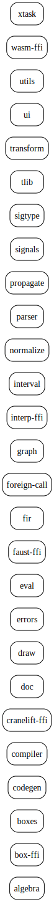
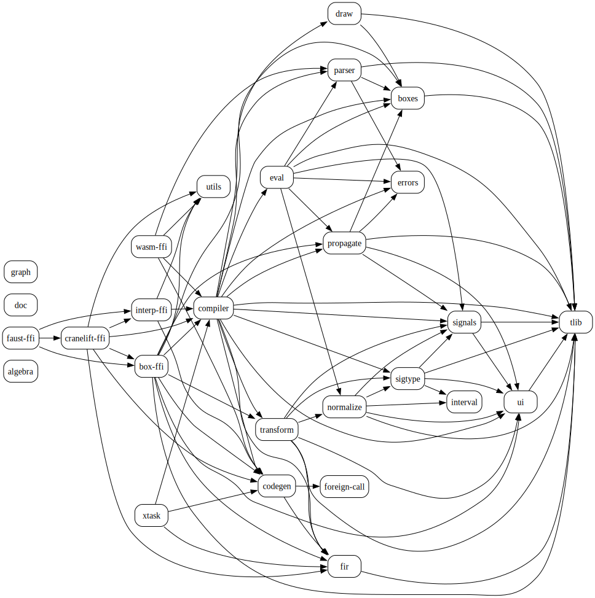
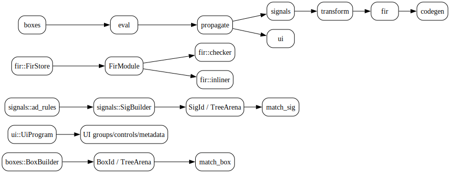

# Code Graphs

Generated by:

```bash
cargo run -p xtask -- code-graphs
```

Files:

- `workspace-crates.mmd` / `workspace-crates.dot` / `workspace-crates.svg`: workspace crate nodes from `cargo metadata`.
- `internal-crate-deps.mmd` / `internal-crate-deps.dot` / `internal-crate-deps.svg`: internal crate dependency edges from `cargo metadata`.
- `ir-overview.mmd` / `ir-overview.dot` / `ir-overview.svg`: curated overview of the main `boxes`, `signals`, `fir`, and `ui` IR relationships.
- `public-api-index.md`: lightweight source-scan index of public items. Use Rustdoc as the authoritative API reference.

## Rendered SVG

### Workspace Crates



### Internal Crate Dependencies



### IR Overview


