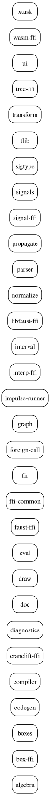
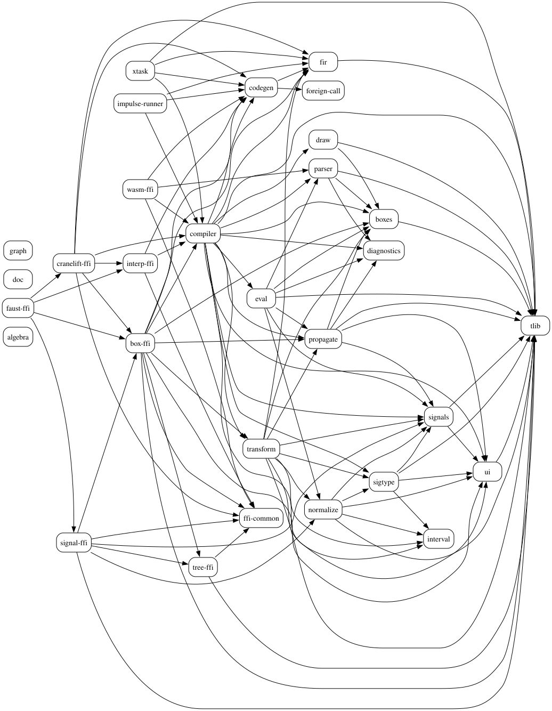
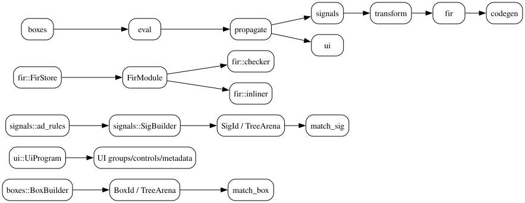

# Code Graphs

Generated by:

```bash
cargo run -p xtask -- code-graphs
```

Verified in CI by:

```bash
cargo run -p xtask -- code-graphs --check
```

The check compares every artifact below except `public-api-index.md` (its source line numbers make code motion look like an API change) and the `.svg` renderings (they need Graphviz `dot`, which CI does not install, and they derive from the checked `.dot` files). Regenerating is the bless path: run the generator, review the diff, commit it.

Files:

- `workspace-crates.mmd` / `workspace-crates.dot` / `workspace-crates.svg`: workspace crate nodes from `cargo metadata`.
- `internal-crate-deps.mmd` / `internal-crate-deps.dot` / `internal-crate-deps.svg`: internal crate dependency edges from `cargo metadata`.
- `ir-overview.mmd` / `ir-overview.dot` / `ir-overview.svg`: curated overview of the main `boxes`, `signals`, `fir`, and `ui` IR relationships.
- `public-api-baseline.txt`: gated inventory of every crate's public items, without source locations. A diff here means a crate boundary moved.
- `public-api-index.md`: lightweight source-scan index of public items, with locations. Use Rustdoc as the authoritative API reference.

## Rendered SVG

### Workspace Crates



### Internal Crate Dependencies



### IR Overview


