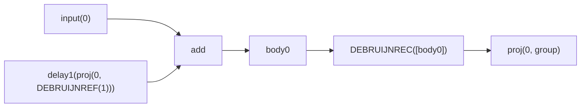

# `FlatNodeKind::Rec` to Signal Form

This note explains how [`FlatNodeKind::Rec`] in
`crates/propagate/src/lib.rs` is lowered to the signal representation used by
the Faust Rust pipeline, and why de Bruijn notation is the key mechanism that
makes the lowering work.

The relevant implementation points are:

- `crates/propagate/src/lib.rs`
- `crates/tlib/src/recursion.rs`
- `crates/transform/src/signal_prepare.rs`

## 1. What `A ~ B` means

Faust recursive composition is written `A ~ B`.

At the box-typing level:

- `A : u -> v`
- `B : x -> y`
- required: `x <= v` and `y <= u`
- result: `A ~ B : (u - y) -> v`

Intuition:

- `A` is the main body.
- `B` is the feedback function.
- `B` reads some outputs of `A`.
- `B` produces feedback signals that are fed back into some inputs of `A`.
- the feedback is always delayed by one sample, so the cycle is causal.

In the Rust lowering, the outputs of `A` are turned into a recursive group body,
and references back into that group are encoded with projections.

## 2. The exact lowering algorithm in `propagate`

The `FlatNodeKind::Rec(left, right)` branch in
`crates/propagate/src/lib.rs` performs these steps:

1. Infer arities of `left` and `right`.
2. Reject the node if `right.inputs > left.outputs` or
   `right.outputs > left.inputs`.
3. Build seed feedback placeholders with
   `make_mem_sig_proj_list(right.inputs)`.
4. Propagate `right` using those seed placeholders.
5. Lift the outer inputs by one de Bruijn level before entering the recursive
   scope.
6. Lift all `slot_env` values by one de Bruijn level for the same reason.
7. Propagate `left` with:
   - first the feedback signals produced by `right`,
   - then the lifted external inputs.
8. Pack all outputs of `left` into one list.
9. Wrap that list in a de Bruijn recursive binder.
10. For each output branch:
    - if it still depends on the recursive binder, emit `proj(i, group)`,
    - otherwise emit the raw closed expression directly.

In pseudocode:

```text
l0 = [ delay1(proj(i, DEBRUIJNREF(1))) for i in 0..right.inputs-1 ]
l1 = propagate(right, l0)
l2 = propagate(left, l1 ++ lift(inputs))
group = DEBRUIJNREC(list(l2))

outputs[i] =
  if aperture(l2[i]) > 0
    then proj(i, group)
    else l2[i]
```

## 3. Why de Bruijn notation is used

The problem with recursion is binding: once you create a recursive group, how do
you refer to “the current recursive group” inside nested recursive scopes
without accidental capture?

De Bruijn notation solves this by using binder depth instead of names.

### 3.1 Binder and reference

In the conceptual model used by the shared recursion utilities:

- `DEBRUIJNREC(body)` is a recursive binder
- `DEBRUIJNREF(1)` means “the nearest enclosing recursive binder”
- `DEBRUIJNREF(2)` means “the next outer recursive binder”
- and so on

So:

```text
DEBRUIJNREC(
  add(DEBRUIJNREF(1), 1)
)
```

means:

```text
let rec W = W + 1
```

without needing to invent the name `W` yet.

### 3.2 Why this is useful here

It gives three practical properties:

- no name generation is needed during propagation,
- nested recursive scopes are unambiguous,
- lifting outer references when entering an inner recursive scope is mechanical.

That last point is exactly what `liftn(...)` does.

## 4. The seed placeholders

The feedback seeds created by `make_mem_sig_proj_list(...)` are:

```text
delay1(proj(i, DEBRUIJNREF(1)))
```

for each feedback input slot `i`.

This means:

- `proj(i, ...)` selects output slot `i` of the recursive group being defined,
- `DEBRUIJNREF(1)` says “that group is the nearest recursive binder”,
- `delay1(...)` makes the feedback causal.

So the right-hand side `B` is not propagated with concrete values. It is
propagated with symbolic placeholders meaning “the previous sample of recursive
output slot `i`”.

## 5. Lifting and capture avoidance

When the lowering enters a new recursive scope, all outer recursive references
must be shifted outward by one level. Otherwise they would be captured by the
new inner binder.

That is the role of:

- `lift_signals(...)`
- `liftn(...)`
- the explicit lifting of `slot_env` values in the `Rec` branch

### 5.1 The rule

Very roughly:

- references with level `< threshold` stay unchanged,
- references with level `>= threshold` are incremented by one,
- descending under a recursive binder increases the threshold.

Example:

```text
outer ref before entering inner rec: DEBRUIJNREF(1)
same ref inside inner rec:           DEBRUIJNREF(2)
```

because level `1` now refers to the inner binder, and the old outer binder has
moved one level farther away.

### 5.2 Why `slot_env` is also lifted

This matters for captured values coming from box abstractions or local
definitions. If a value already contains `DEBRUIJNREF(1)` from an outer loop and
you inject it into an inner loop without lifting, the inner loop will silently
capture it.

That is why the Rust code now lifts every `slot_env` value before propagating
the `left` side of the recursive composition.

## 6. `aperture`: deciding whether a branch is really recursive

After `left` has been propagated, not every output branch necessarily depends on
the recursive group.

The helper `aperture(...)` computes the maximum free de Bruijn level visible
from a subtree.

Useful rules:

- `aperture(DEBRUIJNREF(k)) = k`
- `aperture(DEBRUIJNREC(body)) = aperture(body) - 1`
- for other nodes, aperture is the maximum of child apertures
- a closed non-recursive term has aperture `0`

Interpretation:

- `aperture > 0`: the branch still references the current recursive binder, so
  it must be re-emitted as `proj(i, group)`
- `aperture == 0`: the branch is closed and can stay outside the recursive
  group interface

This is why the output list of `A ~ B` may contain a mix of:

- `proj(i, group)` for genuinely recursive outputs
- raw expressions for closed outputs

## 7. Worked example: `+ ~ _`

The classic one-output feedback shape lowers to:

```text
body0 = add(delay1(proj(0, DEBRUIJNREF(1))), input(0))
group = DEBRUIJNREC([body0])
out0  = proj(0, group)
```

ASCII view:

```text
input(0) ----------------------+
                               v
                        +-------------+
prev proj(0, group) --> |    add      | --> body0
   via delay1           +-------------+

group = DEBRUIJNREC([body0])
output = proj(0, group)
```

Mermaid view:



## 8. How mutual recursion is represented

Mutual recursion is handled by putting all outputs of `left` into the same
recursive group body list.

If `left` has two outputs, the group body is conceptually:

```text
DEBRUIJNREC([
  body0,
  body1
])
```

Inside those bodies, recursive references can target any slot:

```text
body0 = f(proj(1, DEBRUIJNREF(1)), ...)
body1 = g(proj(0, DEBRUIJNREF(1)), ...)
```

This is a mutually recursive pair:

- output 0 depends on output 1
- output 1 depends on output 0

The crucial point is that the binder is shared by the entire output vector, not
one binder per output.

So “mutually recursive outputs” are not a special case. They are just the normal
multi-output case of one recursive group with indexed projections.

## 9. What happens after propagation

`propagate` emits the recursive structure in de Bruijn form. Later,
`de_bruijn_to_sym(...)` converts it to symbolic recursion:

```text
DEBRUIJNREC([
  body0,
  body1
])
```

becomes:

```text
SYMREC(W0, [
  body0',
  body1'
])
```

where references like:

```text
proj(1, DEBRUIJNREF(1))
```

become:

```text
proj(1, SYMREF(W0))
```

That symbolic form is easier for later passes to consume, but the propagation
logic itself is simpler to write in de Bruijn form.

## 10. Why “degenerate” recursion cases exist

There are two different phenomena that are easy to mix up.

### 10.1 Closed branches inside a recursive composition

Some outputs of `left` may not use recursion at all.

Example shape:

```text
left outputs = [ 7, add(delay1(proj(0, ref)), input(0)) ]
```

Then:

- branch 0 has `aperture == 0`, so it stays as raw `7`
- branch 1 has `aperture > 0`, so it becomes `proj(1, group)`

This is a local structural degeneracy: the recursive group body contains some
branches that are not actually recursive.

### 10.2 Unary symbolic groups with non-zero logical projection indices

Later in the pipeline, the C++ compiler can eliminate non-recursive bodies and
shrink a multi-output recursive group to one physical body while preserving the
original logical projection index.

Conceptually:

```text
before shrink:
  SYMREC(W, [b0, b1, b2, b3, b4, b5, b6, b7])
  output = proj(7, W)

after shrink:
  SYMREC(W, [b7])
  output = proj(7, W)
```

Now the group has physical arity `1`, but the projection still says `7`.

That is the degenerate unary-recursion case documented by
`tests/corpus/rep_71_degenerate_unary_recursion.dsp`.

The current Rust fast-lane does not yet port the full C++ dependency-graph-based
degeneracy elimination. Instead, `signal_prepare` performs a narrower
normalization:

- if a symbolic recursion group has one physical body,
- any `proj(k, group)` is canonicalized to `proj(0, group)`

This keeps later FIR lowering stable without implementing the full C++
degenerate-recursion machinery.

## 11. Should `canonicalize_unary_rec_projections` live in `propagate`?

Not really, in the current architecture.

The important distinction is this:

- `propagate` still works on the structural de Bruijn form of recursion
- `canonicalize_unary_rec_projections` is defined in terms of the symbolic
  recursion shape produced after `de_bruijn_to_sym`

Inside `propagate`, the recursive group is still built from the full `l2`
output list:

```text
group_body = list(l2[0], l2[1], ..., l2[n-1])
group = DEBRUIJNREC(group_body)
```

At that point, the physical arity of the group is still the arity of `left`.
`propagate` can already do one structurally justified cleanup:

- if one branch is closed (`aperture == 0`), it can emit the raw expression
  instead of `proj(i, group)`

But the unary-degenerate case is different. The problematic shape is:

```text
SYMREC(W, [body_7])
proj(7, W)
```

That shape is only meaningful after symbolic recursion has been materialized and
the group is observed to have physical arity `1`. In other words:

- `propagate` knows the logical output positions of the original recursive body
- `signal_prepare` knows the symbolic group shape seen by FIR preparation

So moving this canonicalization into `propagate` would either:

- be too early, because the relevant unary symbolic shape does not exist yet, or
- change semantics based on information `propagate` is not supposed to invent

The current placement therefore makes sense:

- `propagate`: build the recursive graph faithfully and separate out truly
  closed branches using `aperture`
- `de_bruijn_to_sym`: convert the recursion representation
- `signal_prepare`: apply the narrow fast-lane normalization once the symbolic
  group arity is visible

If this logic ever moves, the more natural destination would be a general
normalization pass immediately after `de_bruijn_to_sym`, not `propagate`.

## 12. Where the C++ compiler performs the full pass

The reference C++ compiler also does not perform this work in `propagate`.

The full degenerate-recursion elimination pass lives in:

- `compiler/transform/sigDegenerateRecursionElimination.hh`
- `compiler/transform/sigDegenerateRecursionElimination.cpp`
- function: `inlineDegenerateRecursions(Tree siglist, bool trace)`

It is invoked later from generator-side code such as:

- `compiler/generator/compile_scal.cpp`
- `compiler/generator/instructions_compiler.cpp`

So the current Rust split remains structurally coherent:

- `propagate` builds the recursive structure faithfully,
- later passes normalize or rewrite degenerate recursive shapes.

The difference is only that Rust currently implements a much narrower
post-`de_bruijn_to_sym` canonicalization in `signal_prepare`, not the full C++
graph-based elimination pass.

## 13. Is the Rust canonicalization really necessary?

Not in the absolute semantic sense.

Older C++ compiler revisions existed before `inlineDegenerateRecursions()`.
They still handled degenerate recursive shapes correctly, but in a looser way:

- `propagate` already emitted closed branches directly when `aperture == 0`;
- the remaining recursive projections could keep their original logical index;
- later generator-side code tolerated that shape instead of normalizing the
  signal tree eagerly.

In practice, that older strategy relied on downstream code generation behavior:

- scalar recursion code generation directly compiled the requested projection
  definition;
- instruction/FIR-side recursion generation only materialized projections that
  were actually used.

Rust could have copied that older contract, but the current fast-lane chose a
stricter invariant: once recursion has been converted to symbolic form, a group
with one physical body should be addressed through physical slot `0`.

This is not just a FIR convenience.

Today the FIR lowerer also has defensive unary-group remapping, so
`canonicalize_unary_rec_projections` is no longer the only guardrail.
However, preparation-level canonicalization still provides value because it
stabilizes the whole downstream pipeline:

- reduced typing sees dense physical indices;
- promotion does not have to preserve a logical/physical index distinction;
- FIR lowering can stay vector-based without carrying older C++ special cases
  through every consumer.

So the precise answer is:

- semantically, Rust could have worked like the older C++ compiler;
- architecturally, the canonicalization is still a good idea in Rust because it
  establishes one simple IR invariant early.

## 14. One subtle but important implementation detail

The canonical binder tag is `DEBRUIJNREC(body)`.

## 15. Compact mental model

If you want one short way to remember the lowering, use this:

- `right` is propagated first using “previous recursive outputs” as symbolic
  seeds
- `left` is then propagated using the resulting feedback signals plus the normal
  external inputs
- all outputs of `left` become one recursive body vector
- de Bruijn levels make nested recursive scopes safe
- `aperture` decides which branches are truly recursive
- later passes convert de Bruijn recursion to symbolic recursion

That is the whole translation.
