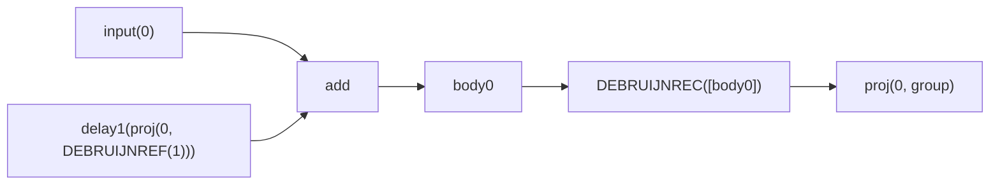

# `FlatNodeKind::Rec` vers la forme signal

Cette note explique comment [`FlatNodeKind::Rec`] dans
`crates/propagate/src/lib.rs` est abaissé vers la représentation signal utilisée
dans le pipeline Rust de Faust, et pourquoi la notation de Bruijn est le
mécanisme central de cet abaissement.

Les points d’implémentation concernés sont :

- `crates/propagate/src/lib.rs`
- `crates/tlib/src/recursion.rs`
- `crates/transform/src/signal_prepare.rs`

## 1. Ce que signifie `A ~ B`

En Faust, la composition récursive s’écrit `A ~ B`.

Au niveau du typage des boxes :

- `A : u -> v`
- `B : x -> y`
- contrainte : `x <= v` et `y <= u`
- résultat : `A ~ B : (u - y) -> v`

Intuition :

- `A` est le corps principal ;
- `B` est la fonction de rétroaction ;
- `B` lit certaines sorties de `A` ;
- `B` produit des signaux de feedback réinjectés dans certaines entrées de `A` ;
- le feedback est toujours retardé d’un échantillon, ce qui rend la boucle causale.

Dans l’abaissement Rust, les sorties de `A` deviennent le corps d’un groupe
récursif, et les références à ce groupe sont encodées via des projections.

## 2. L’algorithme exact dans `propagate`

La branche `FlatNodeKind::Rec(left, right)` dans
`crates/propagate/src/lib.rs` effectue les étapes suivantes :

1. Inférer les arités de `left` et `right`.
2. Rejeter le nœud si `right.inputs > left.outputs` ou
   `right.outputs > left.inputs`.
3. Construire les placeholders de feedback avec
   `make_mem_sig_proj_list(right.inputs)`.
4. Propager `right` avec ces placeholders comme entrées.
5. Lever les entrées externes d’un niveau de Bruijn avant d’entrer dans la
   portée récursive.
6. Lever aussi toutes les valeurs de `slot_env` pour la même raison.
7. Propager `left` avec :
   - d’abord les signaux de feedback produits par `right`,
   - puis les entrées externes levées.
8. Empaqueter toutes les sorties de `left` dans une liste.
9. Envelopper cette liste dans un binder récursif de Bruijn.
10. Pour chaque branche de sortie :
    - si elle dépend encore du binder récursif, émettre `proj(i, group)`,
    - sinon réémettre directement l’expression fermée.

En pseudo-code :

```text
l0 = [ delay1(proj(i, DEBRUIJNREF(1))) for i in 0..right.inputs-1 ]
l1 = propagate(right, l0)
l2 = propagate(left, l1 ++ lift(inputs))
group = DEBRUIJNREC(list(l2))

outputs[i] =
  if aperture(l2[i]) > 0
    then proj(i, group)
    else l2[i]
```

## 3. Pourquoi utiliser la notation de Bruijn

Le problème fondamental de la récursion est le binding : une fois un groupe
récursif créé, comment référencer “le groupe récursif courant” à l’intérieur de
portées récursives imbriquées sans capture accidentelle ?

La notation de Bruijn résout ce problème en utilisant la profondeur des binders
plutôt que des noms.

### 3.1 Binder et référence

Dans le modèle utilisé ici :

- `DEBRUIJNREC(body)` est un binder récursif ;
- `DEBRUIJNREF(1)` signifie “le binder récursif englobant le plus proche” ;
- `DEBRUIJNREF(2)` signifie “le binder récursif extérieur suivant” ;
- etc.

Ainsi :

```text
DEBRUIJNREC(
  add(DEBRUIJNREF(1), 1)
)
```

signifie conceptuellement :

```text
let rec W = W + 1
```

sans avoir besoin d’introduire le nom `W` à ce stade.

### 3.2 Pourquoi c’est utile ici

Cette représentation apporte trois propriétés pratiques :

- aucune génération de nom n’est nécessaire pendant `propagate` ;
- les portées récursives imbriquées sont non ambiguës ;
- le décalage des références extérieures lorsqu’on entre dans une portée
  récursive interne est purement mécanique.

C’est précisément le rôle de `liftn(...)`.

## 4. Les placeholders d’amorçage

Les seeds de feedback créés par `make_mem_sig_proj_list(...)` sont :

```text
delay1(proj(i, DEBRUIJNREF(1)))
```

pour chaque slot d’entrée de feedback `i`.

Cela signifie :

- `proj(i, ...)` sélectionne la sortie `i` du groupe récursif en cours de
  définition ;
- `DEBRUIJNREF(1)` dit “ce groupe est le binder récursif englobant le plus
  proche” ;
- `delay1(...)` rend la boucle causale.

Autrement dit, `right` n’est pas propagé avec des valeurs concrètes, mais avec
des placeholders symboliques représentant “la valeur au sample précédent de la
sortie récursive `i`”.

## 5. Levée et évitement de capture

Quand l’abaissement entre dans une nouvelle portée récursive, toutes les
références récursives extérieures doivent être décalées d’un niveau. Sinon,
elles seraient capturées par le nouveau binder interne.

C’est le rôle de :

- `lift_signals(...)`
- `liftn(...)`
- la levée explicite des valeurs de `slot_env` dans la branche `Rec`

### 5.1 La règle

Schématiquement :

- les références de niveau `< threshold` restent inchangées ;
- les références de niveau `>= threshold` sont incrémentées ;
- lorsqu’on descend sous un binder récursif, le seuil augmente.

Exemple :

```text
référence extérieure avant entrée dans une rec interne : DEBRUIJNREF(1)
même référence à l’intérieur de cette rec interne   : DEBRUIJNREF(2)
```

car le niveau `1` désigne désormais le binder interne, et l’ancien binder
extérieur se retrouve un cran plus loin.

### 5.2 Pourquoi `slot_env` doit aussi être levé

Cela compte pour les valeurs capturées depuis des abstractions de boxes ou des
définitions locales. Si une valeur contient déjà `DEBRUIJNREF(1)` provenant
d’une boucle extérieure et qu’on l’injecte telle quelle dans une boucle
intérieure, cette boucle intérieure la capturera silencieusement.

C’est pourquoi le code Rust lève toutes les valeurs de `slot_env` avant de
propager la partie `left` d’une composition récursive.

## 6. `aperture` : décider si une branche est vraiment récursive

Après propagation de `left`, toutes les branches de sortie ne dépendent pas
forcément du groupe récursif.

Le helper `aperture(...)` calcule le niveau libre maximal de Bruijn visible dans
un sous-arbre.

Règles utiles :

- `aperture(DEBRUIJNREF(k)) = k`
- `aperture(DEBRUIJNREC(body)) = aperture(body) - 1`
- pour les autres nœuds, l’aperture est le maximum des apertures des enfants
- un terme fermé non récursif a une aperture égale à `0`

Interprétation :

- `aperture > 0` : la branche référence encore le binder récursif courant, donc
  elle doit être réémise comme `proj(i, group)`
- `aperture == 0` : la branche est fermée et peut rester hors de l’interface du
  groupe récursif

C’est pour cela que la liste de sorties de `A ~ B` peut mélanger :

- des `proj(i, group)` pour les sorties réellement récursives ;
- des expressions brutes pour les sorties fermées.

## 7. Exemple travaillé : `+ ~ _`

Le schéma classique de feedback à une sortie s’abaisse en :

```text
body0 = add(delay1(proj(0, DEBRUIJNREF(1))), input(0))
group = DEBRUIJNREC([body0])
out0  = proj(0, group)
```

Vue ASCII :

```text
input(0) ----------------------+
                               v
                        +-------------+
prev proj(0, group) --> |    add      | --> body0
   via delay1           +-------------+

group = DEBRUIJNREC([body0])
output = proj(0, group)
```

Vue Mermaid :



## 8. Comment la récursion mutuelle est représentée

La récursion mutuelle est gérée en plaçant toutes les sorties de `left` dans la
même liste de corps du groupe récursif.

Si `left` a deux sorties, le corps du groupe est conceptuellement :

```text
DEBRUIJNREC([
  body0,
  body1
])
```

À l’intérieur de ces corps, les références récursives peuvent cibler n’importe
quel slot :

```text
body0 = f(proj(1, DEBRUIJNREF(1)), ...)
body1 = g(proj(0, DEBRUIJNREF(1)), ...)
```

On obtient alors une paire mutuellement récursive :

- la sortie 0 dépend de la sortie 1 ;
- la sortie 1 dépend de la sortie 0.

Le point crucial est qu’il n’y a pas un binder par sortie. Il y a un seul
binder partagé par tout le vecteur de sorties.

Autrement dit, les formes mutuellement récursives ne sont pas un cas spécial :
ce sont simplement les formes multi-sorties normales d’un groupe récursif avec
projections indexées.

## 9. Ce qui se passe après `propagate`

`propagate` émet la structure récursive sous forme de Bruijn. Plus tard,
`de_bruijn_to_sym(...)` la convertit en récursion symbolique :

```text
DEBRUIJNREC([
  body0,
  body1
])
```

devient :

```text
SYMREC(W0, [
  body0',
  body1'
])
```

et des références comme :

```text
proj(1, DEBRUIJNREF(1))
```

deviennent :

```text
proj(1, SYMREF(W0))
```

La forme symbolique est plus pratique pour certaines passes aval, mais la forme
de Bruijn reste plus simple à produire dans `propagate`.

## 10. Pourquoi il existe des cas “dégénérés”

Il y a deux phénomènes distincts qu’il faut bien séparer.

### 10.1 Branches fermées à l’intérieur d’une composition récursive

Certaines sorties de `left` peuvent ne pas utiliser la récursion du tout.

Exemple :

```text
left outputs = [ 7, add(delay1(proj(0, ref)), input(0)) ]
```

Alors :

- la branche 0 a `aperture == 0`, donc elle reste le `7` brut ;
- la branche 1 a `aperture > 0`, donc elle devient `proj(1, group)`.

Il s’agit d’une dégénérescence structurelle locale : le corps du groupe
récursif contient des branches qui ne sont en réalité pas récursives.

### 10.2 Groupes symboliques unaires avec projection logique non nulle

Plus tard dans le pipeline, le compilateur C++ peut éliminer les corps non
récursifs et réduire un groupe récursif multi-sorties à un seul corps physique,
tout en conservant l’indice logique original d’une projection.

Conceptuellement :

```text
avant réduction :
  SYMREC(W, [b0, b1, b2, b3, b4, b5, b6, b7])
  output = proj(7, W)

après réduction :
  SYMREC(W, [b7])
  output = proj(7, W)
```

Le groupe a alors une arité physique de `1`, mais la projection reste `7`.

C’est ce cas dégénéré unaire qui est documenté par
`tests/corpus/rep_71_degenerate_unary_recursion.dsp`.

Le fast-lane Rust ne porte pas encore toute la logique C++ d’analyse de
dépendances pour l’élimination complète des récursions dégénérées. À la place,
`signal_prepare` applique une normalisation plus étroite :

- si un groupe de récursion symbolique n’a qu’un seul corps physique,
- tout `proj(k, group)` est canonisé en `proj(0, group)`.

Cela suffit à stabiliser l’abaissement FIR actuel sans réimplémenter toute la
machinerie C++.

## 11. Est-ce que `canonicalize_unary_rec_projections` devrait vivre dans `propagate` ?

Pas vraiment, dans l’architecture actuelle.

La distinction importante est la suivante :

- `propagate` travaille encore sur la forme structurelle de Bruijn de la
  récursion ;
- `canonicalize_unary_rec_projections` est défini en termes de forme de
  récursion symbolique produite après `de_bruijn_to_sym`.

Dans `propagate`, le groupe récursif est encore construit à partir de la liste
complète des sorties `l2` :

```text
group_body = list(l2[0], l2[1], ..., l2[n-1])
group = DEBRUIJNREC(group_body)
```

À ce stade, l’arité physique du groupe est encore celle de `left`.
`propagate` peut déjà faire une simplification structurellement justifiée :

- si une branche est fermée (`aperture == 0`), il peut réémettre directement
  l’expression brute au lieu de `proj(i, group)`.

Mais le cas dégénéré unaire est différent. La forme problématique est :

```text
SYMREC(W, [body_7])
proj(7, W)
```

Cette forme n’a de sens qu’après matérialisation de la récursion symbolique, et
après constat que le groupe a une arité physique de `1`. Autrement dit :

- `propagate` connaît les positions logiques de sortie du corps récursif
  original ;
- `signal_prepare` connaît la forme symbolique effectivement vue par la
  préparation FIR.

Déplacer cette canonicalisation dans `propagate` serait donc soit :

- trop tôt, parce que la forme symbolique unaire pertinente n’existe pas encore,
- soit conceptuellement faux, car `propagate` devrait inventer une information
  qui n’est pas encore stabilisée à son niveau.

Le placement actuel est donc cohérent :

- `propagate` : construire fidèlement le graphe récursif et sortir les branches
  réellement fermées via `aperture` ;
- `de_bruijn_to_sym` : convertir la représentation récursive ;
- `signal_prepare` : appliquer cette normalisation étroite du fast-lane une
  fois l’arité symbolique du groupe visible.

Si cette logique devait être déplacée, la destination plus naturelle serait un
pass de normalisation général juste après `de_bruijn_to_sym`, pas `propagate`.

## 12. Où le compilateur C++ réalise la passe complète

Le compilateur C++ de référence ne fait pas non plus cela dans `propagate`.

La passe complète d’élimination des récursions dégénérées vit dans :

- `compiler/transform/sigDegenerateRecursionElimination.hh`
- `compiler/transform/sigDegenerateRecursionElimination.cpp`
- fonction : `inlineDegenerateRecursions(Tree siglist, bool trace)`

Elle est appelée plus tard depuis du code de génération, notamment dans :

- `compiler/generator/compile_scal.cpp`
- `compiler/generator/instructions_compiler.cpp`

La séparation actuelle côté Rust reste donc structurellement cohérente :

- `propagate` construit fidèlement la structure récursive ;
- des passes ultérieures normalisent ou réécrivent les formes récursives
  dégénérées.

La différence est simplement que Rust n’implémente aujourd’hui qu’une
canonisation beaucoup plus étroite après `de_bruijn_to_sym` dans
`signal_prepare`, et non la passe complète C++ fondée sur un graphe de
dépendances récursives.

## 13. Est-ce que la canonicalisation Rust est vraiment nécessaire ?

Pas au sens sémantique absolu.

Des révisions plus anciennes du compilateur C++ existaient avant
`inlineDegenerateRecursions()`. Elles géraient quand même correctement les
formes récursives dégénérées, mais d’une manière plus souple :

- `propagate` émettait déjà directement les branches fermées quand
  `aperture == 0` ;
- les projections récursives restantes pouvaient conserver leur index logique
  d’origine ;
- le code de génération en aval tolérait cette forme au lieu de normaliser
  l’arbre de signaux immédiatement.

En pratique, cette stratégie historique s’appuyait sur le comportement du
codegen :

- la génération scalaire compilait directement la définition de la projection
  demandée ;
- la génération instructions/FIR ne matérialisait que les projections
  effectivement utilisées.

Rust aurait pu reprendre ce contrat plus souple, mais le fast-lane actuel a
choisi un invariant plus strict : une fois la récursion convertie en forme
symbolique, un groupe avec un seul corps physique doit être adressé via le slot
physique `0`.

Ce n’est pas seulement une commodité pour le FIR.

Aujourd’hui, le lowerer FIR effectue aussi une remappage défensif des groupes
unaires, donc `canonicalize_unary_rec_projections` n’est plus l’unique ligne de
défense. En revanche, cette canonicalisation au niveau de la préparation reste
utile parce qu’elle stabilise toute la pipeline aval :

- le typage réduit voit des indices physiques denses ;
- la promotion n’a pas à préserver une distinction index logique / index
  physique ;
- le lowering FIR peut rester fondé sur des vecteurs de slots, sans propager
  partout les cas spéciaux de l’ancien C++.

La réponse précise est donc :

- sémantiquement, Rust aurait pu fonctionner comme l’ancien compilateur C++ ;
- architecturalement, cette canonicalisation reste une bonne idée côté Rust
  parce qu’elle fixe tôt un invariant d’IR simple.

## 14. Modèle mental compact

Si vous voulez retenir l’essentiel sous une forme courte :

- `right` est propagé d’abord avec des graines symboliques représentant les
  sorties récursives au sample précédent ;
- `left` est ensuite propagé avec les signaux de feedback calculés et les
  entrées externes normales ;
- toutes les sorties de `left` deviennent un vecteur de corps récursif ;
- les niveaux de Bruijn rendent les portées récursives imbriquées sûres ;
- `aperture` décide quelles branches sont vraiment récursives ;
- les passes suivantes convertissent la récursion de Bruijn en récursion
  symbolique.

C’est toute la traduction.
