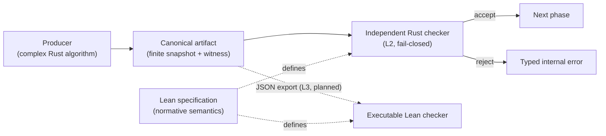

**Date:** 2026-07-19

**Audience:** a contributor who wants to understand *when and how* Lean is
used in this project — across the whole compiler, not just one phase — what
discipline that requires, and what it buys, before deciding whether a new
stream of work deserves its own formalization.

**Companions:** the normative assurance plan
[`lean-rust-certified-porting-plan-2026-07-11-en.md`](../porting/lean-rust-certified-porting-plan-2026-07-11-en.md),
the first checked specification
[`vector-mode-scheduling-formal-spec.lean`](../porting/vector-mode-scheduling-formal-spec.lean),
and its reader's guide
[`vector-mode-scheduling-formal-spec-guide-en.md`](vector-mode-scheduling-formal-spec-guide-en.md).

::: toc+
- **Why Lean in a compiler port** — the specific problem it solves here.
- **What exists today** — the artifacts and their current assurance status.
- **The methodology** — the assurance ladder, the producer/checker pattern, and the spec-first workflow.
- **Working rules** — the discipline that keeps a formalization honest.
- **A map of the compiler** — where Lean applies, stage by stage.
- **Case study: scheduling and vectorization** — concrete returns from the first formalized stream.
- **Costs and risks** — what the formalization does not give, and where it can mislead.
- **When to formalize** — a decision guide for future streams.
:::

## 1. Why Lean in a compiler port

Porting the Faust compiler from C++ to Rust is not a line-by-line
translation. The C++ code encodes many *implicit* contracts: the typing
rules of the block-diagram algebra, the normalization order of algebraic
rewrites, the first-match order of loop-separation rules, the direction of
dependency edges, which effects may commute, what makes a schedule valid. A
port can reproduce the code while silently inverting one of these
contracts, and conventional tests — even large differential corpora — only
catch the inversions that the corpus happens to exercise.

Lean is used here to make those contracts **explicit, typed, and
machine-checked**. The role is deliberately modest and precise:

Lean specification
:   A self-contained Lean 4 file per formalized stream that defines the
    normative meaning of the finite, structural decisions the compiler
    makes at that stage. It compiles with the bundled `Std` library only,
    and contains no `sorry` and no `axiom`.

Reference oracle
:   The executable (`Bool`-valued) Lean functions are the reference answer
    that the corresponding Rust checkers must agree with, fixture by fixture
    and — where feasible — by exhaustive enumeration.

Obligation ledger
:   The `Prop`-valued definitions state what *should* hold. Some are proved
    as theorems; the rest are visible, named promises the implementation
    must keep. Nothing is quietly assumed.

This is a general instrument for the whole port. It happens that its first
application was the scheduling/vectorization stream (§6) — because that is
where a new, high-risk architecture was being built — but nothing in the
method is specific to vectorization, and with hindsight several earlier
stages would have repaid the same treatment (§5).

::: important [What Lean is not, in this project]
A Lean file here is **not** a proof that faust-rs is correct, and it is not
a second implementation of the compiler. It is a kernel-checked contract
for a small, carefully chosen core, connected to production Rust through
tests, runtime certificates, and (eventually) refinement proofs. Describing
a lower assurance level as a higher one is a documentation bug.
:::

## 2. What exists today

| Artifact | Role | Status (2026-07-19) |
|:---|:---|:---|
| `porting/vector-mode-scheduling-formal-spec.lean` | Normative semantics of scheduling/vectorization | Kernel-checked, no `sorry`/`axiom` |
| `porting/lean-rust-certified-porting-plan-2026-07-11-en.md` | Assurance plan: levels L1–L4, gates R0–R7 | Normative; R gates partially delivered |
| `docs/vector-mode-scheduling-formal-spec-guide-en.md` | Reader's guide to the `.lean` file | Current |
| Rust checkers (`verify_schedule`, `verify_vector_plan`, …) | Independent L2 runtime verification | In production, fail-closed |
| Lean L3 CI boundary (JSON certificate ingestion) | Cross-language artifact parity | **Open, unowned** |
| `porting/{bda-typing,interval-arithmetic,normalization-rewrites}-formal-spec.lean` | Gate-0 skeletons of the three §5 proposals | Kernel-checked; adequacy review pending |

One compiler stage is fully engaged so far (scheduling/vectorization); the
three retrospective candidates of §5 have compiling gate-0 skeletons but no
adequacy review and no Rust bridge yet. The rest of the pipeline relies on
L1 evidence: unit and property tests, golden FIR snapshots, and the
differential impulse-test corpus against the pinned C++ reference.

A spec is checked by running:

```bash
lean porting/<name>-formal-spec.lean   # Lean 4.31, bundled Std
```

No Lake project, no mathlib, no external dependencies: every spec file must
remain runnable by any contributor with a stock Lean toolchain.

## 3. The methodology

### 3.1 The assurance ladder

Every claim about a compiler phase is placed on an explicit four-level
ladder, defined normatively in the porting plan (§2) and summarized here:

```csv
Level, Name, Meaning, Required evidence
L1, tested, conventional implementation confidence, unit / property / corpus / C++ differential tests
L2, runtime certified, phase result rejected unless a Rust verifier accepts it, canonical artifact + independent Rust checker
L3, Lean checked, artifact also accepted by the executable Lean reference checker, cross-language parity in CI
L4, refinement proved, Rust implementation deductively connected to the Lean definition, machine-checked refinement theorem
```

The rollout policy is fail-closed and monotone: every new certificate-gated
phase reaches L2 before activation; versioned acceptance corpora reach L3
before their phase gate is declared complete; L4 starts with small pure
verifiers, never with backends. A lower level must never be described using
the vocabulary of a higher one — "formally specified", "kernel checked",
"runtime certified", "translation validated", and "formally verified" are
five different claims with five different evidence requirements.

### 3.2 The producer/checker pattern

The architectural pattern that Lean anchors is the separation of every
critical phase into an untrusted producer and a small independent checker:



"Untrusted" is architectural, not pejorative: correctness must not depend
solely on the producer. The checker never calls the producer's algorithm;
it re-derives the facts it needs by direct, obviously terminating
traversals of the canonical snapshot. The Lean file is what makes "the
checker is right" a meaningful sentence: each Rust checker mirrors a named
executable Lean definition, and the Lean side carries the
soundness/completeness theorems relating the executable check to the
relational statement of validity.

This pattern is phase-agnostic. It applies equally to a schedule, a
normalization pass, an interval annotation, a differentiation transform, or
a memory-layout decision — anything that produces a finite, serializable
result whose validity can be restated independently.

### 3.3 The spec-first workflow

For a stream that warrants formalization, the working order is:

1. **Write the plan document first** (in `porting/`), naming the phases,
   the trust boundaries, and the target assurance level of each — per the
   established phase methodology (plan, then producer + independent checker
   + rejecting mutation tests, then qualification).
2. **Transcribe the finite formal core into Lean** — the decisions, not
   the whole compiler. Types, executable `…B` checks, relational `Prop`
   contracts, and theorems for the tractable cases. Keep it compiling with
   no `sorry` and no `axiom` at every commit.
3. **Run an adequacy review of the spec itself** before relying on it:
   check that typing judgments are functional, that no `Prop` field is
   vacuously satisfiable, that every executable checker has an independent
   relational anchor (a soundness theorem that is not `rfl`), and that the
   reference checker is at least as strong as the Rust one.
4. **Port to Rust against the Lean text**, treating the Lean first-match
   orders, edge conventions, and Boolean characterizations as normative.
   Where a rule order matters, add an exhaustive finite test that checks
   the Rust verdict against the Lean characterization case by case.
5. **Bridge with exhaustive enumeration where the domain is finite** —
   e.g. all upper-triangular DAGs up to n = 6 for the four scheduling
   strategies, cross-checked against Lean fixtures.
6. **Gate activation on L2**, and gate phase completion on L3 once the
   certificate corpus is versioned.

::: note [Prove before implementing, when the design is risky]
For the lockstep SIMD stream, the safety story (`Shape` isomorphism,
`iso_decorations_agree`, `LockstepSafe = FissionSafe`) was mechanized in
Lean *before* the Rust implementation existed, alongside a measured
benchmark justifying the effort. This "Lean-mechanized first" variant is
the right order whenever the correctness argument — not the code — is the
risky part of a design.
:::

## 4. Working rules

These rules come from the first formalized stream and are what keep a
formalization from decaying into decoration.

- **One reading key, enforced by naming.** Executable checks are `def … :
  Bool` with a `B` suffix; contracts are `def … : Prop`; finished proofs
  are `theorem`s; proof-valued structure fields are obligations. A reader
  must always be able to tell what has been *run*, what has been *proved*,
  and what has been *promised*.
- **No `sorry`, no `axiom`, ever.** The file's value is that nothing is
  quietly taken for granted. An unprovable statement stays a `Prop`
  obligation, visibly.
- **Fix conventions once, in the spec.** Dependency edges are oriented
  consumer → dependency ("u needs v, so v runs first"); the words
  `from`/`to` are banned because they repeatedly caused direction bugs.
  The Lean file is where such conventions are frozen; Rust and the JSON
  schema follow it.
- **Audit for vacuity.** A `Prop` field satisfiable by `fun _ => True` is
  worse than no field: it lets the plan claim a property the mechanization
  does not contain. The 2026-07-11 adequacy pass found and fixed several
  (duplicability, vec-safety, a `rfl` soundness "theorem", a coverage
  check that accepted duplicated nodes). Schedule such a pass explicitly;
  do not assume the spec is right because it compiles.
- **The illustrative subset must not become a shadow AST.** A Lean
  expression fragment exists to give exported facts a typed meaning;
  production data is connected to it only through records exported from
  the real compiler structures. Growing it into a parallel untested
  signal language is an explicit anti-goal.
- **The JSON schema is not the semantics.** Schema validation checks
  shape; semantic verification (uniqueness, hashes, order, ownership,
  completeness, simulation premises) belongs to the checkers on both
  sides.
- **Structural certification is not numeric proof.** A certificate says
  the plan is well-formed and the order is valid; it says nothing about
  floating-point output. Differential execution against the pinned C++
  reference remains mandatory and independent of the Lean story.

## 5. A map of the compiler: where Lean applies

The pipeline of the port runs, in crate terms: `parser` → `eval`
(block-diagram algebra evaluation) → `propagate` (boxes → signals) →
`normalize` / `sigtype` / `interval` (signal preparation and annotation) →
`transform` (signal → FIR, scheduling, vectorization, clock domains,
FAD/RAD) → `fir` → `codegen` (backends). Each stage carries contracts of a
different nature, and Lean fits some far better than others.

```csv
Stage, Crates, Contract nature, Lean fit, Status
Parsing, parser, concrete grammar, low — grammar tests suffice, L1
BDA evaluation, eval / boxes, arity typing of the five composition operators; De Bruijn scoping and substitution, high, L1 — retrospective candidate
Symbolic propagation, propagate, box-to-signal wiring; projection laws, medium, L1
Normalization, normalize, algebraic rewrite rules; termination; confluence on the normalized subset, high, L1 — retrospective candidate
Signal typing, sigtype, nature (int/real) and variability (konst/block/samp) lattices; annotation monotonicity, high, L1 — retrospective candidate
Interval analysis, interval, soundness of interval operators (inclusion monotonicity), high — classic target, L1
Clock domains, transform, clock typing; ondemand/US/DS step semantics, high, L1 (Rust ClockStep evidence exists)
FAD/RAD, transform, differentiation rules on the signal algebra; seed/tangent shapes, medium-high, L1
Scheduling & vectorization, transform, orders; plans; effects; commutation; fission, high, **L2 done; L3 open (see §6)**
FIR & backends, fir / codegen, emission parity across languages, low — differential tests are the right tool, L1
```

Reading the table honestly, three earlier stages stand out as places where
a Lean spec would likely have paid for itself, had the method existed at
the time of their port. Each now has a concrete formalization proposal in
`porting/`, sequenced by
[`lean-formalization-roadmap-2026-07-19-en.md`](../porting/lean-formalization-roadmap-2026-07-19-en.md):

- **Block-diagram algebra typing** (`eval`). The five composition
  operators (`:`, `,`, `<:`, `:>`, `~`) have exact arity rules, and
  recursive composition has precise scoping semantics via De Bruijn
  indices (see the companion De Bruijn notes in `docs/`). These are
  textbook inference rules — small, finite, and the source of subtle
  port bugs around modulo fan-in/fan-out and recursion mirroring. An
  executable Lean typing judgment plus an exhaustive small-arity
  enumeration would have pinned them mechanically. Proposal:
  [`lean-bda-typing-formal-spec-proposal-2026-07-19-en.md`](../porting/lean-bda-typing-formal-spec-proposal-2026-07-19-en.md).
- **Normalization rewrites** (`normalize`). Each algebraic simplification
  is a claim (`0 + x → x`, constant folding, sign-propagation exceptions
  such as `-1 * y`) whose soundness and *ordering* matter; C++ encodes the
  order implicitly. A rewrite-system spec with an executable normalizer
  would make rule-order regressions impossible to introduce silently —
  exactly the class of bug the vector stream later hit in
  `needs_separate_loop`. Proposal:
  [`lean-normalization-rewrites-formal-spec-proposal-2026-07-19-en.md`](../porting/lean-normalization-rewrites-formal-spec-proposal-2026-07-19-en.md).
- **Interval arithmetic** (`interval`). Interval operator soundness
  ("the result interval contains every pointwise result") is among the
  most-formalized properties in the proof-assistant literature, the crate
  is already a clean standalone library with 62 unit tests, and its
  results feed delay bounds and table sizes downstream — a correctness
  stake that outlives any single corpus. This remains the best *future*
  candidate for a second spec file, especially as intervals attach to
  `signal_prepare`. Proposal:
  [`lean-interval-arithmetic-formal-spec-proposal-2026-07-19-en.md`](../porting/lean-interval-arithmetic-formal-spec-proposal-2026-07-19-en.md).

Conversely, parsing and backend emission are poor targets: the first is
adequately covered by grammar tests, and the second's contract ("all
backends mean the same thing") is numeric and cross-language, where
differential execution — the impulse-test corpus and golden snapshots —
is both cheaper and stronger than any structural spec.

The general rule the table encodes: **Lean earns its keep where a stage
makes discrete decisions under implicit rules; differential testing earns
its keep where a stage produces numbers.** Most stages need both, at
different points.

## 6. Case study: scheduling and vectorization

The 2026-07 scheduling/vectorization stream was the first full application
of the method, and provides concrete evidence — not projections — of what
it returns:

1. **It fixed a production bug in Rust.** `needs_separate_loop` was
   realigned to the normative C++/Lean first-match order — `max_delay > 0`
   must force separation before slow-rate, very-simple, or delay-read rules
   can inline a signal — with a 96-case exhaustive test checking both the
   Lean Boolean characterization and the exact Rust verdict. Without a
   normative text, that rule order lives only in C++ control flow.
2. **It found bugs in its own claims.** The adequacy review showed the
   mechanization was weaker than the plan asserted: non-functional typing,
   vacuous safety predicates, a checker whose correctness theorem was the
   checker itself, a coverage check fooled by duplicate nodes, a simulation
   statement too strong to be true. Every one was fixable *because* the
   claims were formal; a prose spec hides exactly these gaps.
3. **It is a permanent, cheap oracle.** The Rust `verify_schedule` mirrors
   the Lean `coversB`; exact-order snapshots are cross-checked against Lean
   fixtures; 33,867 enumerated DAGs × 4 strategies bind the two sides far
   beyond what hand-written cases would.
4. **It de-risked a design before implementation.** The lockstep SIMD
   isomorphism argument was proved first, then implemented, and landed
   complete with a 3.69× bit-exact speedup — no correctness rework.
5. **It disciplines the vocabulary.** The five normative terms of §3.1
   prevent the most common failure of "formal methods adjacent" projects:
   quietly promoting tested code to "verified" in documentation.
6. **It is cheap to run.** One file, stock Lean, no mathlib, seconds to
   check — the marginal cost of keeping it green in a fast CI gate is
   negligible.

## 7. Costs and risks

The same stream also shows what the approach costs and where it can
mislead.

- **Up-front and maintenance cost.** The first spec is ~1,500 lines of
  Lean plus an 800-line assurance plan, written and revised by hand. Every
  change to a formalized contract now has two homes (Lean + Rust) that
  must move together; drift between them is a new class of bug that only
  the L3 bridge can catch mechanically — and that bridge is not built yet.
- **The adequacy gap.** A compiling, `sorry`-free spec can still be
  *wrong about itself*: vacuous predicates, self-referential theorems,
  statements too strong to hold. This actually happened here. Formal text
  shifts the review burden from "is the code right?" to "does the spec say
  anything?", and that review is skilled, manual work.
- **Coverage illusion.** A spec covers the finite structural core of one
  stage — not signal semantics, not floating-point behavior, not
  backends, not the C++ oracle itself. The trusted computing base (Lean
  kernel, serialization, toolchain, OS, hardware, foreign functions)
  remains large. Over-claiming is a standing temptation the terminology
  rules exist to resist.
- **Unfinished value chain.** As of this writing, L3 — Lean ingesting the
  Rust-produced JSON certificates in CI — is open and has no owner. Until
  it lands, cross-language agreement rests on fixtures and enumeration
  written once, not on continuous checking. L4 refinement has not started.
  The investment's full return is contingent on finishing at least L3.
- **Expertise bottleneck.** Reading `Bool` vs `Prop` is teachable (the
  reader's guide exists for this), but *writing and reviewing* a spec —
  especially spotting vacuity — requires Lean fluency that most DSP or
  compiler contributors do not have. The bus factor on the `.lean` files
  is low.
- **Scope-creep hazard.** Any illustrative expression subset exerts a
  constant pull toward becoming a second signal language. Resisting it is
  a policy decision that must be re-affirmed at every extension.
- **It proves order, not numbers.** None of this machinery replaces the
  impulse-test corpus, golden snapshots, or sample-for-sample differential
  runs against the pinned C++ branch. Teams that treat certificates as
  end-to-end correctness evidence will ship numeric bugs with a green
  formal badge.

## 8. When to formalize

A decision guide for future streams (interval attachment, FAD/RAD phases,
clock domains, memory layout, new backends):

**Formalize in Lean when:**

- the contract is *finite and structural* (typing rules, rewrite systems,
  orders, graphs, commutation, coverage) — Lean's sweet spot here;
- the C++ behavior is an implicit rule order or edge convention that a
  port can silently invert;
- the design's risk is the *correctness argument itself* (as with
  lockstep fission) — then mechanize before implementing;
- an executable Lean check can serve as oracle for exhaustive or
  property-based Rust tests;
- the stage's results feed many downstream consumers (typing, intervals),
  so one spec amortizes across the whole pipeline.

**Do not formalize when:**

- the property is numeric or perceptual (filter response, denormal
  behavior) — differential execution and impulse tests are the right
  tool;
- the code is a thin port of straightforward C++ with strong corpus
  coverage — L1/L2 suffice;
- no one will maintain the spec alongside the code — an abandoned spec
  is negative documentation;
- the formalization would have to model unbounded or foreign behavior
  (I/O, `ffunction`, backends) — that belongs to the explicit trusted
  base, not the spec.

And when in doubt, follow the ladder: state the contract as a `Prop`, make
the check executable, connect it to Rust at L2, and let evidence — a found
bug, a de-risked design, a needed CI gate — justify climbing further.
