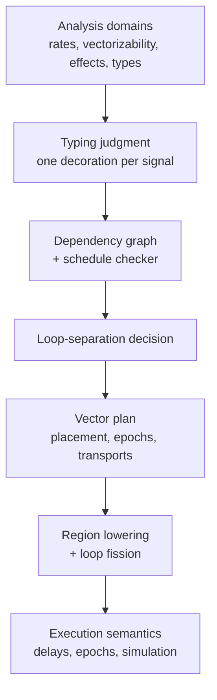

**Date:** 2026-07-11

**Audience:** a reader who wants to understand *what the formal specification is
for* and *how to read it*, without following every proof.

**Describes:**
[`vector-mode-scheduling-formal-spec.lean`](../porting/vector-mode-scheduling-formal-spec.lean).

**Companions:** the porting plan
[`vector-mode-signal-level-analysis-cpp-port-plan-2026-07-10-en.md`](../porting/vector-mode-signal-level-analysis-cpp-port-plan-2026-07-10-en.md)
and the gentle overview
[`vector-scheduling-synthesis-en.md`](vector-scheduling-synthesis-en.md).

::: toc+
- **What this file is (and is not)** — a machine-checked contract, not a full proof.
- **The one reading key** — executable checks vs. contracts vs. proofs.
- **A guided tour of the layers** — what each part captures and why.
- **The trust mechanism** — certificates that carry their own proof.
- **Proven vs. promised** — an honest ledger.
- **How it connects to Rust** — the specification as an acceptance gate.
:::

## 1. What this file is (and is not)

The `.lean` file is a **precise, machine-checked description** of the finite,
structural invariants that the vector-mode compiler must respect: what a valid
execution order is, what a well-formed vector plan is, what a correctly typed
cross-loop transport is, and so on. Lean checks that every statement is
well-formed and that every claimed proof genuinely holds.

::: important [The scope in one sentence]
It is **not** a proof that the whole Faust compiler is correct. It pins down the
*meaning* of the compiler's key decisions and proves a small, carefully chosen
set of them. The rest are written down as explicit *obligations* — promises the
implementation must later keep.
:::

Two properties make the file trustworthy as a reference:

- it contains **no `sorry`** (no unfinished proof) and **no `axiom`** (nothing
  assumed true without proof) — so nothing is quietly taken for granted;
- every `theorem` in it is accepted by Lean's kernel, the small trusted core that
  re-checks each proof step.

## 2. The one reading key

Lean lets you write *programs* and *statements* in the same language. The single
most useful thing to know before opening the file is how to tell them apart.

| You see…                                   | It means…                                                |
| :----------------------------------------- | :------------------------------------------------------- |
| `def … : Bool` (name often ends in **B**)  | an **executable check** — you can actually run it        |
| `def … : Prop`                             | a **contract / statement** — something to be proven      |
| `theorem …`                                | a **finished proof** of such a statement                 |
| a proof-valued **field** in a structure    | an **obligation**: you cannot build the value without it |

So `verifyScheduleB`-style definitions *compute* a yes/no answer, while
`ValidSchedule`, `VSimulation` or `FissionSafe` *state* what should be true. A
`theorem` closes the gap for the easy cases; an obligation leaves it open for the
hard ones — visibly, on purpose.

::: note [One convention that prevents real bugs]
Every dependency edge is oriented **consumer → dependency**: an edge `u → v` means
"`u` needs `v`, so `v` must run first". The file never uses `from`/`to` because
those words repeatedly caused direction mistakes. Keep this in mind everywhere.
:::

## 3. A guided tour of the layers

The file builds up in layers, each one consuming the previous. You can read any
layer for its intent without descending into its proofs.



### 3.1 Analysis domains — the vocabulary

Small enumerations with a "combine" operation. Two examples:

- **Rate** — how fast a value varies: `Konst < Block < Samp`. Combining two
  operands takes the faster rate.
- **Vectorizability** — how freely a value can be block-computed:
  `Vect < Scal < TrueScal`, a parent inheriting the strongest restriction.

*At stake:* these must combine consistently no matter how operands are grouped.
The file **proves** the algebraic laws (commutativity, associativity,
idempotence) that guarantee it.

Alongside sit the **effects** — reads/writes of state, tables, UI, outputs, and
foreign calls with a purity tag. A conservative `conflicts` test says when two
effects must keep their order; it is **proven symmetric**, because the whole
"these two loops commute" reasoning depends on that symmetry.

### 3.2 Typing judgment — one honest label per signal

A miniature signal language (`Expr`) with a typing relation `HasType` that attaches
to each expression a **decoration**: its type, rate, vectorizability, clock, and
effects — bundled so later passes cannot make locally inconsistent decisions. A
representative rule reads:

```inference (T-DELAY)
Γ ⊢ x : τ @ r [c]; Γ ⊢ n : Int @ rₙ [c]
---
Γ ⊢ Delay(x, n) : τ @ (r ⊔ rₙ) [c] ! {ReadState, WriteState}
```

*At stake:* the porting plan claims each signal has **exactly one** decoration.
The file **proves** this (`hasType_functional`) — earlier it was false because
literals carried a free clock; now base signals live in a fixed root clock and
only an explicit `clocked` node changes it.

### 3.3 Dependency graph + schedule checker — the heart

A finite graph plus a tiny checker that answers "is this order valid?" — every
dependency before its consumer, and the order a duplicate-free permutation of the
nodes.

*At stake:* a checker is only trustworthy if "accepts" really means "valid". The
file defines validity **independently** of the checker (`ValidScheduleRel`) and
**proves the checker sound and complete** against it (`validScheduleB_iff`,
`verifySchedule_sound`, `verifySchedule_complete`). This is what lets a small,
obviously-correct checker validate the output of a large, optimized scheduler
*without re-running it*.

The four public `-ss` strategies appear here only as tags; a `Scheduler`
structure states the obligations any real scheduler must meet (sound, complete,
deterministic, terminating).

### 3.4 Loop-separation decision — a fragile ordered rule

`separateLoop` reproduces the exact C++ priority order deciding whether a signal
gets its own loop (a delayed use forces a loop, a very simple or slow value stays
inline, and so on — first match wins).

*At stake:* this is the single most regression-prone parity point. The file
**proves an exhaustive characterization** (`separateLoop_complete`) so the Rust
port can be checked against it case by case.

### 3.5 Vector plan — the strategy-independent blueprint

`VectorPlan` is the central object: for each signal a **placement**
(`Owned`/`Inline`/`Control`), for each loop a kind, plus epochs, typed transports,
and data/effect edges. Its construction invariants are **proof fields**: an inline
signal must be duplicable, ownership and roots must agree, and so on — so an
ill-formed plan cannot even be built.

::: important [A guarantee encoded in a type]
`VectorPlan` has **no scheduling-strategy field**. That absence is the machine-
enforced statement of "changing `-ss` cannot change the plan". It is impossible,
not merely intended.
:::

Duplicability and vectorization-safety are **defined** from the signals' effects
and vectorizability (not left as blank predicates), so the corresponding
guarantees have real content rather than being vacuously true.

A `VectorPlanCertificate` then gathers the finite gate before code generation:
unique ids, epochs covering all loops, every edge endpoint present, each per-epoch
graph acyclic, transports well typed, epoch order respected.

### 3.6 Lowering and fission — where blocks are allowed

Four rewrite cases turn a placed signal into code (inline / local / cross-loop /
control), each carrying two obligations: effects emitted **exactly once**, and
storage **never changing the value bits**.

*At stake:* the legality of the whole "turn per-sample loops into per-node loops"
transformation reduces to one implication — that a finite, checkable set of static
facts (`StaticFissionSafe`) implies the true dynamic safety (`FissionSafe`). The
file **states this as an obligation**, not an assumed fact: it is the crux and it
is deliberately left open.

### 3.7 Execution semantics — what "same sound" means

Abstract, backend-neutral models of delays (`delayRead`, `historyStep`),
step-by-step running (`iterate`), and execution results (outputs + final state +
observations). On top of them:

- **VSimulation** — the main correctness statement: vector execution equals scalar
  execution, for every chunk size and loop variant, *for valid schedules*. (The
  validity premise was missing in an early draft, which made the statement
  unprovably strong; it is now stated correctly.)
- **ScheduleIndependent** — any two valid orders yield the same observations.

*At stake:* these are the properties a listener would care about. They are
**stated precisely** and left as obligations, to be discharged for now by
differential testing.

## 4. The trust mechanism

The design idea (spelled out in the porting plan) is that **checking is easier
than producing** — like verifying a filled sudoku versus solving it. Lean makes
this concrete in two ways.

- **Certificates that carry their own proof.** A `ScheduleCertificate` has a field
  `valid : ValidSchedule …`. You literally cannot construct the certificate value
  unless you supply a proof that the order is valid. Illegal states are
  unrepresentable.
- **Producer/checker separation.** The checkers traverse a finite snapshot and
  never call the scheduling or planning algorithm. A bug in the (complex) producer
  cannot hide behind the (simple) checker.

At the bottom sit the `#guard` lines: executable assertions that fail compilation
if edge direction, strategy decoding, or the separation rule ever drift.

## 5. Proven vs. promised — an honest ledger

| Proven (machine-checked `theorem`s)                               | Promised (`Prop` obligations, not yet proven) |
| :---------------------------------------------------------------- | :-------------------------------------------- |
| lattice laws for rate and vectorizability                         | `StaticFissionSafe ⇒ FissionSafe`             |
| symmetry of effect conflict                                       | `VSimulation` (scalar = vector)               |
| typing assigns one decoration (`hasType_functional`)              | `ScheduleIndependent`                         |
| schedule checker sound **and** complete (`validScheduleB_iff`)    | `Scheduler` soundness/completeness            |
| transport index stays in bounds (`chunkIndex_lt`)                 | delay/recursion/clock/AD refinements          |
| exhaustive separation rule (`separateLoop_complete`)              | —                                             |

The pattern is deliberate: the small, reusable, adversarial-input-facing pieces
are proven; the deep semantic equivalences are stated and, for now, tested.

## 6. How it connects to Rust

The Lean file is the **normative meaning** behind a chain of runtime checks in the
Rust compiler. Each critical phase emits a finite certificate; a small Rust checker
must accept it before the next phase runs, and the same certificate can be re-checked
by an executable Lean reference. If a check fails, compilation stops (fail-closed) —
no backend ever sees code derived from a rejected plan.

::: caution [Read it for the shape, not the finish line]
Treat the specification as a *map of the invariants* and a *proof of the small
checkers*, not as a certificate that the compiler is correct. Its value today is
that it makes every important claim precise and every remaining obligation
visible.
:::
