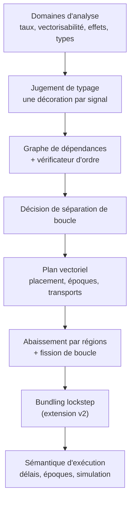

**Date :** 2026-07-11

**Public :** un lecteur qui veut comprendre *à quoi sert* la spécification
formelle et *comment la lire*, sans suivre chaque preuve.

**Décrit :**
[`vector-mode-scheduling-formal-spec.lean`](../porting/vector-mode-scheduling-formal-spec.lean).

**Documents liés :** le plan de portage
[`vector-mode-signal-level-analysis-cpp-port-plan-2026-07-10-en.md`](../porting/vector-mode-signal-level-analysis-cpp-port-plan-2026-07-10-en.md)
et la synthèse pédagogique
[`vector-scheduling-synthesis-fr.md`](vector-scheduling-synthesis-fr.md).

::: toc+
- **Ce qu'est ce fichier (et ce qu'il n'est pas)** — un contrat vérifié, pas une preuve complète.
- **La seule clé de lecture** — vérifications exécutables vs contrats vs preuves.
- **Visite guidée des couches** — ce que chaque partie capture et pourquoi.
- **Le mécanisme de confiance** — des certificats qui portent leur preuve.
- **Prouvé vs promis** — un bilan honnête.
- **Le lien avec Rust** — la spécification comme porte d'acceptation.
:::

## 1. Ce qu'est ce fichier (et ce qu'il n'est pas)

Le fichier `.lean` est une **description précise et vérifiée par machine** des
invariants finis et structurels que le compilateur en mode vectoriel doit
respecter : ce qu'est un ordre d'exécution valide, un plan vectoriel bien formé,
un transport inter-boucles correctement typé, etc. Lean vérifie que chaque énoncé
est bien formé et que chaque preuve annoncée tient réellement.

::: important [Le périmètre en une phrase]
Ce n'est **pas** une preuve que tout le compilateur Faust est correct. Le fichier
fixe le *sens* des décisions clés du compilateur et en prouve un petit ensemble
soigneusement choisi. Le reste est écrit comme des *obligations* explicites — des
promesses que l'implémentation devra tenir plus tard.
:::

Deux propriétés rendent le fichier fiable comme référence :

- il ne contient **aucun `sorry`** (aucune preuve inachevée) et **aucun `axiom`**
  (rien admis vrai sans preuve) — donc rien n'est tenu pour acquis en douce ;
- chaque `theorem` est accepté par le noyau de Lean, le petit cœur de confiance
  qui re-vérifie chaque pas de preuve.

## 2. La seule clé de lecture

Lean permet d'écrire des *programmes* et des *énoncés* dans le même langage. La
chose la plus utile à savoir avant d'ouvrir le fichier est de les distinguer.

| Vous voyez…                                   | Cela signifie…                                                    |
| :-------------------------------------------- | :--------------------------------------------------------------- |
| `def … : Bool` (nom finissant souvent par **B**) | une **vérification exécutable** — on peut vraiment la lancer     |
| `def … : Prop`                                | un **contrat / énoncé** — quelque chose à prouver                |
| `theorem …`                                   | une **preuve terminée** d'un tel énoncé                          |
| un **champ** à valeur de preuve dans une structure | une **obligation** : on ne peut pas construire la valeur sans elle |

Ainsi, les définitions du genre `verifyScheduleB` *calculent* un oui/non, tandis
que `ValidSchedule`, `VSimulation` ou `FissionSafe` *énoncent* ce qui devrait être
vrai. Un `theorem` comble l'écart pour les cas faciles ; une obligation le laisse
ouvert pour les cas difficiles — visiblement, et à dessein.

::: note [Une convention qui évite de vrais bugs]
Chaque arête de dépendance est orientée **consommateur → dépendance** : une arête
`u → v` signifie « `u` a besoin de `v`, donc `v` doit s'exécuter d'abord ». Le
fichier n'utilise jamais `from`/`to`, car ces mots ont provoqué des erreurs de
sens à répétition. À garder en tête partout.
:::

## 3. Visite guidée des couches

Le fichier se construit en couches, chacune consommant la précédente. On peut lire
chaque couche pour son intention sans descendre dans ses preuves.



### 3.1 Domaines d'analyse — le vocabulaire

De petites énumérations munies d'une opération « combiner ». Deux exemples :

- **Taux (Rate)** — à quelle vitesse une valeur varie : `Konst < Block < Samp`.
  Combiner deux opérandes prend le taux le plus rapide.
- **Vectorisabilité** — avec quelle liberté une valeur peut être calculée par
  blocs : `Vect < Scal < TrueScal`, un parent héritant de la restriction la plus
  forte.

*Enjeu :* ces domaines doivent se combiner de façon cohérente quel que soit le
regroupement des opérandes. Le fichier **prouve** les lois algébriques
(commutativité, associativité, idempotence) qui le garantissent.

À côté vivent les **effets** — lectures/écritures d'état, de tables, d'interface,
de sorties, et appels externes avec une étiquette de pureté. Un test conservateur
`conflicts` dit quand deux effets doivent garder leur ordre ; il est **prouvé
symétrique**, car tout le raisonnement « ces deux boucles commutent » en dépend.

### 3.2 Jugement de typage — une étiquette honnête par signal

Un langage de signaux miniature (`Expr`) avec une relation de typage `HasType` qui
attache à chaque expression une **décoration** : type, taux, vectorisabilité,
horloge et effets — regroupés pour que les passes suivantes ne prennent pas de
décisions localement incohérentes. Une règle représentative se lit :

```inference (T-DELAY)
Γ ⊢ x : τ @ r [c]; Γ ⊢ n : Int @ rₙ [c]
---
Γ ⊢ Delay(x, n) : τ @ (r ⊔ rₙ) [c] ! {ReadState, WriteState}
```

*Enjeu :* le plan de portage affirme que chaque signal a **exactement une**
décoration. Le fichier le **prouve** (`hasType_functional`) — c'était faux
auparavant, car les littéraux portaient une horloge libre ; désormais les signaux
de base vivent dans une horloge racine fixe et seul un nœud `clocked` explicite la
change.

### 3.3 Graphe de dépendances + vérificateur d'ordre — le cœur

Un graphe fini plus un petit vérificateur qui répond « cet ordre est-il valide ? »
— chaque dépendance avant son consommateur, et l'ordre est une permutation sans
doublon des nœuds.

*Enjeu :* un vérificateur n'est fiable que si « accepte » veut vraiment dire
« valide ». Le fichier définit la validité **indépendamment** du vérificateur
(`ValidScheduleRel`) et **prouve le vérificateur correct et complet** vis-à-vis
d'elle (`validScheduleB_iff`, `verifySchedule_sound`, `verifySchedule_complete`).
C'est ce qui permet à un petit vérificateur manifestement correct de valider la
sortie d'un ordonnanceur gros et optimisé *sans le rejouer*.

Les quatre stratégies publiques `-ss` n'apparaissent ici que comme étiquettes ;
une structure `Scheduler` énonce les obligations que tout vrai ordonnanceur doit
remplir (correct, complet, déterministe, terminant).

### 3.4 Décision de séparation de boucle — une règle ordonnée fragile

`separateLoop` reproduit l'ordre de priorité exact du C++ décidant si un signal
obtient sa propre boucle (un usage retardé force une boucle, une valeur très
simple ou lente reste en ligne, etc. — la première ligne qui correspond gagne).

*Enjeu :* c'est le point de parité le plus sujet aux régressions. Le fichier
**prouve une caractérisation exhaustive** (`separateLoop_complete`) pour que le
portage Rust puisse être vérifié cas par cas.

### 3.5 Plan vectoriel — le schéma indépendant de la stratégie

`VectorPlan` est l'objet central : pour chaque signal un **placement**
(`Owned`/`Inline`/`Control`), pour chaque boucle un genre, plus des époques, des
transports typés et des arêtes de données/effets. Ses invariants de construction
sont des **champs de preuve** : un signal en ligne doit être duplicable,
propriété et racines doivent concorder, etc. — un plan mal formé ne peut même pas
être construit.

::: important [Une garantie encodée dans un type]
`VectorPlan` n'a **aucun champ de stratégie d'ordonnancement**. Cette absence est
l'énoncé, imposé par la machine, de « changer `-ss` ne peut pas changer le plan ».
C'est impossible, pas seulement souhaité.
:::

La duplicabilité et la sûreté de vectorisation sont **définies** à partir des
effets et de la vectorisabilité des signaux (et non laissées comme prédicats
vides), afin que les garanties correspondantes aient un contenu réel plutôt
qu'être vraies de façon vacante.

Un `VectorPlanCertificate` rassemble ensuite la porte finie avant génération de
code : identités uniques, époques couvrant toutes les boucles, chaque extrémité
d'arête présente, chaque graphe par époque acyclique, transports bien typés, ordre
des époques respecté.

### 3.6 Abaissement et fission — là où les blocs sont permis

Quatre cas de réécriture transforment un signal placé en code (en ligne / local /
inter-boucles / contrôle), chacun portant deux obligations : effets émis
**exactement une fois**, et le stockage **ne change jamais les bits** de la
valeur.

*Enjeu :* la légalité de toute la transformation « passer de boucles par
échantillon à des boucles par nœud » se réduit à une implication — qu'un ensemble
fini et vérifiable de faits statiques (`StaticFissionSafe`) implique la vraie
sûreté dynamique (`FissionSafe`). Le fichier l'**énonce comme une obligation**,
pas comme un fait admis : c'est le point crucial, et il est délibérément laissé
ouvert.

### 3.7 Bundling lockstep — accélérer la récursion à travers les instances

La vectorisation temporelle laisse les boucles récursives sérielles ; la
spécification couvre donc aussi l'extension **lockstep** planifiée : k boucles
sérielles structurellement identiques et mutuellement indépendantes, exécutées
ensemble, une lane SIMD par instance. Trois ajouts, tous locaux :

- `Expr.shape` efface exactement les charges des feuilles (valeurs littérales,
  canaux d'entrée, ressources d'état). L'isomorphisme *est* l'égalité des
  formes — réflexivité, symétrie et transitivité sont donc gratuites, et le
  vérificateur exécutable `isoB` décide simplement l'égalité de formes (la
  référence pour le détecteur Rust par hash de forme).
- Un quatrième genre de boucle, `lockstep (width)` : sériel dans le temps,
  parallèle à travers les lanes — délibérément ni `vectorizable`, ni
  simplement `recursive`.
- `LockstepObligations`, la porte finie pour un bundle : au moins deux lanes,
  sans doublon, chaque lane dans le plan, et deux à deux — aucun chemin de
  dépendance dans un sens ou l'autre, effets qui commutent, même époque.

*Enjeu :* deux choses, une de chaque nature. **Prouvé** :
`iso_decorations_agree` — des lanes isomorphes reçoivent le même type de
valeur, le même taux, la même vectorisabilité et la même horloge, ce qui
permet à un bundle de partager un seul type d'élément de transport et un seul
placement (les effets sont volontairement exclus : chaque lane possède son
état, et la commutation s'en charge). **Énoncé** : `LockstepSafe` est
*littéralement* `FissionSafe` avec l'ordre lockstep substitué — l'extension
n'introduit aucun nouvel axiome sémantique ; ses prémisses sont celles que le
fichier exige déjà.

### 3.8 Sémantique d'exécution — ce que veut dire « le même son »

Des modèles abstraits, indépendants du backend, des délais (`delayRead`,
`historyStep`), de l'exécution pas à pas (`iterate`) et des résultats d'exécution
(sorties + état final + observations). Par-dessus :

- **VSimulation** — l'énoncé de correction principal : l'exécution vectorielle
  égale l'exécution scalaire, pour toute taille de bloc et variante de boucle,
  *pour des ordres valides*. (La prémisse de validité manquait dans une première
  version, ce qui rendait l'énoncé trop fort pour être prouvable ; elle est
  maintenant correctement posée.)
- **ScheduleIndependent** — deux ordres valides quelconques donnent les mêmes
  observations.

*Enjeu :* ce sont les propriétés qui comptent pour un auditeur. Elles sont
**énoncées précisément** et laissées comme obligations, à décharger pour l'instant
par tests différentiels.

## 4. Le mécanisme de confiance

L'idée de conception (détaillée dans le plan de portage) est que **vérifier est
plus facile que produire** — comme vérifier un sudoku rempli plutôt que le
résoudre. Lean la concrétise de deux façons.

- **Des certificats qui portent leur propre preuve.** Un `ScheduleCertificate` a
  un champ `valid : ValidSchedule …`. On ne peut littéralement pas construire la
  valeur du certificat sans fournir une preuve que l'ordre est valide. Les états
  illégaux sont non représentables.
- **Séparation producteur/vérificateur.** Les vérificateurs parcourent un
  instantané fini et n'appellent jamais l'algorithme d'ordonnancement ou de
  planification. Un bug du producteur (compliqué) ne peut pas se cacher derrière
  le vérificateur (simple).

Tout en bas se trouvent les lignes `#guard` : des assertions exécutables qui font
échouer la compilation si la direction des arêtes, le décodage de stratégie ou la
règle de séparation venaient à dériver.

## 5. Prouvé vs promis — un bilan honnête

| Prouvé (`theorem`s vérifiés par machine)                          | Promis (obligations `Prop`, pas encore prouvées) |
| :---------------------------------------------------------------- | :----------------------------------------------- |
| lois de treillis pour le taux et la vectorisabilité               | `StaticFissionSafe ⇒ FissionSafe`                |
| symétrie du conflit d'effets                                       | `VSimulation` (scalaire = vectoriel)             |
| le typage attribue une décoration (`hasType_functional`)          | `ScheduleIndependent`                            |
| vérificateur d'ordre correct **et** complet (`validScheduleB_iff`)| correction/complétude de `Scheduler`             |
| l'indice de transport reste borné (`chunkIndex_lt`)               | raffinements délais/récursion/horloge/AD         |
| règle de séparation exhaustive (`separateLoop_complete`)          | `LockstepSafe` (une instance de `FissionSafe`)   |
| lanes isomorphes : mêmes type/taux/vectorisabilité/horloge (`iso_decorations_agree`) | —                             |

Le motif est délibéré : les petits morceaux réutilisables et exposés à des entrées
adverses sont prouvés ; les équivalences sémantiques profondes sont énoncées et,
pour l'instant, testées.

## 6. Le lien avec Rust

Le fichier Lean est le **sens normatif** derrière une chaîne de vérifications à
l'exécution dans le compilateur Rust. Chaque phase critique émet un certificat
fini ; un petit vérificateur Rust doit l'accepter avant que la phase suivante ne
s'exécute, et le même certificat peut être re-vérifié par une référence Lean
exécutable. Si une vérification échoue, la compilation s'arrête (« fail-closed »)
— aucun backend ne voit de code dérivé d'un plan rejeté.

::: caution [Le lire pour la forme, pas pour la ligne d'arrivée]
Traitez la spécification comme une *carte des invariants* et une *preuve des
petits vérificateurs*, pas comme un certificat que le compilateur est correct. Sa
valeur aujourd'hui est de rendre chaque affirmation importante précise et chaque
obligation restante visible.
:::
