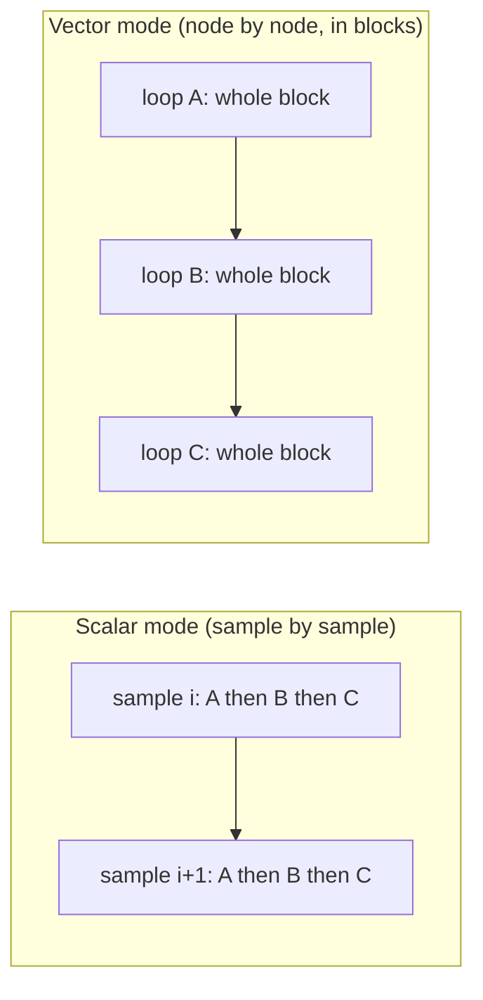
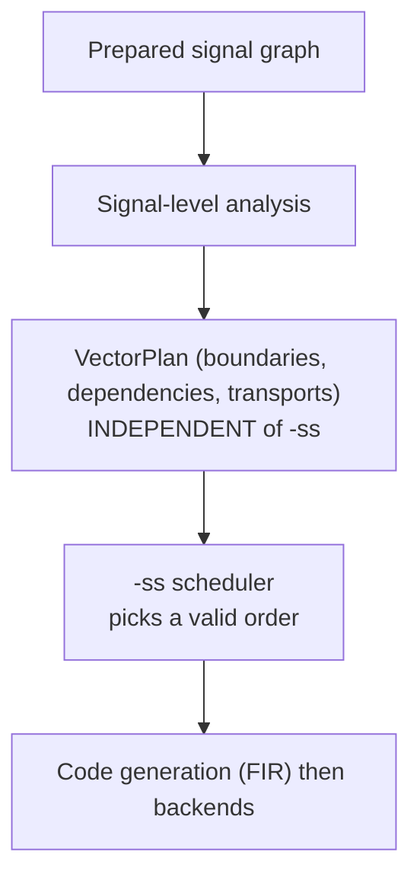
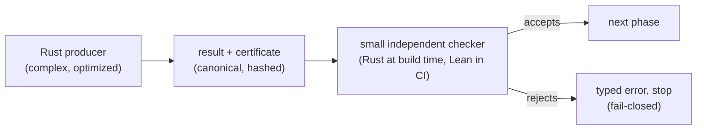

**Date:** 2026-07-11

**Audience:** a curious reader, not necessarily a compiler specialist.

**Reference document:**
[`vector-mode-signal-level-analysis-cpp-port-plan-2026-07-10-en.md`](../porting/vector-mode-signal-level-analysis-cpp-port-plan-2026-07-10-en.md).

**Goal:** explain, without the formalism of the porting plan, *why* scheduling is
needed, how it fits with vectorization, multi-rate clock domains (OD/US/DS) and
automatic differentiation (FAD/RAD), and *what the Lean model is for*.

::: toc+
- **What is this about?** — the Faust compiler from a distance.
- **Why scheduling matters** — the order of computations counts.
- **Vectorization** — computing in blocks, and what it breaks.
- **The key idea: plan, then schedule** — two separate decisions.
- **Signal placement** — who owns what.
- **Multi-rate (OD/US/DS)** — when not everyone runs at the same speed.
- **FAD and RAD** — differentiating an audio signal.
- **Why model in Lean?** — from confidence to proof.
- **The method: write in Rust, verify in Lean** — producer, certificate, checker.
- **Takeaways** — the one-page map.
:::

## 1. What is this about?

Faust is a language for describing sound processing (filters, echoes,
synthesizers…). The programmer writes a formula; the compiler turns it into fast
code (C, C++, WebAssembly, machine code…).

In between, the program is not a list of instructions: it is a **signal graph**.
Each node is a small value that evolves over time ("the oscillator's output",
"the mic input", "the sum of the two"). The arrows say who needs whom.

::: definition [Signal graph]
A network of audio values connected by dependencies. Compiling means deciding
*in which order* and *inside which loop shape* to evaluate those values for each
audio sample — typically 48,000 times per second.
:::

The whole subject of the reference document is this translation: how to go from
the signal graph to efficient **loops** of code without ever changing the sound.

## 2. Why scheduling matters

Scheduling means **choosing the order** in which nodes are evaluated. The rule is
simple: a value must be computed **before** anything that uses it.

Take a mix: `d = (a + b) * c`. You cannot compute `d` before `a + b`. Yet many
orders remain valid — you can compute `a` then `b`, or `b` then `a`; you can
group independent computations differently. Every valid order produces **the same
sound**, but not the same performance: some keep fewer variables "live" at once,
others give better memory locality.

That is exactly the role of the `-ss` option (scheduling strategy): it picks
**among the valid orders**. faust-rs unifies four classic strategies behind a
single option.

| `-ss` | Name               | Intuition                                                 |
| :---: | :----------------- | :------------------------------------------------------- |
| `0`   | depth-first (DFS)  | finish one dependency chain before starting the next     |
| `1`   | breadth-first (BFS)| process nodes in "levels" from the leaves                |
| `2`   | special            | interleave independent branches                          |
| `3+`  | reverse breadth    | levels measured from the outputs, then reversed          |

::: important [The point to remember]
Changing `-ss` changes the **order** of computations, never **which**
computations happen, nor the sound. It is a performance knob, not a semantic one.
:::

## 3. Vectorization

By default (scalar mode) the compiler computes one sample at a time: on each turn
of the loop, all nodes produce their value, then it moves to the next sample.

**Vector mode** (`-vec`) flips the loop: instead of "for each sample, compute all
nodes", it does "for each node, compute a **block** of several samples at once".
On a block, the processor can apply the same operation to several samples in
parallel (SIMD), which is faster.



This flip is called **loop fission**: the big "per-sample" loop is split into
several "per-node" loops. It is great for speed, but it does not always work.
Two obstacles:

- **Feedback (recursion).** Consider a counter `y[n] = 1 + y[n−1]`:

  ```bda "Recursive signal: a counter"
  1 : +~_
  ```

  To compute sample `n`, you must *already* know `n−1`. You cannot produce a whole
  block "in parallel": the value propagates sample by sample. Such a signal must
  stay in a **serial loop**.

- **Side effects.** Writing to a table, to a UI zone, or calling an external
  function whose behavior is unknown: reordering these operations could change the
  observable result. Until you have proven they "commute" (that they can be
  swapped harmlessly), you keep them in order.

When a value computed in one loop is used in **another** loop, you need a
**transport**: a small array holding the block produced by the first loop so the
second can read it back. That is the price of fission — hence the importance,
later, of a model that records *all* the transports needed.

::: note [Why it isn't free]
Vectorization only speeds things up if the SIMD gain beats the cost of the
transport arrays. Measurements in the plan show cases at `0.92×` (slower!) and
others at `1.15×`. Systematic separation is therefore not always profitable, and
the compiler must eventually decide case by case.
:::

### The other direction: stacking instances (lockstep)

Block computation fails on recursion — but there is a second, complementary
direction. Picture **four identical filters** (say four biquads) on four
separate outputs. Each one is recursive, so none can be block-computed in time.
Yet the four are independent of each other and perform *the same* operations:
at every instant, the processor can execute the four state updates with **one
SIMD instruction** — one lane per filter, all four advancing sample by sample
together, in *lockstep*.

This is not a new theory: bundling k loops this way is legal under exactly the
rules already stated — no dependency between them, commuting effects, same
clock and phase — plus one new check: their structures must be *identical up to
the leaves* (inputs, coefficients, states). And each lane runs exactly its
scalar instruction sequence, so the output stays **bit-for-bit identical**.

Measured on 4 independent biquads (Apple M1): **~3.7× faster** than four
separate loops, bit-exact, without even writing SIMD by hand — merely fusing
the four loops lets the C compiler vectorize them — and 4.5× with explicit
SIMD. The audio buffers keep their usual non-interleaved layout: the
interleaving lives only inside the bundle. Filter banks, `par(i, N, f)`
constructs, multichannel processing, and multi-parameter FAD derivatives are
the natural beneficiaries.

## 4. The key idea: plan, *then* schedule

The heart of the proposal fits in one sentence: **deciding where the loop
boundaries are is one thing; deciding in which order to run the loops is
another.** The document separates the two strictly.

1. A **signal-level analysis** produces a *plan*: which loops exist, who depends
   on whom, which transports are needed. This plan is **independent of `-ss`**.
2. Only then does the **scheduler** (`-ss`) serialize the plan's loop graph.



::: important [The structural guarantee]
The plan (`VectorPlan`) does **not** contain the scheduling strategy. Changing
`-ss` therefore cannot alter loop boundaries, identities, transports or names. It
is a guarantee *by construction*: `-ss` only acts on the order, never on the
structure.
:::

Why insist? Because the historical C++ version discovered loop boundaries *during*
low-level code generation, reconstructing dependencies that were already explicit
in the signal graph. That is fragile and hard to test. faust-rs moves the
decision back up **to the level where the information still exists**.

## 5. Signal placement

To build the plan, each signal receives a **placement** — an answer to "who owns
this computation?". Only three cases:

::: definition [The three placements]
- **Owned** — the signal has **one** unique producing loop. Its value is
  materialized (stored in memory) there.
- **Inline** — the signal is too simple to deserve its own loop; it is
  **recomputed in place** in every loop that needs it. It therefore has no unique
  owner.
- **Control** — the signal changes slowly (a slider setting); it is computed
  once, in a "control" region, before the audio loops.
:::

The *Inline* case is subtle and important: the same small computation (e.g.
`2 * x`) can appear, copied, in several loops. Forcing it into **one** unique loop
would be a mistake — indeed a flaw of the current prototype. A signal is only
inlineable if it is **duplicable**: recomputing it elsewhere yields exactly the
same result, which requires it to have no side effect and no read of mutable
state.

## 6. Multi-rate (OD/US/DS)

So far everyone moved at the same speed: one output sample per input sample. But
Faust allows **clock domains** where the rate changes:

::: definition [Three families of domains]
- **DS — downsampling** — the domain produces **fewer** samples (e.g. a slow
  computation refreshed only one time in four).
- **US — upsampling** — the domain produces **more** samples (e.g. to process
  finely before decimating again).
- **OD — ondemand** — the domain computes **only when a trigger signal asks for
  it** (zero, one, or several times per outer sample).
:::

These rate boundaries are semantic barriers: you cannot freely mix computations
that do not advance at the same rhythm. In the plan, each OD/US/DS boundary
becomes a **serial island** — a region that keeps its internal order and is not
scattered by fission. Only the main-rate signals, around the island, can be
vectorized in blocks.

In other words: vectorization applies **within a single rhythm**; rate changes
are walls to respect.

## 7. FAD and RAD: differentiating an audio signal

Faust can compute **derivatives** of signals (useful for learning, automatic
filter tuning, differentiable DSP). Two modes, two very different behaviors with
respect to vectorization.

::: definition [Two ways to differentiate]
- **FAD — forward** — the derivative is propagated *at the same time* as the
  signal, point by point, forward in time. Once this transformation is done, a
  FAD derivative is **just another signal**.
- **RAD — reverse** — a *forward* pass first computes the signal and records a
  "tape", then a *backward* pass goes back in time to accumulate gradients.
:::

The consequence is direct:

- **FAD vectorizes** like everything else, because it stays a point-by-point
  forward-in-time computation.
- **RAD stays serial** for now: its backward pass walks time in reverse, which
  does not yet fit the block computation model (which moves forward). This is an
  acknowledged limitation, flagged by an explicit diagnostic.

This introduces the notion of an **epoch**: a fixed, ordered phase of the
computation. "Forward pass" then "backward pass" are two epochs, in that
**mandatory** order.

::: important [Epochs vs scheduling]
`-ss` may reorder the loops **inside** an epoch, but may **never** swap epochs:
the forward pass must precede the backward pass, constants must precede
computations, and so on. Epochs are constraints; the internal order is a
preference.
:::

## 8. Why model in Lean?

All of these choices — loop boundaries, transports, effect ordering, islands,
epochs — are **invisible in the sound**. A scheduling bug does not crash: it
*silently* produces a slightly wrong sound. That is exactly the kind of error we
want to make **detectable**.

The chosen idea rests on a general observation: it is often far easier to
**check** an answer than to **produce** it.

::: note [The sudoku analogy]
Solving a sudoku is hard; checking that a filled grid is correct is trivial.
Likewise, the algorithm that builds a schedule may be complex and optimized; but
**checking** that a given order respects all dependencies is simple and safe.
:::

The plan applies this idea to every critical phase:

1. the (complex) algorithm produces a result **plus** a **certificate** — a
   finite description of what it decided;
2. a **small independent checker** re-reads the certificate and accepts or rejects
   it, without ever re-running the algorithm;
3. if the checker refuses, compilation **stops** before the next stage
   ("fail-closed") — no code is produced from a dubious plan.

This is where **Lean**, a proof assistant, comes in. It serves two purposes:

- **Give a precise mathematical meaning** to the checks. The Lean file
  unambiguously defines what "valid schedule", "correct vector plan" and
  "well-typed transport" mean. That text becomes the reference.
- **Prove, once and for all**, that the small checkers do what we think — for
  example that "the order checker accepts a list if and only if it is genuinely a
  valid topological order".

The plan honestly distinguishes several **assurance levels**:

| Level | What it guarantees                                                       |
| :---: | :---------------------------------------------------------------------- |
| L1    | tested (unit tests, differential comparison against C++)                |
| L2    | a result is **rejected** unless it passes a Rust checker                 |
| L3    | the same certificate is also accepted by the Lean checker (in CI)       |
| L4    | a selected Rust function is **proven** correct against Lean             |

::: caution [Specifying is not proving]
Today, Lean **specifies** everything precisely and **proves** the small checkers
(scheduling, transport index bounds, symmetry of effect conflicts, determinism of
typing). The big property — "vector mode produces exactly the same sound as
scalar mode" — is still guaranteed by **differential testing** (bit-for-bit
scalar / vector / C++ comparison), not yet by a proof. This is a deliberate
engineering choice: secure the small, reusable boundaries first.
:::

## 9. The method: write in Rust, verify in Lean

The companion plan
([`../porting/lean-rust-certified-porting-plan-2026-07-11-en.md`](../porting/lean-rust-certified-porting-plan-2026-07-11-en.md))
describes *how* to build all this incrementally. Its guiding idea is to
**separate the code that produces a result from the code that checks it**.

::: definition [The producer → certificate → checker pattern]
Each critical phase works the same way: a (possibly complex, optimized) **Rust
producer** emits its result **plus a certificate** — a finite, canonical
description of what it decided. A **small independent checker** re-reads that
certificate and accepts or rejects it, **without re-running the producer**. On
rejection, compilation stops with a typed error (**fail-closed**).
:::



**A chain of certificates.** There is one certificate per boundary — decorations
(per-signal facts), schedule (a valid order), vector plan (loops, placement,
transports), routed FIR (generated code) — plus a *verification result*
recording who accepted what. Each is serialized to stable bytes with a SHA-256
hash, so it can be stored, compared, and re-checked; the hash binds a certificate
to *exactly* the object it describes (and, by design, changing `-ss` never changes
the plan's hash).

**Two checkers, one certificate.** The Rust checker gates the build at runtime;
the executable functions of the Lean file re-check the *same* artifact in CI.
Lean is the **normative oracle** — it defines what "valid" means — and
cross-language agreement is the goal.

**Four assurance levels, honestly named.** Every claim is graded on the L1–L4
scale of §8, and a lower level is never described as a proof of a higher one. A
precise vocabulary keeps this honest: *specified* (Lean has the definition),
*kernel-checked* (Lean proved a theorem or guard), *runtime-certified* (a Rust
checker accepted one result), *translation-validated* (independent runs agreed),
and *formally verified* (a stated refinement theorem with named assumptions) —
the last reserved, never assumed.

::: important [First a slice that works, then the scaffolding]
The order matters. Before building the full canonical-hashing, cross-platform,
four-strategy machinery, the plan requires **one** non-trivial DSP to run
end-to-end — prepared signals → plan → routed FIR → a real backend — **bit-exact
and genuinely vectorized**. Assurance follows a working execution; it does not
precede it.
:::

**Every check must know how to refuse.** A checker is not trusted until a concrete
mutation is shown to make it reject — a reversed edge, a wrong epoch rank, a
missing transport, a duplicated effect. A dedicated *vectorization-retention* gate
even rejects a plan that quietly serializes everything, so "correct but not
vectorized" cannot slip through unnoticed.

## 10. Takeaways

::: columns
**The decisions**

- Decide the **loops** at the **signal** level, not in low-level code.
- The **plan** is independent of `-ss`.
- `-ss` only picks an **order**, never the structure nor the sound.

---

**The constraints**

- Recursion and effects ⇒ **serial** loop.
- Identical independent recursions ⇒ **lockstep** SIMD lanes.
- Rate change (OD/US/DS) ⇒ serial **island**.
- FAD vectorizes; RAD stays **serial**.
- Forward pass **before** backward pass: mandatory **epoch** order.
:::

In one sentence: **plan the structure once, verifiably; then schedule freely,
without ever touching the sound.** Lean makes that "verifiably" precise and,
where realistic, proven.
