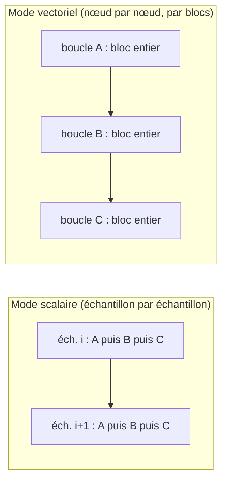
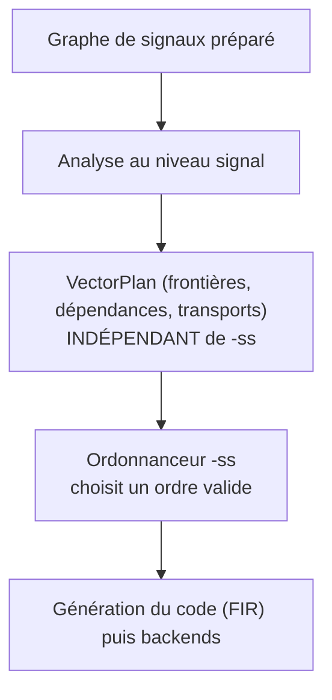
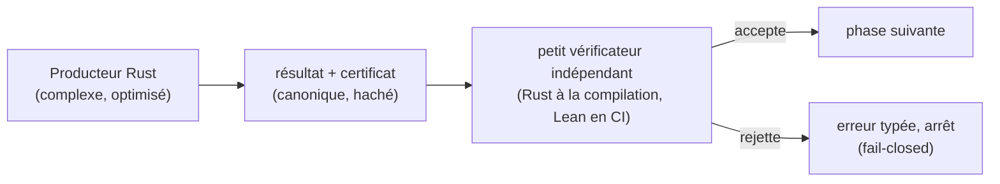

**Date :** 2026-07-11

**Public :** lecteur curieux, pas nécessairement spécialiste des compilateurs
audio.

**Document de référence :**
[`vector-mode-signal-level-analysis-cpp-port-plan-2026-07-10-en.md`](../porting/vector-mode-signal-level-analysis-cpp-port-plan-2026-07-10-en.md).

**But :** expliquer, sans le formalisme du plan de portage, *pourquoi* il faut
ordonnancer, comment cela s'articule avec la vectorisation, le multi-horloge
(OD/US/DS) et la différentiation automatique (FAD/RAD), et *à quoi sert* la
modélisation en Lean.

::: toc+
- **De quoi parle-t-on ?** — le compilateur Faust vu de loin.
- **L'enjeu de l'ordonnancement** — pourquoi l'ordre des calculs compte.
- **La vectorisation** — calculer par blocs, et ce que cela casse.
- **L'idée clé : planifier puis ordonnancer** — deux décisions séparées.
- **Le placement des signaux** — qui possède quoi.
- **Le multi-horloge (OD/US/DS)** — quand tout le monde ne va pas à la même vitesse.
- **FAD et RAD** — dériver un signal audio.
- **Pourquoi modéliser en Lean ?** — de la confiance à la preuve.
- **La méthode : écrire en Rust, vérifier en Lean** — producteur, certificat, vérificateur.
- **Ce qu'il faut retenir** — la carte en une page.
:::

## 1. De quoi parle-t-on ?

Faust est un langage pour décrire des traitements du son (filtres, échos,
synthétiseurs…). Le programmeur écrit une formule ; le compilateur la traduit en
code rapide (C, C++, WebAssembly, code machine…).

Entre les deux, le programme n'est pas une suite d'instructions : c'est un
**graphe de signaux**. Chaque nœud est une petite valeur qui évolue dans le
temps (« la sortie de l'oscillateur », « l'entrée micro », « la somme des
deux »). Les flèches disent qui a besoin de qui.

::: definition [Graphe de signaux]
Un réseau de valeurs audio reliées par des dépendances. Compiler, c'est décider
*dans quel ordre* et *sous quelle forme de boucle* évaluer ces valeurs pour
chaque échantillon sonore — typiquement 48 000 fois par seconde.
:::

Tout le sujet du document de référence est cette traduction : comment passer du
graphe de signaux à des **boucles** de code efficaces, sans jamais changer le son
produit.

## 2. L'enjeu de l'ordonnancement

Ordonnancer (« scheduling »), c'est **choisir l'ordre** dans lequel on évalue
les nœuds. La règle est simple : une valeur doit être calculée **avant** celles
qui s'en servent.

Prenons un mixage : `d = (a + b) * c`. On ne peut pas calculer `d` avant d'avoir
`a + b`. Beaucoup d'ordres restent pourtant valides — on peut calculer `a`,
puis `b`, ou `b` puis `a` ; on peut regrouper les calculs indépendants
autrement. Chaque ordre valide donne **le même son**, mais pas la même
performance : certains gardent moins de variables « vivantes » en même temps,
d'autres offrent une meilleure localité mémoire.

C'est exactement le rôle de l'option `-ss` (scheduling strategy) : elle choisit
**parmi les ordres valides**. faust-rs unifie quatre stratégies classiques
derrière une seule option.

| `-ss` | Nom               | Idée intuitive                                             |
| :---: | :---------------- | :-------------------------------------------------------- |
| `0`   | profondeur (DFS)  | finir une chaîne de dépendances avant d'attaquer la suivante |
| `1`   | largeur (BFS)     | traiter les nœuds par « niveaux » depuis les feuilles      |
| `2`   | spéciale          | entrelacer les branches indépendantes                     |
| `3+`  | largeur inversée  | niveaux mesurés depuis les sorties, puis inversés          |

::: important [Le point à retenir]
Changer `-ss` change l'**ordre** des calculs, jamais **quels** calculs ont lieu,
ni le son. C'est un levier de performance, pas de sémantique.
:::

## 3. La vectorisation

Par défaut (mode scalaire), le compilateur calcule un échantillon à la fois : à
chaque tour de boucle, tous les nœuds produisent leur valeur, puis on passe à
l'échantillon suivant.

Le **mode vectoriel** (`-vec`) renverse la boucle : au lieu de « pour chaque
échantillon, calculer tous les nœuds », on fait « pour chaque nœud, calculer un
**bloc** de plusieurs échantillons d'un coup ». Sur un bloc, le processeur peut
appliquer la même opération à plusieurs échantillons en parallèle (SIMD), ce qui
va plus vite.



Ce retournement s'appelle une **fission de boucle** : on découpe la grande
boucle « par échantillon » en plusieurs boucles « par nœud ». Il est génial pour
la vitesse, mais il ne marche pas toujours. Deux obstacles :

- **La rétroaction (récursion).** Considérons un compteur `y[n] = 1 + y[n−1]` :

  ```bda "Signal récursif : un compteur"
  1 : +~_
  ```

  Pour calculer l'échantillon `n`, il faut *déjà* connaître `n−1`. On ne peut pas
  produire tout un bloc « en parallèle » : la valeur se propage échantillon par
  échantillon. Un tel signal doit rester dans une **boucle sérielle**.

- **Les effets de bord.** Écrire dans une table, dans une zone d'interface, ou
  appeler une fonction externe dont on ignore le comportement : réordonner ces
  opérations pourrait changer le résultat observable. Tant qu'on n'a pas prouvé
  qu'elles « commutent » (qu'on peut les échanger sans conséquence), on les garde
  en ordre.

Quand une valeur calculée dans une boucle sert dans une **autre** boucle, il
faut un **transport** : un petit tableau qui range le bloc produit par la
première boucle pour que la seconde le relise. C'est le prix de la fission —
d'où l'importance, plus loin, d'un modèle qui recense *tous* les transports
nécessaires.

::: note [Pourquoi ce n'est pas gratuit]
La vectorisation n'accélère que si le gain SIMD dépasse le coût des tableaux de
transport. Des mesures du plan montrent des cas à `0,92×` (plus lent !) et
d'autres à `1,15×`. La séparation systématique n'est donc pas toujours rentable,
et le compilateur doit à terme décider au cas par cas.
:::

### L'autre direction : empiler les instances (lockstep)

Le calcul par blocs échoue sur la récursion — mais il existe une seconde
direction, complémentaire. Imaginez **quatre filtres identiques** (quatre
biquads) sur quatre sorties séparées. Chacun est récursif, donc aucun ne peut
être calculé par blocs dans le temps. Pourtant les quatre sont indépendants
entre eux et font *les mêmes* opérations : à chaque instant, le processeur peut
exécuter les quatre mises à jour d'état en **une seule instruction SIMD** — une
lane par filtre, les quatre avançant échantillon par échantillon ensemble, en
*lockstep*.

Ce n'est pas une théorie nouvelle : regrouper k boucles ainsi est légal sous
exactement les règles déjà énoncées — aucune dépendance entre elles, effets qui
commutent, même horloge et même phase — plus une vérification nouvelle : leurs
structures doivent être *identiques aux feuilles près* (entrées, coefficients,
états). Et chaque lane exécute exactement sa séquence d'instructions scalaire,
donc la sortie reste **identique au bit près**.

Mesuré sur 4 biquads indépendants (Apple M1) : **~3,7× plus rapide** que quatre
boucles séparées, bit-exact, sans même écrire de SIMD à la main — fusionner
simplement les quatre boucles suffit pour que le compilateur C les vectorise —
et 4,5× en SIMD explicite. Les buffers audio gardent leur format habituel non
entrelacé : l'entrelacement ne vit qu'à l'intérieur du groupe. Bancs de
filtres, constructions `par(i, N, f)`, traitement multicanal et dérivées FAD
multi-paramètres en sont les bénéficiaires naturels.

## 4. L'idée clé : planifier, *puis* ordonnancer

Le cœur de la proposition tient en une phrase : **décider où sont les frontières
de boucles est une chose ; décider dans quel ordre exécuter les boucles en est
une autre.** Le document sépare strictement les deux.

1. Une **analyse au niveau des signaux** produit un *plan* : quelles boucles
   existent, qui dépend de qui, quels transports sont nécessaires. Ce plan est
   **indépendant de `-ss`**.
2. Ensuite seulement, l'**ordonnanceur** (`-ss`) sérialise le graphe de boucles
   du plan.



::: important [La garantie structurelle]
Le plan (`VectorPlan`) ne contient **pas** la stratégie d'ordonnancement.
Changer `-ss` ne peut donc pas modifier les frontières de boucles, les
identités, les transports ni les noms. C'est une garantie *par construction* :
`-ss` n'agit que sur l'ordre, jamais sur la structure.
:::

Pourquoi insister ? Parce que la version C++ historique découvrait les frontières
de boucles *pendant* la génération du code de bas niveau, en reconstruisant des
dépendances qui étaient pourtant explicites dans le graphe de signaux. C'est
fragile et difficile à tester. faust-rs remonte la décision **au niveau où
l'information est encore là**.

## 5. Le placement des signaux

Pour construire le plan, chaque signal reçoit un **placement** — une réponse à la
question « qui possède ce calcul ? ». Trois cas seulement :

::: definition [Les trois placements]
- **Owned (possédé)** — le signal a **une** boucle productrice unique. Sa valeur
  y est matérialisée (rangée en mémoire).
- **Inline (recopié)** — le signal est trop simple pour mériter sa propre boucle ;
  il est **recalculé sur place** dans chaque boucle qui en a besoin. Il n'a donc
  pas de propriétaire unique.
- **Control (contrôle)** — le signal change lentement (un réglage de curseur) ;
  il est calculé une fois, dans une région de « contrôle », avant les boucles
  audio.
:::

Le cas *Inline* est subtil et important : un même petit calcul (par exemple
`2 * x`) peut apparaître, recopié, dans plusieurs boucles. Vouloir lui attribuer
**une** boucle unique serait une erreur — c'est d'ailleurs un défaut du prototype
actuel. Un signal n'est recopiable (`Inline`) que s'il est **duplicable** :
le recalculer ailleurs donne exactement le même résultat, ce qui exige qu'il
n'ait pas d'effet de bord ni de lecture d'état modifiable.

## 6. Le multi-horloge (OD/US/DS)

Jusqu'ici, tout le monde avançait à la même vitesse : un échantillon de sortie
par échantillon d'entrée. Mais Faust permet des **domaines d'horloge** où le taux
change :

::: definition [Trois familles de domaines]
- **DS — downsampling (sous-échantillonnage)** : le domaine produit **moins**
  d'échantillons (par ex. un calcul lent qu'on ne rafraîchit qu'un temps sur
  quatre).
- **US — upsampling (sur-échantillonnage)** : le domaine produit **plus**
  d'échantillons (par ex. pour traiter finement avant de re-décimer).
- **OD — ondemand (à la demande)** : le domaine ne calcule **que lorsqu'un
  signal déclencheur le demande** (zéro, une, ou plusieurs fois par échantillon
  externe).
:::

Ces frontières de taux sont des barrières sémantiques : on ne peut pas mélanger
librement des calculs qui n'avancent pas au même rythme. Dans le plan, chaque
frontière OD/US/DS devient un **îlot sériel** — une région qui garde son ordre
interne et n'est pas éparpillée par la fission. Seuls les signaux au taux
principal, autour de l'îlot, peuvent être vectorisés par blocs.

Autrement dit : la vectorisation s'applique **à l'intérieur d'un même rythme** ;
les changements de rythme sont des murs qu'on respecte.

## 7. FAD et RAD : dériver un signal audio

Faust sait calculer des **dérivées** de signaux (utile pour l'apprentissage, le
réglage automatique de filtres, la DSP différentiable). Deux modes, deux
comportements très différents vis-à-vis de la vectorisation.

::: definition [Deux façons de dériver]
- **FAD — forward (différentiation en avant)** : la dérivée est propagée
  *en même temps* que le signal, point par point, dans le sens du temps. Une
  fois cette transformation faite, une dérivée FAD est **un signal comme un
  autre**.
- **RAD — reverse (différentiation en arrière)** : on fait d'abord une passe
  *avant* qui calcule le signal et enregistre une « bande » (tape), puis une
  passe *arrière* qui remonte le temps pour accumuler les gradients.
:::

La conséquence est directe :

- **FAD se vectorise** comme le reste, parce qu'il reste un traitement
  point-par-point dans le sens du temps.
- **RAD reste sériel** pour l'instant : sa passe arrière parcourt le temps à
  rebours, ce qui ne rentre pas encore dans le modèle de calcul par blocs (qui
  avance). C'est une limite assumée, signalée par un diagnostic explicite.

Cela introduit la notion d'**époque** : une phase fixe et ordonnée du calcul.
« Passe avant » puis « passe arrière » sont deux époques, dans cet ordre
**imposé**.

::: important [Époques vs ordonnancement]
`-ss` peut réordonner les boucles **à l'intérieur** d'une époque, mais ne peut
**jamais** échanger les époques : la passe avant doit précéder la passe arrière,
les constantes avant les calculs, etc. Les époques sont des contraintes ; l'ordre
interne est une préférence.
:::

## 8. Pourquoi modéliser en Lean ?

Tous ces choix — frontières de boucles, transports, ordre des effets, îlots,
époques — sont **invisibles dans le son**. Un bug d'ordonnancement ne plante pas :
il produit *silencieusement* un son légèrement faux. C'est précisément le genre
d'erreur qu'on veut rendre **détectable**.

L'idée retenue s'inspire d'une observation générale : il est souvent bien plus
facile de **vérifier** une réponse que de la **produire**.

::: note [L'analogie du sudoku]
Résoudre un sudoku est difficile ; vérifier qu'une grille remplie est correcte
est trivial. De même, l'algorithme qui construit un ordonnancement peut être
compliqué et optimisé ; mais **vérifier** qu'un ordre donné respecte toutes les
dépendances est simple et sûr.
:::

Le plan applique cette idée à chaque phase critique :

1. l'algorithme (compliqué) produit un résultat **plus** un **certificat** — une
   description finie de ce qu'il a décidé ;
2. un **petit vérificateur indépendant** relit le certificat et l'accepte ou le
   rejette, sans jamais rejouer l'algorithme ;
3. si le vérificateur refuse, la compilation **s'arrête** avant l'étape suivante
   (comportement « fail-closed ») — aucun code n'est produit à partir d'un plan
   douteux.

C'est là qu'intervient **Lean**, un assistant de preuve. Il sert à deux choses :

- **Donner un sens mathématique précis** aux vérifications. Le fichier Lean
  définit sans ambiguïté ce que veut dire « ordonnancement valide », « plan
  vectoriel correct », « transport bien typé ». Ce texte devient la référence.
- **Prouver, une fois pour toutes**, que les petits vérificateurs font bien ce
  qu'on croit — par exemple que « le vérificateur d'ordre accepte une liste si et
  seulement si c'est vraiment un ordre topologique valide ».

Le plan distingue honnêtement plusieurs **niveaux de confiance** :

| Niveau | Ce qu'il garantit                                                        |
| :----: | :---------------------------------------------------------------------- |
| L1     | testé (tests unitaires, comparaison différentielle avec le C++)         |
| L2     | un résultat est **rejeté** s'il ne passe pas un vérificateur Rust        |
| L3     | le même certificat est aussi accepté par le vérificateur Lean (en CI)   |
| L4     | une fonction Rust choisie est **prouvée** correcte par rapport à Lean    |

::: caution [Spécifier n'est pas prouver]
Aujourd'hui, Lean **spécifie** tout précisément et **prouve** les petits
vérificateurs (ordonnancement, bornes des indices de transport, symétrie des
conflits d'effets, déterminisme du typage). La grande propriété — « le mode
vectoriel produit exactement le même son que le mode scalaire » — reste, elle,
garantie par **tests différentiels** (comparaison bit-à-bit scalaire / vectoriel
/ C++), pas encore par une preuve. C'est un choix d'ingénierie assumé : on
sécurise d'abord les frontières petites et réutilisables.
:::

## 9. La méthode : écrire en Rust, vérifier en Lean

Le plan associé
([`../porting/lean-rust-certified-porting-plan-2026-07-11-en.md`](../porting/lean-rust-certified-porting-plan-2026-07-11-en.md))
décrit *comment* construire tout cela de façon incrémentale. Son idée directrice :
**séparer le code qui produit un résultat du code qui le vérifie**.

::: definition [Le motif producteur → certificat → vérificateur]
Chaque phase critique fonctionne pareil : un **producteur Rust** (éventuellement
compliqué et optimisé) émet son résultat **plus un certificat** — une description
finie et canonique de ce qu'il a décidé. Un **petit vérificateur indépendant**
relit ce certificat et l'accepte ou le rejette, **sans rejouer le producteur**.
En cas de rejet, la compilation s'arrête sur une erreur typée (**fail-closed**).
:::



**Une chaîne de certificats.** Un certificat par frontière — décorations (faits
par signal), ordonnancement (un ordre valide), plan vectoriel (boucles,
placement, transports), FIR routé (code généré) — plus un *résultat de
vérification* qui consigne qui a accepté quoi. Chacun est sérialisé en octets
stables avec un hachage SHA-256, ce qui permet de le stocker, le comparer et le
re-vérifier ; le hachage lie un certificat à *exactement* l'objet qu'il décrit
(et, par construction, changer `-ss` ne change jamais le hachage du plan).

**Deux vérificateurs, un seul certificat.** Le vérificateur Rust garde la
compilation à l'exécution ; les fonctions exécutables du fichier Lean re-vérifient
le *même* artefact en CI. Lean est l'**oracle normatif** — il définit ce que veut
dire « valide » — et l'accord entre les deux langages est le but.

**Quatre niveaux de confiance, nommés honnêtement.** Chaque affirmation est
graduée sur l'échelle L1–L4 du §8, et un niveau bas n'est jamais présenté comme la
preuve d'un niveau haut. Un vocabulaire précis maintient cette honnêteté :
*spécifié* (Lean a la définition), *vérifié par le noyau* (Lean a prouvé un
théorème ou un garde), *certifié à l'exécution* (un vérificateur Rust a accepté un
résultat), *validé par traduction* (des exécutions indépendantes ont concordé) et
*formellement vérifié* (un théorème de raffinement énoncé, aux hypothèses
nommées) — ce dernier réservé, jamais supposé.

::: important [D'abord une tranche qui marche, ensuite l'échafaudage]
L'ordre compte. Avant de construire toute la machinerie de hachage canonique,
multi-plateforme et à quatre stratégies, le plan exige qu'**un** DSP non trivial
passe de bout en bout — signaux préparés → plan → FIR routé → un vrai backend —
**bit-à-bit exact et réellement vectorisé**. L'assurance suit une exécution qui
marche ; elle ne la précède pas.
:::

**Chaque vérification doit savoir refuser.** Un vérificateur n'est pas digne de
confiance tant qu'une mutation concrète n'a pas montré qu'il rejette — une arête
inversée, un rang d'époque faux, un transport manquant, un effet dupliqué. Une
porte dédiée de *rétention de vectorisation* rejette même un plan qui sérialise
tout en douce, pour que « correct mais non vectorisé » ne passe pas inaperçu.

## 10. Ce qu'il faut retenir

::: columns
**Les décisions**

- Décider les **boucles** au niveau des **signaux**, pas du code de bas niveau.
- Le **plan** est indépendant de `-ss`.
- `-ss` ne choisit qu'un **ordre**, jamais la structure ni le son.

---

**Les contraintes**

- Récursion et effets ⇒ boucle **sérielle**.
- Récursions identiques indépendantes ⇒ lanes SIMD **lockstep**.
- Changement de rythme (OD/US/DS) ⇒ **îlot** sériel.
- FAD se vectorise ; RAD reste **sériel**.
- Passe avant **avant** passe arrière : ordre d'**époques** imposé.
:::

En une phrase : **on planifie la structure une fois, de façon vérifiable ; on
ordonnance ensuite librement, sans jamais toucher au son.** Lean sert à rendre
ce « vérifiable » précis et, là où c'est réaliste, prouvé.
