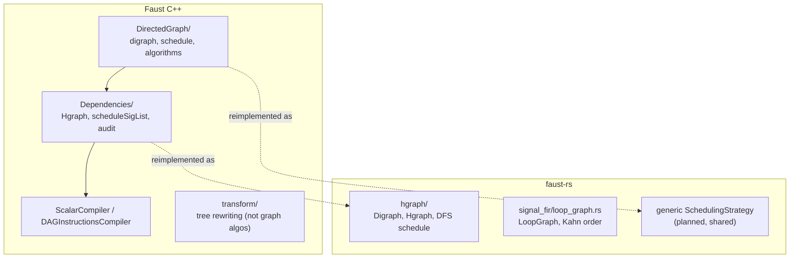

**Date:** 2026-07-11

**Status:** analysis and porting reference; not a normative plan.

**C++ reference tree:** `/Users/letz/Developpements/RUST/faust/compiler`
(`DirectedGraph/`, `Dependencies/`, `transform/`).

**Studied Rust branch:** `ondemand-vec-fad-synthesis`.

**Related documents:**
[`vector-mode-signal-level-analysis-cpp-port-plan-2026-07-10-en.md`](vector-mode-signal-level-analysis-cpp-port-plan-2026-07-10-en.md),
[`lean-rust-certified-porting-plan-2026-07-11-en.md`](lean-rust-certified-porting-plan-2026-07-11-en.md),
[`vector-mode-scheduling-formal-spec.lean`](vector-mode-scheduling-formal-spec.lean).

::: toc+
- **Objective** — what this document answers.
- **Three directories, three roles** — separate what is graph code from what is not.
- **The generic graph library** — inventory of `DirectedGraph/`.
- **Reuse verdict** — per-artifact mapping to faust-rs.
- **Reused as algorithm** — the four scheduling strategies.
- **Done differently** — recursion, weighted edges, decycling.
- **New in faust-rs** — the certified contract and the vector plan.
- **The Dependencies architecture** — hierarchical graphs and schedules.
- **Out of scope** — why most of `transform/` is not graph code.
- **Porting guidance** — a short checklist.
:::

## 1. Objective

Answer one question precisely: **to what extent are the C++ graph-manipulation
algorithms reused in faust-rs, and where does faust-rs use a different approach?**
The document is a mapping table plus the rationale behind each decision, usable as
a reference while porting.

## 2. Three directories, three roles

The three C++ directories are not the same kind of code. Only the first two are
about graphs at all.

::: definition [What each directory is]
- **`DirectedGraph/`** — a *generic, Faust-agnostic* graph library: `digraph<N>`,
  `schedule<N>`, and the topological/analysis algorithms. This is where the real
  graph algorithms live.
- **`Dependencies/`** — the *Faust-specific* use of that library over signal
  trees (`Tree`): building a hierarchical graph per clock domain and scheduling
  it.
- **`transform/`** — despite the name, mostly *tree rewriting* (promotion,
  constant propagation, FIR/IIR reveal, retiming, differentiation, type checking).
  Only a few files (`sigDependenciesGraph`, `sigRecursiveDependencies`,
  `sigRecursivenessChecker`) touch a graph.
:::

## 3. The generic graph library (`DirectedGraph/`)

| C++ symbol | File | What it does |
|---|---|---|
| `digraph<N>` | `DirectedGraph.hh` | nodes + edges carrying a **set of int delays** (weights) |
| `schedule<N>` | `Schedule.hh` | an ordered node set with `order()`/`reverse()` |
| `dfschedule` | `Schedule.hh` | depth-first postorder topological schedule (`-ss 0`) |
| `bfschedule` | `Schedule.hh` | level order from leaves via `parallelize` (`-ss 1`) |
| `spschedule` | `Schedule.hh` | interleaved branch order, dedup on reverse (`-ss 2`) |
| `rbschedule` | `Schedule.hh` | levels on `reverse(G)`, then reversed (`-ss 3+`) |
| `schedulingcost` | `Schedule.hh` | cache-distance heuristic — **unused by any path** |
| `cycles` | `DirectedGraphAlgorythm.hh` | count strongly connected components |
| `graph2dag` / `graph2dag2` | `DirectedGraphAlgorythm.hh` | **Tarjan SCC** → condensation to a DAG of SCCs |
| `parallelize` / `rparallelize` | `DirectedGraphAlgorythm.hh` | BFS-level partition (forward / reversed) |
| `cut(g, dm)` | `DirectedGraphAlgorythm.hh` | drop edges of delay weight ≥ `dm` (break cycles) |
| `reverse`, `chain`, `serialize` | `DirectedGraphAlgorythm.hh` | edge reversal, chain extraction, flatten |
| `roots`, `leaves`, `criticalpath` | `DirectedGraphAlgorythm.hh` | terminal sets, longest path |
| `recschedule` + `interleave` | `DirectedGraphAlgorythm.hh` | duplicate root-to-leaf lists for `spschedule` |
| `mapnodes`, `mapconnections`, `splitgraph`, `subgraph`, `topology` | `DirectedGraphAlgorythm.hh` | functorial + structural helpers |

The key design fact: **edges are weighted by a multiset of integer delays**, and
recursion is handled *on that weighted cyclic graph* — `graph2dag` finds the
cycles and `cut` breaks them by delay. Keep this in mind; it is exactly where
faust-rs diverges.

## 4. Reuse verdict

Status vocabulary: **Algorithm** (idea reimplemented in idiomatic Rust),
**Structure** (architecture ported), **Different** (faust-rs solves it another
way), **New** (no C++ equivalent), **Out** (not graph code).

| C++ element | faust-rs status | Where / how |
|---|---|---|
| `dfschedule`/`bfschedule`/`spschedule`/`rbschedule` | **Algorithm** (planned) | one generic `SchedulingStrategy`; today only DFS exists |
| `parallelize`, `roots`, `reverse`, `interleave`, `recschedule` | **Algorithm** (planned) | primitives of the four strategies |
| `schedule<N>` order type | **Algorithm** | `Vec<_>` order + independent validity checker (Lean `validScheduleB`) |
| `Hgraph`, `scheduleSigList`, `auditHgraph` | **Structure** (partial) | [`hgraph/mod.rs`](../crates/transform/src/hgraph/mod.rs) (`Digraph`, `Hgraph`, `schedule`) |
| `digraph<N>` weighted by delay multiset | **Different** | `Edge { delayed: bool }`, not an int-delay multiset |
| `graph2dag` / `cycles` (Tarjan SCC) | **Different** | recursion identity kept from the signal graph, not rediscovered |
| `cut(g, dm)` | **Different** | immediate/delayed split; DFS ignores `delayed` edges |
| `CodeLoop::sortGraph` (vector loop order) | **Different → Algorithm** | [`loop_graph.rs`](../crates/transform/src/signal_fir/loop_graph.rs) `topological_order` (Kahn), to be driven by the shared `-ss` |
| `schedulingcost` | **Different** (deferred) | no cost-based default without measurement |
| `-dfs` vector option | **Not ported** | subsumed by the single public `-ss` |
| generic scheduler contract + validity proof | **New** | Lean `ValidScheduleRel`, `verifySchedule_sound/complete` |
| strategy-independent `VectorPlan` | **New** | C++ builds loops online during code generation |
| most of `transform/` | **Out** | tree rewriting, ported elsewhere (`signal_prepare`, …) |

## 5. Reused as algorithm — the four scheduling strategies

This is the core of what carries over. The porting plan is explicit
(vector-mode plan §4.1, phase P1):

::: important [One generic scheduler, ported literally first]
Introduce **one** `SchedulingStrategy` enum and **one** dependency-DAG adapter
shared by `hgraph::Digraph` and `LoopGraph` — not four algorithms copied into two
modules. Port the C++ strategies *literally first* (root selection, sibling
interleaving for `Special`, full-list reversal for `Reverse-BFS`), then optimise
behind the checker.
:::

So `DirectedGraph/Schedule.hh` and the strategy primitives of
`DirectedGraphAlgorythm.hh` are the part of the C++ graph code that genuinely
carries over — but as **idiomatic Rust rewrites**, with three deliberate changes:

- **Deterministic tie-breaking by stable id.** C++ within-level ties follow
  `Tree`/pointer order; that is explicitly *not* a cross-language parity promise.
  faust-rs pins ties by `SigId`/`LoopId`.
- **Independent validation.** Every produced order is checked against the Lean
  validity predicate rather than trusted from the algorithm.
- **Uniform scope.** In C++, `-ss` does *not* even affect the `-vec` path
  (`DAGInstructionsCompiler` never calls `scheduleSigList`; vector order comes
  from `sortGraph`/`-dfs`). faust-rs applies the same `-ss` to scalar regions and
  to each vector epoch subgraph.

Current gap: [`hgraph::schedule`](../crates/transform/src/hgraph/mod.rs) implements
only the DFS strategy (`-ss 0`), and `LoopGraph::topological_order` uses Kahn's
algorithm — a fifth order that is none of the four. Both will route through the
shared strategy set.

## 6. Done differently — recursion, weighted edges, decycling

The sharpest divergence is **how cycles and recursion are handled**.

- **C++** operates on a *weighted cyclic* graph and recovers structure with
  generic algorithms: `graph2dag` (Tarjan SCC) condenses strongly connected
  components, and `cut(g, dm)` breaks cycles by removing edges whose delay weight
  reaches `dm`.
- **faust-rs** keeps **recursion-group identity from the prepared signal graph**
  (`SYMREC`/`SIGPROJ`, see [`recursion.rs`](../crates/transform/src/signal_fir/recursion.rs)),
  and works on a **DAG of immediate edges**, with delays handled separately by the
  delay plan. It does not rediscover cycles with a generic SCC.

::: note [Why not port graph2dag / cut?]
The vector-mode plan states it directly: *"a generic SCC over FIR is not a
substitute for a signal recursion group"*. Group identity and projections must
stay visible through planning (to reproduce C++ `closeLoop` absorption), so
faust-rs preserves the information the C++ pass discards and then reconstructs.
Consequently the `cycles` / `graph2dag` / `cut` / delay-multiset family of
`DirectedGraph/` is unlikely to be ported at all.
:::

## 7. New in faust-rs

- **A certified scheduling contract.** The generic scheduler's output is anchored
  to an independent relational meaning (`ValidScheduleRel`) with a machine-checked
  soundness/completeness proof — there is no C++ equivalent.
- **A strategy-independent `VectorPlan`.** C++ builds loops *online* while lowering
  signals; faust-rs first produces an immutable plan (boundaries, placement,
  transports) and only then schedules it. Changing `-ss` cannot change the plan.
- **A single public `-ss`** spanning scalar and vector modes, replacing the C++
  `-ss` / `-dfs` split.

## 8. The Dependencies architecture (`Dependencies/`)

This *is* reused, as a structure, and is already partly ported.

| C++ (`Dependencies/`) | faust-rs |
|---|---|
| `Hgraph { outSigList; controls; siggraph }` | `Hgraph` with per-`GraphKey` graphs incl. controls |
| `scheduleSigList(list, f)` applying a strategy per subgraph | `schedule(hgraph)` (currently DFS per subgraph) |
| `auditHgraph` well-formedness checks | debug-assertion audit in `build_hgraph` |
| `DependenciesUtils` clock-domain externality | [`clk_env/`](../crates/transform/src/clk_env/mod.rs) + `is_external` |

The remaining parity work (vector-mode plan P3): represent the C++ control graph
explicitly, keep top and nested clock-domain graphs, and keep delayed edges as
placement-only (not same-tick ordering) — which is already the `delayed`-flag
behaviour of the Rust `Digraph`.

## 9. Out of scope — most of `transform/`

`transform/` is largely **not** graph manipulation. Files such as `sigPromotion`,
`sigConstantPropagation`, `revealFIR`/`revealIIR`, `sigRetiming`, `sigTypeChecker`,
`treeTransform`/`treeTraversal`, `signalFIRCompiler`, `signalRenderer` are tree
rewrites and lowering, ported (or to be ported) under `signal_prepare` and
`signal_fir`, independently of the scheduling question. The graph-relevant
members — `sigDependenciesGraph`, `sigRecursiveDependencies`,
`sigRecursivenessChecker` — feed the dependency graph and recursion facts that
faust-rs instead derives during `signal_prepare` and carries as explicit signal
structure.

## 10. Porting guidance

::: columns
**Port (reimplement + verify)**

- the four `-ss` strategies and their primitives;
- the `Hgraph`/`scheduleSigList`/audit structure;
- the immediate/delayed edge split.

---

**Do not port**

- `digraph<N>` delay-multiset weights;
- `graph2dag` (Tarjan SCC) and `cut`;
- `-dfs` as a separate option;
- `schedulingcost` as a default.
:::

In one line: **faust-rs reuses the C++ scheduling *algorithms* (reimplemented,
unified, and verified), reuses the `Dependencies` *architecture*, and drops the
weighted-cyclic-graph machinery — because it keeps recursion structure from the
signal level instead of rediscovering it.**
