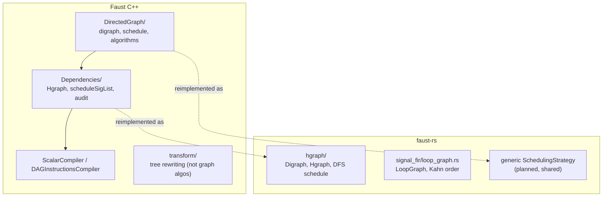

**Date:** 2026-07-11

**Status:** analysis and porting reference; not a normative plan.

**C++ reference tree:** `/Users/letz/Developpements/RUST/faust/compiler`
(`DirectedGraph/`, `Dependencies/`, `transform/`).

**Studied Rust branch:** `ondemand-vec-fad-synthesis`.

**Related documents:**
[`vector-mode-signal-level-analysis-cpp-port-plan-2026-07-10-en.md`](vector-mode-signal-level-analysis-cpp-port-plan-2026-07-10-en.md),
[`lean-rust-certified-porting-plan-2026-07-11-en.md`](lean-rust-certified-porting-plan-2026-07-11-en.md),
[`vector-mode-scheduling-formal-spec.lean`](vector-mode-scheduling-formal-spec.lean).

::: toc+
- **Objective** — what this document answers.
- **Three directories, three roles** — separate what is graph code from what is not.
- **The generic graph library** — inventory of `DirectedGraph/`.
- **Reuse verdict** — per-artifact mapping to faust-rs.
- **Reused as algorithm** — the four scheduling strategies.
- **Done differently** — recursion, weighted edges, decycling.
- **New in faust-rs** — the certified contract and the vector plan.
- **Effects and commutation** — when reordering effectful work is legal.
- **The Dependencies architecture** — hierarchical graphs and schedules.
- **Out of scope** — why most of `transform/` is not graph code.
- **Why the faust-rs strategy improves on C++, and at what cost** — benefits and counterweights.
- **Porting guidance** — a short checklist.
:::

## 1. Objective

Answer one question precisely: **to what extent are the C++ graph-manipulation
algorithms reused in faust-rs, and where does faust-rs use a different approach?**
The document is a mapping table plus the rationale behind each decision, usable as
a reference while porting.

## 2. Three directories, three roles

The three C++ directories are not the same kind of code — only the first two are
about graphs at all.

`DirectedGraph/`
:   a *generic, Faust-agnostic* graph library: `digraph<N>`, `schedule<N>`, and the
    topological/analysis algorithms. This is where the real graph algorithms live.

`Dependencies/`
:   the *Faust-specific* use of that library over signal trees (`Tree`): building a
    hierarchical graph per clock domain and scheduling it.

`transform/`
:   despite the name, mostly *tree rewriting* (promotion, constant propagation,
    FIR/IIR reveal, retiming, differentiation, type checking). Only a few files
    (`sigDependenciesGraph`, `sigRecursiveDependencies`, `sigRecursivenessChecker`)
    touch a graph.



## 3. The generic graph library (`DirectedGraph/`)

Inventory grouped by file (two columns each, so the descriptions have room to
breathe rather than being squeezed into a third column).

**`DirectedGraph.hh` — the graph type**

| Symbol | Role |
|---|---|
| `digraph<N>` | nodes + edges carrying a **set of int delays** (weights) |

**`Schedule.hh` — schedule type and the four strategies**

| Symbol | Role |
|---|---|
| `schedule<N>` | ordered node set with `order()` / `reverse()` |
| `dfschedule` | depth-first postorder schedule (`-ss 0`) |
| `bfschedule` | level order from leaves via `parallelize` (`-ss 1`) |
| `spschedule` | interleaved branch order, dedup on reverse (`-ss 2`) |
| `rbschedule` | levels on `reverse(G)`, then reversed (`-ss 3+`) |
| `schedulingcost` | cache-distance heuristic — **unused by any path** |

**`DirectedGraphAlgorythm.hh` — analysis and transforms**

| Symbol | Role |
|---|---|
| `cycles` | count strongly connected components |
| `graph2dag` / `graph2dag2` | **Tarjan SCC** → condensation to a DAG of SCCs |
| `parallelize` / `rparallelize` | BFS-level partition (forward / reversed) |
| `cut(g, dm)` | drop edges of delay weight ≥ `dm` (break cycles) |
| `reverse`, `chain`, `serialize` | edge reversal, chain extraction, flatten |
| `roots`, `leaves`, `criticalpath` | terminal sets, longest path |
| `recschedule` + `interleave` | duplicate root-to-leaf lists for `spschedule` |
| `mapnodes`, `mapconnections`, `splitgraph`, `subgraph`, `topology` | functorial + structural helpers |

The key design fact: **edges are weighted by a multiset of integer delays**, and
recursion is handled *on that weighted cyclic graph* — `graph2dag` finds the
cycles and `cut` breaks them by delay. Keep this in mind; it is exactly where
faust-rs diverges.

## 4. Reuse verdict

The verdict uses five status labels:

Algorithm
:   the idea is reimplemented in idiomatic Rust.

Structure
:   the architecture is ported.

Different
:   faust-rs solves it another way.

New
:   no C++ equivalent.

Out
:   not graph code.

The verdict itself, grouped by label (two columns each):

**Algorithm** — reimplemented, unified, verified:

| C++ element | faust-rs |
|---|---|
| `dfschedule`/`bfschedule`/`spschedule`/`rbschedule` | one generic `SchedulingStrategy` (planned; today only DFS) |
| `parallelize`, `roots`, `reverse`, `interleave`, `recschedule` | primitives of the four strategies |
| `schedule<N>` order type | `Vec<_>` order + independent checker (Lean `validScheduleB`) |

**Structure** — architecture ported:

| C++ element | faust-rs |
|---|---|
| `Hgraph`, `scheduleSigList`, `auditHgraph` | [`hgraph/mod.rs`](../crates/transform/src/hgraph/mod.rs) — `Digraph`/`Hgraph`/`schedule` (partial) |

**Different** — solved another way:

| C++ element | faust-rs |
|---|---|
| `digraph<N>` weighted by delay multiset | `Edge { delayed: bool }`, not an int-delay multiset |
| `graph2dag` / `cycles` (Tarjan SCC) | recursion identity kept from the signal graph |
| `cut(g, dm)` | immediate/delayed split; DFS ignores `delayed` edges |
| `CodeLoop::sortGraph` | [`loop_graph.rs`](../crates/transform/src/signal_fir/loop_graph.rs) `topological_order` (Kahn), to be driven by `-ss` |
| `schedulingcost` | no cost-based default without measurement |

**New** — no C++ equivalent:

| Item | faust-rs |
|---|---|
| generic scheduler contract + validity proof | Lean `ValidScheduleRel`, `verifySchedule_sound/complete` |
| strategy-independent `VectorPlan` | C++ builds loops online during code generation |

**Out** — not ported / not graph code:

| C++ element | Reason |
|---|---|
| `-dfs` vector option | subsumed by the single public `-ss` |
| most of `transform/` | tree rewriting (ported under `signal_prepare`) |

## 5. Reused as algorithm — the four scheduling strategies

This is the core of what carries over. The porting plan is explicit
(vector-mode plan §4.1, phase P1):

::: important [One generic scheduler, ported literally first]
Introduce **one** `SchedulingStrategy` enum and **one** dependency-DAG adapter
shared by `hgraph::Digraph` and `LoopGraph` — not four algorithms copied into two
modules. Port the C++ strategies *literally first* (root selection, sibling
interleaving for `Special`, full-list reversal for `Reverse-BFS`), then optimise
behind the checker.
:::

So `DirectedGraph/Schedule.hh` and the strategy primitives of
`DirectedGraphAlgorythm.hh` are the part of the C++ graph code that genuinely
carries over — but as **idiomatic Rust rewrites**, with three deliberate changes:

- **Deterministic tie-breaking by stable id.** C++ within-level ties follow
  `Tree`/pointer order; that is explicitly *not* a cross-language parity promise.
  faust-rs pins ties by `SigId`/`LoopId`.
- **Independent validation.** Every produced order is checked against the Lean
  validity predicate rather than trusted from the algorithm.
- **Uniform scope.** In C++, `-ss` does *not* even affect the `-vec` path
  (`DAGInstructionsCompiler` never calls `scheduleSigList`; vector order comes
  from `sortGraph`/`-dfs`). faust-rs applies the same `-ss` to scalar regions and
  to each vector epoch subgraph.

Current gap: [`hgraph::schedule`](../crates/transform/src/hgraph/mod.rs) implements
only the DFS strategy (`-ss 0`), and `LoopGraph::topological_order` uses Kahn's
algorithm — a fifth order that is none of the four. Both will route through the
shared strategy set.

## 6. Done differently — recursion, weighted edges, decycling

The sharpest divergence is **how cycles and recursion are handled**.

- **C++** operates on a *weighted cyclic* graph and recovers structure with
  generic algorithms: `graph2dag` (Tarjan SCC) condenses strongly connected
  components, and `cut(g, dm)` breaks cycles by removing edges whose delay weight
  reaches `dm`.
- **faust-rs** keeps **recursion-group identity from the prepared signal graph**
  (`SYMREC`/`SIGPROJ`, see [`recursion.rs`](../crates/transform/src/signal_fir/recursion.rs)),
  and works on a **DAG of immediate edges**, with delays handled separately by the
  delay plan. It does not rediscover cycles with a generic SCC.

::: note [Why not port graph2dag / cut?]
The vector-mode plan states it directly: *"a generic SCC over FIR is not a
substitute for a signal recursion group"*. Group identity and projections must
stay visible through planning (to reproduce C++ `closeLoop` absorption), so
faust-rs preserves the information the C++ pass discards and then reconstructs.
Consequently the `cycles` / `graph2dag` / `cut` / delay-multiset family of
`DirectedGraph/` is unlikely to be ported at all.
:::

## 7. New in faust-rs

- **A certified scheduling contract.** The generic scheduler's output is anchored
  to an independent relational meaning (`ValidScheduleRel`) with a machine-checked
  soundness/completeness proof — there is no C++ equivalent.
- **A strategy-independent `VectorPlan`.** C++ builds loops *online* while lowering
  signals; faust-rs first produces an immutable plan (boundaries, placement,
  transports) and only then schedules it. Changing `-ss` cannot change the plan.
- **A single public `-ss`** spanning scalar and vector modes, replacing the C++
  `-ss` / `-dfs` split.

## 8. Effects and commutation: an explicit ordering condition

Loop fission reorders operations across samples and across loops, so it is only
legal when the reordered **side effects** would have been safe to reorder.
faust-rs turns this legality into an **explicit graph edge**; C++ leaves it mostly
implicit. Because it becomes an edge, the *same* reused scheduler enforces it — no
separate mechanism.

**Effects vs pure values.** Most nodes compute a pure value (arithmetic, a filter);
some also touch a mutable, observable resource — read/write of internal state, a
table, a UI zone, an output channel, or a foreign call. A pure value can be moved
or recomputed freely; an effect's order can matter. The effect algebra is:

```adt
Effect   ::= Read(r)                 (* r ∈ Resource *)
           | Write(r)
           | Foreign(name, purity)

Resource ::= State(k) | Table(k) | UI(k) | Output(k)
Purity   ::= Pure | Impure | Unknown
```

**Commutation.** Two effects *commute* when doing A then B is observably identical
to B then A. Only commuting effects may be left unordered, hence reorderable by
`-ss`.

**Conflict rule (conservative).** Two effects conflict — do not commute — when they
touch the same mutable resource and at least one writes:

| | read R | write R |
|---|:--:|:--:|
| **read R** | commute | conflict |
| **write R** | conflict | conflict |

Different resources always commute; a pure foreign call commutes with everything;
an impure or unknown foreign call conflicts with everything (its effects cannot be
inspected). The relation is symmetric (proved as `conflicts_symm`).

**What faust-rs does.** For two loops with no data dependency, if commutation
cannot be proved, the planner must add a directed **effect edge**, co-locate the
loops, or place them in a serial island. These effect edges live in the loop graph
next to the data edges, so the generic `-ss` scheduler orders them like any other
dependency.

::: important [Why this is the point]
Schedule independence needs the effect edges: data-flow correctness alone is not
enough. Without them a plain topological sort would be "data-correct" yet produce a
sound that depends on `-ss` — a silent bug. This is the same theme as the rest of
the document: keep an invariant explicit as **graph structure** rather than
implicit in the producer. It is captured by the `L-Effects` obligation of
`VectorPlanCertificate`.
:::

Spec: `Effect`, `Effect.conflicts`, `effectsCommute`, `Commute`, and the
`L-Effects` field in
[`vector-mode-scheduling-formal-spec.lean`](vector-mode-scheduling-formal-spec.lean).

## 9. The Dependencies architecture (`Dependencies/`)

This *is* reused, as a structure, and is already partly ported.

| C++ (`Dependencies/`) | faust-rs |
|---|---|
| `Hgraph { outSigList; controls; siggraph }` | `Hgraph` with per-`GraphKey` graphs incl. controls |
| `scheduleSigList(list, f)` applying a strategy per subgraph | `schedule(hgraph)` (currently DFS per subgraph) |
| `auditHgraph` well-formedness checks | debug-assertion audit in `build_hgraph` |
| `DependenciesUtils` clock-domain externality | [`clk_env/`](../crates/transform/src/clk_env/mod.rs) + `is_external` |

The remaining parity work (vector-mode plan P3): represent the C++ control graph
explicitly, keep top and nested clock-domain graphs, and keep delayed edges as
placement-only (not same-tick ordering) — which is already the `delayed`-flag
behaviour of the Rust `Digraph`.

## 10. Out of scope — most of `transform/`

`transform/` is largely **not** graph manipulation. Files such as `sigPromotion`,
`sigConstantPropagation`, `revealFIR`/`revealIIR`, `sigRetiming`, `sigTypeChecker`,
`treeTransform`/`treeTraversal`, `signalFIRCompiler`, `signalRenderer` are tree
rewrites and lowering, ported (or to be ported) under `signal_prepare` and
`signal_fir`, independently of the scheduling question. The graph-relevant
members — `sigDependenciesGraph`, `sigRecursiveDependencies`,
`sigRecursivenessChecker` — feed the dependency graph and recursion facts that
faust-rs instead derives during `signal_prepare` and carries as explicit signal
structure.

## 11. Why the faust-rs strategy improves on C++, and at what cost

The reuse choices above are not only a reimplementation; they change the
architecture. This section states where that architecture is better, and the
costs, so the improvement is not overstated. The gain is in **architecture and
assurance**, not automatically in speed or C++ compatibility.

### 11.1 Improvements

| Dimension | Faust C++ | faust-rs |
|---|---|---|
| Decision level | loop boundaries decided *online* during FIR generation (and, in the current Rust prototype, reconstructed from fused FIR) | decided on the prepared **signal graph**, where recursion identity, occurrences, delays and clocks are still explicit |
| `-ss` scope | does **not** affect the `-vec` path; vector order comes from `sortGraph`/`-dfs` — a split `-ss`/`-dfs`, two scheduling worlds | one `-ss`, one graph contract, applied to scalar regions **and** vector epochs |
| Plan vs schedule | loops built online while lowering, mutating state | immutable, strategy-independent `VectorPlan`; `-ss` only orders |
| Determinism | within-level ties follow `Tree`/pointer order (not a parity promise) | ties broken by stable `SigId`/`LoopId`; byte-stable snapshots |
| Recursion | rediscovered via `graph2dag` (Tarjan SCC) + `cut`, then `closeLoop` absorption | recursion-group identity **preserved** from signal prep (`SYMREC`/`SIGPROJ`) |
| OD/US/DS | guard-based emission | explicit **serial islands** + fixed epoch barriers, composed with `ClkEnvMap` |
| Effect reordering | legality mostly implicit | explicit **commutation** condition (`Commute`, certificate `L-Effects`) |
| Assurance | producer + tests | certificate + independent checker + Lean normative spec, **fail-closed** |

The single most consequential improvement is the **plan ⟂ schedule** separation:
it makes "changing `-ss` cannot change structure" a type-level fact, and gives one
consistent meaning to `-ss` across modes, which C++ does not have.

### 11.2 Costs and honest limits

- **Not implemented yet.** The C++ path ships and is battle-tested; the faust-rs
  certified layer is a plan and the FIR partition is a transitional prototype. A
  better design on paper is not yet a better running compiler.
- **More conservative initially.** Prudent effect/`VecSafe` rules may serialize
  more than C++ at first (an explicit "adapted" safety boundary). The
  vectorization-retention gate exists to catch over-serialization, but out of the
  box faust-rs may vectorize less aggressively.
- **Deliberate non-parity default.** Rust `-ss 0` means DFS in both modes, whereas
  the C++ vector default is closer to `rbschedule`/`sortGraph` levels. Better for
  consistency, but a user-visible break from C++ vector ordering.
- **Extra machinery.** Certificates, canonical hashing, and Lean cross-checks are
  overhead C++ does not carry — justified only for the structural phases (hence
  scoped, not global, in `AGENTS.md`). Vectorization is also not always profitable
  (measured `0.92×` in some cases), independently of who schedules.

::: important [What "better" means here]
Better along **explicitness, verifiability, determinism, and a unified `-ss`** — at
the cost of implementation effort, some initial conservatism, and an intentional
break from the C++ vector default. C++ is not wrong: the plan itself is *"closer to
Faust C++ on the important point — dependencies remain signal dependencies"*, only
more explicit and testable. This is not a correctness fix of C++.
:::

## 12. Porting guidance

::: columns
**Port (reimplement + verify)**

- the four `-ss` strategies and their primitives;
- the `Hgraph`/`scheduleSigList`/audit structure;
- the immediate/delayed edge split.

---

**Do not port**

- `digraph<N>` delay-multiset weights;
- `graph2dag` (Tarjan SCC) and `cut`;
- `-dfs` as a separate option;
- `schedulingcost` as a default.
:::

In one line: **faust-rs reuses the C++ scheduling *algorithms* (reimplemented,
unified, and verified), reuses the `Dependencies` *architecture*, and drops the
weighted-cyclic-graph machinery — because it keeps recursion structure from the
signal level instead of rediscovering it.**
