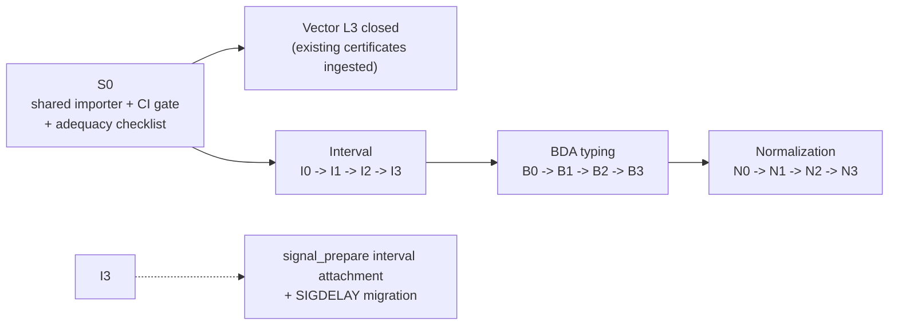

**Date:** 2026-07-19

**Status:** action plan for a future step. The three gate-0 spec skeletons
(`bda-typing-formal-spec.lean`, `interval-arithmetic-formal-spec.lean`,
`normalization-rewrites-formal-spec.lean`) are written and kernel-checked;
everything else — the gate-0 adequacy reviews, S0, the Rust bridges, and
all later gates — remains open. The plan sequences the three proposals:

- [`lean-interval-arithmetic-formal-spec-proposal-2026-07-19-en.md`](lean-interval-arithmetic-formal-spec-proposal-2026-07-19-en.md) (gates I0–I3)
- [`lean-bda-typing-formal-spec-proposal-2026-07-19-en.md`](lean-bda-typing-formal-spec-proposal-2026-07-19-en.md) (gates B0–B3)
- [`lean-normalization-rewrites-formal-spec-proposal-2026-07-19-en.md`](lean-normalization-rewrites-formal-spec-proposal-2026-07-19-en.md) (gates N0–N3)

**Companions:** the methodology overview
[`../docs/lean-usage-methodology-en.md`](../docs/lean-usage-methodology-en.md)
and the assurance plan
[`lean-rust-certified-porting-plan-2026-07-11-en.md`](lean-rust-certified-porting-plan-2026-07-11-en.md).

::: toc+
- **Ordering and rationale** — interval first, BDA second, normalization third.
- **Shared infrastructure first** — one importer, one CI gate, one checklist.
- **Phase plan** — the common four-phase template and the combined timeline.
- **Effort and ownership** — estimates, bus factor, and review duties.
- **Exit criteria** — what "done" means for the whole initiative.
:::

## 1. Ordering and rationale

The three streams run **sequentially, not in parallel**. Lean review
capacity is the scarce resource (one fluent reviewer today), and the
vector stream showed that the adequacy review — not the writing — is where
quality is made. The order:

1. **Interval (I)** — first. The crate is complete, standalone, and
   fully tested: a stable target with no moving parts. The property is
   classical (inclusion), the proofs are the easiest of the three, and the
   output plugs directly into the already-planned `signal_prepare`
   interval attachment and `SIGDELAY` migration, so I3 lands exactly when
   its consumer needs it. It is also the best *training* stream: a second
   contributor can learn the house Lean style on well-understood
   mathematics.
2. **BDA typing (B)** — second. Small, high leverage (the FAD/RAD arity
   rules are port-authored and currently normative only in a doc
   comment), and its certificate machinery is a light copy of what I3
   builds. Runs while normalization porting (`aterm`/`simplify`) is still
   converging in Rust.
3. **Normalization (N)** — third, and largest. Deliberately last so the
   spec is written when the `normalize` crate's port surface has
   stabilized, and so termination/canonicity proofs start with two
   streams' worth of local Lean experience. Its N2 rule-order gate is the
   highest-value single deliverable of the initiative (the
   `needs_separate_loop` lesson) and is reachable even if N3 slips.

## 2. Shared infrastructure first

Before I0 opens, one enabling work package (gate **S0**) builds what all
three streams — and the still-open vector L3 gap — need:

- **The Lean JSON certificate importer.** The vector stream's L3 boundary
  (Lean ingesting Rust-produced canonical JSON artifacts in CI) is open
  and unowned. Building the importer once, schema-agnostic at its core,
  serves four consumers: vector certificates (retroactively closing that
  gap), interval annotations (I3), box-arity certificates (B3), and
  normalization pairs (N3). This turns the biggest standing criticism of
  the first stream — "the value chain is unfinished" — into the first
  deliverable of the second.
- **The CI gate.** One fast job: `lean` on every `porting/*-formal-spec.lean`
  file (seconds each, stock Lean 4.31, bundled Std, no Lake, no mathlib),
  failing on any `sorry`/`axiom` via a grep guard in addition to the
  compile. Wired into the existing fast gate next to `cargo fmt`.
- **The adequacy checklist**, promoted from the vector stream's review
  into a reusable document (`porting/lean-adequacy-checklist-en.md`):
  typing judgments functional; no `Prop` satisfiable by `fun _ => True`;
  no soundness theorem proved by `rfl`; reference checker at least as
  strong as the Rust checker; every executable check anchored to a
  relational statement; conventions (consumer → dependency edges, `…B`
  naming) applied. Every gate 0 and every later extension passes it.

## 3. Phase plan

Each stream instantiates the same four-phase template from the
methodology (§3.3 of the overview):

```csv
Phase, Content, Gate examples
0 — skeleton, syntax + judgments/contracts compiling; adequacy review, I0 / B0 / N0
1 — core theorems, executable checks + soundness against relational anchors; fixture parity both ways, I1 / B1 / N1
2 — exhaustive bridge, enumeration or property bridge binding Lean to Rust path-by-path, I2 / B2 / N2
3 — certificates, corpus artifacts checked by independent Rust (L2) and Lean importer (L3) in CI, I3 / B3 / N3
```

Sequencing across streams, with the dependency that matters:



Two scheduling rules:

- **A stream's phase 3 may overlap the next stream's phase 0** (the
  certificate work is mechanical once phases 1–2 hold), but phases 1–2
  never overlap across streams — that is where review attention lives.
- **N0 does not open until `aterm`/`simplify` porting is declared
  surface-stable** in the `normalize` crate. If that slips, N waits; B3
  is a respectable pause point for the initiative.

## 4. Effort and ownership

Rough estimates, calibrated on the vector stream (~1,500-line spec plus
adequacy pass over several sessions):

```csv
Work package, Estimate, Notes
S0 shared infrastructure, 2-3 sessions, importer is the bulk; closes vector L3 as a side effect
Interval I0-I3, 4-6 sessions, I1 fast (monotone lemma covers a family); trig case analyses dominate I2
BDA typing B0-B3, 3-4 sessions, smallest spec; enumeration harness is the main Rust-side work
Normalization N0-N3, 6-10 sessions, termination + canonicity are real proofs; N2 alone already pays
```

Ownership and the bus factor:

- Each stream has **one writer and one adequacy reviewer**, and they must
  be different people. Today both roles concentrate in one person; the
  interval stream is explicitly the vehicle for training a second reader
  (its §5 "Proven vs. promised" reading key and classical subject matter
  make it the gentlest entry).
- Every gate closure gets a JOURNAL.md entry (in English, as always)
  recording what was proved, what was promised, and what validation ran —
  the same discipline as every other stream.
- The specs are **normative once their gate 1 closes**: from that point,
  a Rust change to a formalized contract requires the paired Lean change
  in the same commit, enforced socially first and by the L3 CI gate once
  phase 3 lands.

## 5. Exit criteria

The initiative is complete when:

1. the shared Lean importer runs in CI and the **vector certificate corpus
   passes L3** (retroactive closure of the 2026-07 gap);
2. `porting/` contains three additional kernel-checked spec files —
   interval, BDA typing, normalization — each with zero `sorry`/`axiom`,
   each past its adequacy review;
3. all four certificate families (schedule/plan, interval annotations,
   box arities, normalization pairs) are checked at **L2 by independent
   Rust and L3 by Lean** on the full corpus in CI;
4. the R-declared placeholder list of the interval spec is either empty
   or each entry carries a named open obligation referenced from the
   crate's `missing.rs`;
5. the methodology overview's §5 map is updated: the three "retrospective
   candidate" rows move to a real status, and the next candidates (clock
   domains, FAD/RAD rules) inherit an honest fit assessment from this
   round's experience.

No date is attached: per the methodology, each escalation up the ladder is
justified by evidence at the previous gate, and the corridor for this work
is whatever the scheduling/FAD streams leave available. What this roadmap
fixes is the *order* and the *gates*, so that whenever the step opens, no
re-planning is needed.
