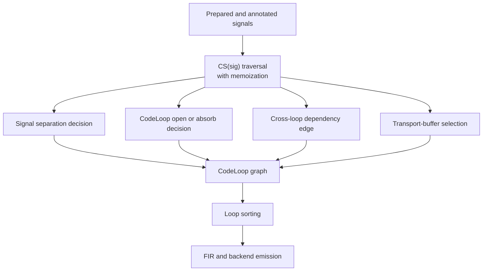
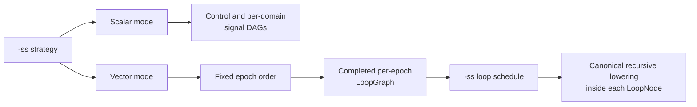

**Date:** 2026-07-10

**Scheduling analysis update and design review:** 2026-07-11

**Formal specification update:** 2026-07-11

**Status:** proposed replacement for FIR-level loop discovery

**Studied Rust branch:** `ondemand-vec-fad-synthesis`

**C++ reference:** `master-dev-ocpp-od-fir-2-FIR19`, commit `8eebea429`

**Related documents:**
[initial `-vec` analysis](vector-mode-analysis-port-plan-2026-06-10-en.md),
[current loop-separation design](vector-mode-loop-separation-plan-2026-07-09-en.md),
[FIR-model hardening](vector-mode-fir-model-hardening-plan-2026-07-10-en.md),
the [signal-to-FIR rewriting calculus](signal-to-fir-rewriting-calculus-2026-06-20-en.md),
the [Lean formal specification](vector-mode-scheduling-formal-spec.lean), and
the [Lean/Rust certified porting plan](lean-rust-certified-porting-plan-2026-07-11-en.md).

::: toc+
- **Conclusion** - state the architectural decision and its rationale.
- **What Faust C++ actually does** - establish the behavioral reference.
- **Current faust-rs state** - identify the implemented baseline and gaps.
- **Recommended architecture boundary** - assign ownership and scheduling roles.
- **Formal specification layer** - state the mathematical safety contracts.
- **Port plan** - sequence implementation phases and acceptance gates.
- **Risks and guardrails** - keep parity and semantic hazards explicit.
- **Lockstep instance vectorization extension** - accelerate recursive loops across independent instances.
- **Proposed decision** - record the normative porting direction.
:::

## 1. Conclusion

::: important [Porting decision]
Yes: vectorization decisions should primarily be made on the prepared signal
graph, before signals are fused into FIR statements.
:::

The current FIR partition was useful for validating the chunk driver,
cross-loop buffers, and backend support. It can extract a pure tail from an
already-fused recursive loop. It is not a general model, however: it has to
reconstruct dependencies that were explicit in the signal graph, and it does
not cleanly cover pure prefixes, all delay shapes, multiple recursion groups,
or clocked blocks.

The C++ compiler confirms this direction, with an important nuance: Faust C++
does not first compute a complete immutable loop plan in one standalone pass.
It combines:

1. prior signal analyses (type, recursiveness, occurrences, delays, and
   execution conditions);
2. incremental loop-graph construction while signals are lowered;
3. immediate materialization of values that cross a loop boundary.

The recommended Rust port preserves those semantics while making the boundary
more explicit: a pure `VectorPlan` over `SigId`s decides loop boundaries,
dependencies, and transports; a separate scheduling pass serializes the
resulting execution DAG; signal-to-FIR lowering then emits the planned regions.
FIR remains the emission and storage IR. It must no longer be the source of
truth used to discover vectorization dependencies.

faust-rs will expose one general `-ss` option in scalar and vector modes, backed
by one `SchedulingStrategy` enum and one family of graph algorithms. The node
type scheduled by that policy is mode-specific:

- scalar mode schedules the control and per-domain signal DAGs;
- vector mode schedules the completed `LoopGraph` induced inside each fixed
  execution epoch produced by signal-level vector analysis.

This is one public scheduling contract, not two coupled scheduling passes. In
particular, vector mode does not first serialize the complete signal graph and
then serialize the loop graph. Inline signals have no unique loop owner and may
be lowered independently in several loop regions, so such a global signal
schedule cannot be filtered into loop schedules without inventing per-region
signal instances. A separate public `-dfs` option is not part of the Rust
design.

## 2. What Faust C++ actually does

This analysis uses `DAGInstructionsCompiler` as the primary reference because
it feeds the maintained FIR backends. The older `VectorCompiler` used by the
`-ocpp` path implements nearly the same algorithm and is useful as a cross-check,
but `-ocpp` is outside the Rust port scope.

### 2.1 Signal-graph preparation

`InstructionsCompiler::prepare` in
`compiler/generator/instructions_compiler.cpp` prepares a shared signal forest
before any loop is built:

- normalization and constant propagation;
- simplification and optional signal-level FIR/IIR reconstruction;
- execution-condition annotation;
- recursiveness annotation;
- type annotation and causality checking;
- `OccMarkup::mark`, which computes context-sensitive occurrences.

`Occurrences` is not a plain parent count. It records the variability of use
contexts, delayed uses, `min/maxDelay`, the number of delayed reads, and the
execution condition. `hasMultiOccurrences()` also becomes true when a value is
used from a faster context or under different execution conditions.

This is already a semantic analysis of the signal graph. It provides the facts
later consumed by vector lowering.

### 2.2 Online loop construction

`DAGInstructionsCompiler::compileMultiSignal` calls `prepare`, opens a loop from
each output, and descends through the signals with `CS(sig)`.

For each signal that has not been compiled yet:

- `generateCodeRecursions` first finds recursion groups and opens one dedicated
  loop per group;
- `generateLoopCode` calls `needSeparateLoop(sig)`;
- when the signal must be separated, a `CodeLoop` is opened, the signal is
  lowered, and the loop is closed;
- `CodeContainer::closeLoop` either keeps that loop or absorbs it into its
  enclosing loop when it is empty or when separation would cut an active
  recursive dependency.

The C++ `needSeparateLoop` rule, in exact precedence order, is:

```csv
Priority,Signal property,Decision
1,maxDelay > 0,Separate loop
2,verySimple or variability < kSamp,Inline
3,sigDelay read,Inline at the use site
4,Recursive projection,Separate serial loop
5,Multiple occurrences,Separate loop
6,Other sample expression,Inline into the consumer
```

The order is semantic. In particular, a simple or slow value that is used with
a delay first matches `maxDelay > 0`, because its sample history still has to be
produced one sample at a time.

### 2.3 Dependencies and value transport

The `CS` cache is also where C++ constructs loop-graph edges. When an already
compiled signal is reused, the current loop depends on its defining loop.
Additional cases cover:

- a delayed read whose carried signal owns a loop;
- a delayed read of a recursive projection;
- a projection whose recursion group owns a loop.

`CodeContainer::closeLoop` completes missing edges by scanning sub-signals and
their loop properties before deciding whether to absorb or retain the loop. The
topology is therefore not inferred from generated FIR instructions.

`generateCacheCode` simultaneously selects how a value is transported:

- a scalar for slow values with no history;
- a block array (`Vector*`/`Zec*`) for a sample value shared across loops;
- a temporary plus permanent `Yec*` delay line for a short delay;
- a persistent ring buffer for a long delay.

Finally, `CodeLoop::sortGraph` orders the loops and `VectorCodeContainer` emits
the chunk driver and `-lv` variants.

### 2.4 Meaning of "signal-level analysis" in C++

C++ uses neither a FIR post-pass nor one pure pass equivalent to a complete
scheduler. It uses a hybrid model:



The key invariant to port is not the exact C++ object structure. It is that loop
boundaries and dependencies are decided while signal identity and semantics are
still available.

### 2.5 Signal scheduling with `-ss`

`-ss <n>` selects a topological ordering policy for signal dependency graphs:

```csv
CLI value,C++ function,Algorithm
0 (default),dfschedule,Depth-first postorder from graph roots
1,bfschedule,Dependency-level order from leaves to roots
2,spschedule,"Recursively interleaved branch order, then reverse deduplication"
3+,rbschedule,"Levelize the reversed graph, then reverse the schedule"
```

The implementation lives in `compiler/DirectedGraph/Schedule.hh`. The graph
edge convention is `consumer -> dependency`; therefore every valid schedule
must place the edge destination before its source.

#### Depth-first (`-ss 0`)

`dfschedule` starts from graph roots, recursively visits all destinations, and
appends the current node after its dependencies. It tends to finish one
dependency chain before moving to a sibling chain. Shared dependencies are
emitted once through the visited set.

#### Breadth-first (`-ss 1`)

`bfschedule` calls `parallelize(G)`. A leaf with no dependencies has level 0;
every other node has `1 + max(level(dependency))`. Levels are emitted from 0
upward. This groups independent nodes at the same dependency depth and exposes
the graph's parallel width, but it can keep intermediate values live longer
than a depth-first order.

#### Special (`-ss 2`)

`spschedule` recursively builds root-to-dependency lists with duplicates,
interleaves sibling lists, then scans the result backwards while retaining only
the first occurrence of each node. This produces a dependencies-first order
while mixing independent branches more than DFS. It is a fixed heuristic, not
an automatic cost optimizer: `schedulingcost` exists in the same header, but no
compiler path invokes it to select or tune a strategy.

#### Reverse breadth-first (`-ss 3+`)

`rbschedule` levelizes `reverse(G)`, so levels are measured from the original
roots rather than from dependency leaves. It then reverses the complete result
to restore dependencies-first execution. This gives another valid lifetime and
locality profile without changing graph semantics.

#### Hierarchical application

`dependenciesGraphs` builds an `Hgraph` with a control graph and one signal
graph per clock domain or OD/US/DS wrapper. Immediate dependencies create
ordering edges. Delayed dependencies are traversed for placement but create no
same-tick ordering edge.

`scheduleSigList` applies the selected function independently to:

- the control graph;
- the top-rate signal graph;
- every nested clock-domain subgraph.

`ScalarCompiler` and `InstructionsCompiler` then compile controls first, walk
the top schedule, and walk a wrapper's own sub-schedule inside its guard. The
schedule changes statement order and temporary lifetime; it does not change
domain ownership, causality, or the set of computations.

#### Interaction with C++ vector mode

On the reference commit, `-ss` does **not** schedule vector loops.
`DAGInstructionsCompiler::compileMultiSignal`, selected by maintained backends
when `gVectorSwitch` is set, overrides the scalar method and never calls
`scheduleSigList`. It constructs `CodeLoop`s directly through the memoized
`CS(sig)` traversal described above. The old `VectorCompiler` follows the same
pattern. Consequently, `-ss` is parsed globally but has no effective role in
the C++ `-vec` path studied here.

C++ has a separate vector-loop ordering switch, `-dfs`:

- by default, `CodeLoop::sortGraph` propagates levels from the synthetic output
  root through `fBackwardLoopDependencies`, keeps the greatest root distance
  reached for a shared node, and emits levels in reverse order;
- with `-dfs`, `sortDeepFirstDAG` performs a dependency-first DFS over
  `CodeLoop::fBackwardLoopDependencies`.

With the common `consumer -> dependency` edge orientation, the default
`sortGraph` level partition is closest to `rbschedule`, not `bfschedule`:

- `bfschedule` groups nodes by longest distance from dependency leaves;
- `sortGraph` and `rbschedule` group nodes by longest distance from output
  roots, then emit dependencies first;
- their within-level order is not identical: `sortGraph` uses pointer-ordered
  sets while `rbschedule` reverses the flattened level order. Only the level
  policy, not textual output order, is a C++ parity claim.

faust-rs deliberately does not preserve the C++ option split. The single public
`-ss` strategy selects the serialization of the active execution DAG:



The exact cross-mode mapping is:

```csv
-ss,Scalar DAG,Vector LoopGraph
0 (default),C++ dfschedule parity target,Subsumes C++ -dfs
1,C++ bfschedule parity target,New dependency-leaf level order
2,C++ spschedule parity target,New interleaved order
3+,C++ rbschedule parity target,Closest to default C++ sortGraph levels
```

Therefore the faust-rs vector default intentionally changes from the C++
vector default: Rust `-ss 0` means DFS in both modes. Users wanting the closest
equivalent to the C++ default vector levelization select `-ss 3`. Loop levels
may still be retained as internal parallelism metadata for future OMP or task
scheduling; they do not require another user-facing option.

This is an intentional adapted behavior, not strict reproduction of the current
C++ `-vec` path. It gives `-ss` one consistent meaning across faust-rs modes.
Lifecycle ordering and semantic barriers, such as constants before compute or a
RAD forward sweep before its reverse sweep, remain fixed constraints rather
than scheduling preferences.

The initial port does not expose a second, intra-loop signal scheduling knob in
vector mode. Each `LoopNode` owns materialized signal roots; lowering those roots
recursively emits their inline dependency closures in deterministic child order.
If later profiling justifies scheduling statements inside a loop, that requires
an explicit graph of per-region signal instances such as `(LoopId, SigId)` and a
separate design decision. It must not be implemented by filtering a global
`Hsched` because one inline `SigId` can legitimately occur in several regions.

## 3. Current faust-rs state

faust-rs already has several components at the correct level:

- [`signal_prepare`](../crates/transform/src/signal_prepare/mod.rs) produces a
  private, canonical, typed forest;
- [`placement.rs`](../crates/transform/src/signal_fir/placement.rs) computes
  reference counts and variability boundaries;
- [`delay/plan.rs`](../crates/transform/src/signal_fir/delay/plan.rs) analyzes
  delays over `SigId`s without FIR side effects;
- [`loop_graph.rs`](../crates/transform/src/signal_fir/loop_graph.rs) contains
  `LoopGraph`, the separation predicate, an `assign_loops` prototype, and chunk
  buffers;
- [`region.rs`](../crates/transform/src/signal_fir/module/region.rs) already
  provides one routing surface for `compute` instructions.

These pieces do not yet form one coherent vector model:

1. `assign_loops` is only called by its tests. It does not drive
   `SignalToFirLower`.
2. It receives synthetic properties through a closure; no production path
   currently combines types, occurrences, and delays into `SignalLoopProps`.
3. `signal_value_children` is intentionally incomplete for clock domains and
   several specialized signal forms.
4. It assigns even inline signals to the first visited loop. A trivial inline
   signal has no owning loop: it may be duplicated in several consumers.
   Therefore, `SigId -> LoopId` is too strong a representation for every signal.
5. The current `needs_separate_loop` precedence differs from C++: it tests
   variability, delay-read shape, and `verySimple` before `max_delay`.
6. The lowering cache is only `SigId -> FirId`; it records neither the producing
   region nor cross-region transport.
7. `build_module` first flattens regions, runs CSE on the fused loop, and then
   builds a `LoopGraph` from FIR slices.
8. Effective separation uses `partition_recursive_body`, which recovers a
   serial core and pure tail from FIR temporaries after fusion.
9. [`hgraph::schedule`](../crates/transform/src/hgraph/mod.rs) implements only a
   deterministic DFS order, corresponding to C++ `-ss 0`.
10. `Hgraph` is currently built only when the propagated clock-domain table is
    non-empty. Unlike C++, it has no separate control graph yet; slower-than-
    sample placement remains owned by `signal_fir::placement`.
11. The resulting `Hsched` is currently used as a clock-domain causality and
    partition validation gate and then discarded; demand-driven region lowering
    does not consume its order.
12. Neither `SignalFirOptions` nor the CLI/FFI option surfaces expose `-ss`.
    `LoopGraph::topological_order` is a deterministic Kahn serialization with a
    `LoopId`-ordered ready set; it is not one of the four C++ `-ss` algorithms.
    faust-rs has no existing `-dfs` compatibility surface, so `-ss` can become
    the sole public scheduling option without deprecation work.

The FIR partition should be treated as a validation prototype. It proved the
chunk driver, the possible SIMD gain, and backend portability of local buffers.
It should not become the general semantic model.

## 4. Recommended architecture boundary

"At signal level" does not mean placing `-vec` policy in the `signals` crate.
That crate should remain the owner of the canonical IR, builders, and matchers.
Vectorization depends on variability, occurrences, delay strategies, clock
domains, and lowering options, so it belongs under
`crates/transform/src/signal_fir/`.

The proposed ownership boundary is:

```csv
Layer,Responsibility
signals,Canonical node shapes and inspection
signal_prepare,"Prepared forest, types, causality, and recursion invariants"
"schedule(strategy, dag)","Deterministic DFS, BFS, Special, or Reverse-BFS serialization"
hgraph,Scalar control and per-domain signal DAGs and schedules
signal_fir::vector_analysis,"Uses, loop boundaries, loop graph, and required transports"
LoopGraph,Strategy-independent vector execution dependencies
ExecutionSchedule,Selected scalar signal orders or per-epoch vector loop orders
SignalToFirLower,Value and instruction emission into planned regions
FIR,"Backend-neutral loops, arrays, accesses, and phases"
backends,Mechanical FIR translation with no vectorization re-analysis
```

The vector analysis and the selected schedule must be separate values. This
makes it structurally impossible for `-ss` to alter vector partitioning:

```rust
struct VectorPlan {
    uses: HashMap<SigId, SignalUseInfo>,
    placement: HashMap<SigId, SignalPlacement>,
    loops: LoopGraph,
    epochs: Vec<ExecutionEpoch>,
    transports: Vec<ValueTransport>,
}

enum SignalPlacement {
    Inline,
    Control,
    Owned(LoopId),
}

enum ExecutionSchedule {
    Scalar(Hsched),
    Vector(Vec<ScheduledEpoch>),
}

struct ScheduledEpoch {
    epoch: EpochId,
    loops: Vec<LoopId>,
}

struct ValueTransport {
    signal: SigId,
    producer: LoopId,
    consumer: LoopId,
    kind: TransportKind,
}
```

`Inline` is essential. Forcing every signal into a `LoopId` would misrepresent
the C++ model and make assignment depend on DFS order.

Each `LoopNode` must retain an ordered list of materialized `SigId` roots. A
region-aware lowerer recursively expands inline dependencies from those roots.
Its cache key must include the producing region (or encode equivalent
visibility), because an inline signal may be recomputed in sibling regions.

The plan must also retain recursion-group identity on recursive loops, for
example `LoopKind::Recursive { group }`. The current `Recursive` flag is enough
for emission, but not for absorption analysis and special projection cases.

The selected strategy must not affect `placement`, loop identity, loop roots,
transport allocation, buffer names, or loop-graph edges. In scalar mode it
chooses among valid signal-DAG orders; in vector mode it chooses among valid
orders of each already-completed epoch subgraph. The same `SchedulingStrategy`
type, edge convention, validation rules, and algorithms apply to both node
types.

### 4.1 Generic scheduling contract

All scheduler adapters must present the same graph contract:

- an edge `A -> B` means "A depends on B", so B must occur before A;
- `nodes()` and `dependencies(node)` expose all nodes and edges in stable-key
  order (`SigId` for signals, `LoopId` for loops);
- a root is a terminal consumer with no incoming edge; DFS and Special visit all
  roots in stable order, including roots of disconnected components;
- a successful schedule contains every node exactly once;
- for every edge `A -> B`, `position(B) < position(A)`;
- a cycle returns a typed error listing the remaining stable node ids; no
  strategy may recurse forever or return a partial order.

Same-loop dependencies are removed while constructing `LoopGraph`, before it is
adapted to this contract. Any self-edge that reaches the generic scheduler is an
instantaneous cycle and must be rejected.

The C++ implementations assume a DAG. The Rust port must validate this contract
for all four strategies. Exact Rust output is deterministic, but C++ tie order
is not a cross-language compatibility promise: C++ signal ties follow `Tree`
ordering and vector loop ties are pointer-ordered. Differential tests compare
edge validity and level membership first; Rust-only snapshots pin exact tie
order.

`spschedule` deserves an explicit complexity guardrail. Its literal C++ form
constructs duplicate root-to-leaf lists and can grow with the number of graph
paths. The first port should preserve exact ordering on the focused corpus and
benchmark path-heavy DAGs. Any compact rewrite must prove order equivalence
against the literal algorithm before replacing it.

### 4.2 Scheduling scope and hard barriers

`-ss` serializes only nodes inside one schedulable DAG. It never reorders these
outer phases:

1. class and instance lifecycle code;
2. compute controls;
3. forward sample/chunk execution;
4. reverse-time AD execution;
5. post-compute maintenance.

Clock-domain guards and vector scalar islands are structural regions, not
ordinary independent nodes that may escape their parent. Within vector mode,
the `LoopGraph` must also contain every data and effect dependency needed to
make arbitrary topological orders legal. Initially, signals with unknown or
observable effects (foreign calls without purity information, mutable table
access, UI writes, or state shared outside one recursion owner) must be
co-located or chained conservatively. Only proven-independent loops may be
reordered by `-ss`.

### 4.3 Unified signal-use analysis design

This subsection is the implementation design consumed by P4. Its goal is one
pass, one child walk, one result table.

**Single labelled child walk.** One function is the only place that enumerates
a signal's children with their dependency labels:

```rust
fn signal_dependencies(arena: &TreeArena, sig: SigId)
    -> Result<Vec<LabelledEdge>, AnalysisError>

struct LabelledEdge {
    child: SigId,
    kind: DepKind, // Immediate | Delayed(u32) | Control | ClockBoundary | Effect
}
```

`hgraph` construction, use analysis, and the `VectorPlan` builder all consume
this function. Maintaining a second child walk anywhere is a review-rejection
criterion, because divergent walks are how C++ parity silently breaks.

**One traversal, one table.** The analysis performs a single iterative
post-order traversal from the output list (explicit stack, no recursion) and
fills one table:

```rust
struct SignalUseInfo {
    variability: Variability,          // from the existing total type map
    clock: ClkEnv,                     // from ClkEnvMap
    occurrences: OccInfo,              // context-sensitive, below
    max_delay: u32,                    // max delayed use of this signal
    delay_reads: u32,                  // number of delayed read sites
    is_delay_read: bool,               // the node itself is a sigDelay read
    recursive_projection: Option<(SigId, usize)>, // (group, index)
    very_simple: bool,                 // C++ verySimple predicate
    effects: Vec<EffectAtom>,          // ordered, conservative (section 4.4)
}
```

**OccMarkup port.** `OccInfo` reproduces the context-sensitive C++ semantics:
an occurrence is counted per use context, not globally:

```rust
struct UseContext {
    variability: Variability,  // variability of the *consumer's* context
    exec_condition: CondId,    // canonical execution-condition class
}

struct OccInfo {
    per_context: Vec<(UseContext, u32)>, // sorted by (variability, cond)
    multi: bool,
}
```

`multi` is derived exactly as `hasMultiOccurrences()`: more than one occurrence
in one context, or occurrences from a faster context than the signal's own
variability, or occurrences under different execution conditions. As in C++
`OccMarkup::incOcc`, every use increments the target's occurrence facts, but a
signal expands its children only on its first visit. That expansion passes the
current signal's inferred variability and execution condition to each child;
it does not forward the variability inherited by the current use. Delayed
edges contribute to `max_delay` and `delay_reads` of the *carried* signal,
while `is_delay_read` describes the `sigDelay` node itself.

**Ownership consolidation.** `placement.rs` reference counting and
`delay/plan.rs` delay analysis stop recomputing these facts: the delay plan
keeps ownership of storage geometry but reads `max_delay`/`delay_reads` from
`SignalUseInfo`; the placement variability boundary reads `occurrences`. One
definition of sharing, one definition of `max_delay`. P4's exit test compares
the table against C++ `OccMarkup` on the P0 corpus signal by signal
(`maxDelay`, delayed-read count, multi bit, context variability set).

The exported projection of this table is the `DecorationCertificate` of the
certified porting plan; the in-memory table and the exported records must be
produced by the same traversal.

### 4.4 Stable effect-resource identity

Effect atoms need resource identities that are deterministic, strategy
independent, and derivable from the prepared forest alone. The rules:

```csv
Resource, Identity, Rationale
State (delay line / rec carrier / counter), owning SigId (+ cell discriminant), hash-consing makes identical subtrees one SigId; same signal means same state - semantically exact
Recursion group state, "(group SigId, projection index)", groups and projections are explicit in the prepared forest
Table, SigId of the table-creation node, accesses identify the table instance through its creation chain root
UI zone, canonical UI path id from the prepared forest, allocated in source order; independent of -ss
Output, channel index, fixed by the output list
Foreign call, function name + declared signature, no purity inference: Unknown unless declared pure
```

The hash-consing point deserves emphasis: two textually identical
`delay(x, n)` expressions are the *same* `SigId`, hence the same state
resource — which is semantically correct, precisely because they are the same
signal. No resource identity may ever be minted during lowering or scheduling;
`verify_vector_plan` recomputes every identity from the forest and rejects
mismatches.

### 4.5 Region-aware value cache and pre-planned transports

The P5 lowering cache replaces the raw `SigId -> FirId` map with three tables
whose visibility rules are explicit:

```rust
struct ValueCache {
    control: HashMap<SigId, FirId>,            // ancestor region: visible below
    owned:   HashMap<SigId, (LoopId, FirId)>,  // unique producer loop
    inline:  HashMap<(LoopId, SigId), FirId>,  // per-region instances
}
```

Lookup from requesting region `Q`:

- `control` hits are always reusable (`R ≤reg Q` holds by construction);
- `owned` hits in the same loop return the `FirId`; hits from a *different*
  loop return the pre-planned transport load for `(sig, Q)` — never the raw
  `FirId`;
- `inline` hits require the exact `(Q, sig)` key; sibling instances are
  invisible and the signal is re-lowered under `P-Duplicate`.

**Transports are pre-planned, never allocated on demand.** All cross-loop
current-sample reads are known from the `VectorPlan` edges, so transport ids,
buffer names, and the `(sig, producer, consumer)` table are frozen at plan
construction (P4), before any schedule exists. Lowering only *resolves*
against this table. This is what makes storage names strategy-independent; a
lowering path that needs a transport absent from the plan is a plan bug and
must fail closed, not allocate.

CSE composes without interference: it runs per routed region after routing,
never across region boundaries, so it can only merge values the cache already
scoped to one region. `verify_routed_fir` independently rejects any value
reference from `Q` to a definition in `R` unless `R ≤reg Q` or a declared
transport carries it.

### 4.6 Control and per-domain graph construction

P3's parity gap with C++ `dependenciesGraphs` is closed by this membership
design. `Hgraph` gains an explicit control graph next to the existing top and
per-domain graphs:

```rust
enum GraphKey {
    Control,          // new: slower-than-sample signals
    Top,              // sample-rate signals of the root domain
    Domain(ClkEnv),   // one per clock-domain wrapper
}
```

Membership and edge rules:

- a signal belongs to `Control` iff its variability is `Konst` or `Block` and
  it is not owned by a clock-domain wrapper's per-fire evaluation;
- `Samp` signals belong to their domain's graph (`Top` or `Domain(env)`);
- a wrapper appears as a single node in its parent graph; its body signals
  form the nested `Domain` graph — a signal appears in exactly one graph;
- immediate edges order execution within one graph; delayed edges stay
  placement-only (the existing `delayed` flag); references from a sample graph
  to a control value are preconditions, not ordering edges — controls are
  compiled first as a fixed outer phase (section 4.2), matching C++
  `scheduleSigList` applying the strategy to controls, top, and each wrapper
  subgraph independently;
- cross-domain immediate references are legal only through the wrapper node or
  a declared external precondition (`is_external`), mirroring the clock
  consistency rule of section 5.2.

The audit (`auditHgraph` parity) is extended accordingly: exact one-graph
membership for every reachable signal, no `Samp` signal in `Control`, no
undeclared cross-domain immediate edge. Activation stays behind the P3 shadow
mode: the selected `Hsched` is compared against demand-driven lowering before
it becomes authoritative.

## 5. Formal specification layer

This section extends, rather than replaces, the
[signal-to-FIR rewriting calculus](signal-to-fir-rewriting-calculus-2026-06-20-en.md).
That document specifies the complete prepared signal algebra and signal-to-FIR
translation. The present layer specifies only the additional facts required for
scheduling and vector loop planning.

The formulas are design contracts. The first implementation target is an
executable specification plus property tests and independent verifiers, not a
mechanized proof of the whole compiler.

::: warning [Formal assurance status]
This layer is **formally specified**, not a proof that faust-rs is correct.
Lean's kernel checks the definitions, theorems, and executable guards present
in the companion file. `FissionSafe`, `V-Simulation`, schedule independence,
and the concrete Rust refinement remain open obligations until they receive
explicit proofs. Project and release communication must use "kernel-checked
specification" or "translation validated" as appropriate, never "formally
verified compiler".
:::

### 5.1 Semantic domains and analysis judgment

For one prepared output forest, define:

```math
\begin{aligned}
S   &:= \text{finite set of reachable prepared SigId values} \\
L   &:= \text{finite set of allocated LoopId values} \\
C   &:= \text{rooted clock-domain tree with ancestor order } \le_c \\
\Theta &:= \text{existing SigType shapes and numeric qualifiers} \\
Res &:= \text{abstract mutable and effect resources} \\
Eff &:= \text{finite effect sets over } Res
\end{aligned}
```

```adt
Rate ::= Konst | Block | Samp
Vec  ::= Vect | Scal | TrueScal
```

The canonical type map from `sigtype`, the clock-environment map, and the new
effect analysis jointly establish the decoration judgment:

```math
\Gamma; \Omega; \mathcal{E} \vdash s : \theta\; @\; rate\; [clock]\; !\; effects
```

where `Gamma(s) = theta`, `rate = variability(theta)`, `Omega(s) = clock`, and
`Epsilon(s) = effects`. The required properties are:

::: definition [Analysis judgment requirements]
- **Totality:** for every $s \in S$, exactly one judgment exists.
- **Stability:** the judgment depends only on the prepared forest and options
  that affect semantics, never on `-ss` or traversal order.
- **Consistency:** $\Gamma$ agrees with the existing total `SigType` map.
- **Domain:** $\Omega$ agrees with `ClkEnvMap` and the clock-domain tree.
- **Effects:** $\mathcal{E}$ over-approximates every observable read or write
  of $s$.
:::

Representative rules are shown below. They are not a replacement for the full
constructor rules in `sigtype`; they make explicit the facts consumed by this
plan. The companion Lean `Expr` and `HasType` definitions are illustrative and
must not become an independent shadow AST. The implementation boundary is a
canonical `DecorationCertificate` exported from the real prepared `SigId`
forest and checked against `SigType`, `ClkEnvMap`, effect analysis, and the
rules below.

```inference (T-BIN)
\Gamma \vdash x : \tau_x @ r_x [c] ! \varepsilon_x; \Gamma \vdash y : \tau_y @ r_y [c] ! \varepsilon_y; promote(op, \tau_x, \tau_y) = \tau
---
\Gamma \vdash BinOp(op,x,y) : \tau @ (r_x \sqcup r_y) [c] ! (\varepsilon_x \cup \varepsilon_y)
```

```inference (T-DELAY)
\Gamma \vdash x : \tau @ r_x [c] ! \varepsilon_x; \Gamma \vdash n : Int @ r_n [c] ! \varepsilon_n; interval(n) \subseteq [0,+\infty); stateResource(Delay(x,n)) = k
---
\Gamma \vdash Delay(x,n) : \tau @ (r_x \sqcup r_n) [c] ! (\varepsilon_x \cup \varepsilon_n \cup \{ReadState(k),WriteState(k)\})
```

```inference (T-PROJ)
\Gamma \vdash g : Tuple(\tau_0,\ldots,\tau_k,\ldots) @ Samp [c] ! \varepsilon_g
---
\Gamma \vdash Proj(k,g) : \tau_k @ Samp [c] ! \varepsilon_g
```

```inference (T-CLOCKED)
\Gamma \vdash x : \tau @ r [c] ! \varepsilon
---
\Gamma \vdash Clocked(c,x) : \tau @ r [c] ! \varepsilon
```

`Clocked`'s environment token is an annotation, not a value dependency. For a
general delay, the carried edge is classified `Delayed(n)` only when analysis
proves a constant `n >= 1`; otherwise it remains `Immediate`, conservatively
preserving possible same-tick dependence.

The effect decoration adds constructor-owned effects in addition to child
effects:

```adt
Effect ::= ReadState(k) | WriteState(k)
         | ReadTable(k) | WriteTable(k)
         | WriteUi(k) | WriteOutput(k)
         | Foreign(name, purity)

Purity ::= Pure | Impure | Unknown
```

Here `k` is a stable abstract resource identity, not a generated FIR variable
name. A zero-history delay may discharge its state effects after delay analysis.
Every other constructor that lowers to persistent state, including waveform,
clock-domain, hold, and table index/counter state, receives the corresponding
`ReadState/WriteState` atoms by the same rule.

The existing `Vectorability` qualifier is an analysis input, but it is not
identified with `LoopKind`. Define a separate witness:

```math
\begin{aligned}
VecSafe(l) :=\;& \text{no loop-carried dependence remains inside } l \\
&\land\; \text{all effects in } l \text{ are reorderable across samples} \\
&\land\; \text{every non-Vect operation has a SIMD-safety rule.}
\end{aligned}
```

`vectorability(s) = Vect` is a local sufficient fact for an otherwise pure
operation. `Scal` or `TrueScal` requires a dedicated discharge rule or forces a
serial loop/island. The mandatory implication is one-way:

```math
LoopKind(l) = Vectorizable \quad \Longrightarrow \quad VecSafe(l)
```

The converse is an optimization choice, not a correctness requirement.
This conservative rule can initially classify more loops as serial than C++;
that is an explicit `adapted` safety boundary, to be relaxed only by adding and
testing a new discharge rule.

### 5.2 Dependency relations and causality

The structured dependency analysis returns labelled edges:

```math
Dep \subseteq S \times DepKind \times S
```

```adt
DepKind ::= Immediate
          | Delayed(n)              (* n >= 1 *)
          | Control
          | ClockBoundary
          | Effect(resource, mode)
```

An edge `(u, Immediate, v)` means that consumer `u` needs the current-tick value
of dependency `v`. Scheduling therefore uses the orientation `u -> v` and must
emit `v` first. A delayed edge is traversed for ownership, history sizing, and
state allocation, but is excluded from the same-tick ordering graph.

For each scalar execution region `R` (controls, top domain, or one nested clock
domain), define:

```math
\begin{aligned}
G_R &= (S_R, E_R) \\
E_R &= E_{immediate}^{R} \cup E_{effect}^{R}
\end{aligned}
```

The causality obligation is:

::: definition [WF-Causality]
For every execution region $R$, $G_R$ is a finite DAG.
:::

A cycle in the full signal relation is legal only if every cyclic path is cut
by at least one `Delayed(n)` edge or represented by an explicit recursion group.
An immediate self-edge or an immediate SCC is a causality error.

Clock-domain consistency is:

```math
\begin{aligned}
&(u, Immediate, v) \land \Omega(u)=c_u \land \Omega(v)=c_v \\
&\Longrightarrow
  c_v=c_u
  \;\lor\; (c_v \le_c c_u \land ExternalPrecondition(v,c_u))
  \;\lor\; WrapperBoundary(u,v).
\end{aligned}
```

This prevents a value owned by a child or sibling domain from being silently
scheduled in an ancestor domain.

### 5.3 Effects and commutation

Use at least these abstract effect atoms:

```adt
Effect ::= ReadState(k) | WriteState(k)
         | ReadTable(k) | WriteTable(k)
         | WriteUi(k) | WriteOutput(k)
         | Foreign(name, purity)
```

Two effect sets conflict, written `e1 # e2`, when they touch the same mutable
resource and at least one writes. `Impure` and `Unknown` foreign effects conflict
with every non-local effect unless a stronger contract is available.

For two loops `a` and `b` that are incomparable in `LoopGraph`, require:

```math
Commute(a,b) :=
\forall e_a \in Effects(a),\; \forall e_b \in Effects(b),\; \neg(e_a \mathbin{\#} e_b)
```

If `Commute(a,b)` cannot be proved, the planner must add a directed effect edge
that preserves the semantic order, co-locate both computations, or place them in
one serial island. This is the condition that makes different topological
schedules observationally equivalent rather than merely data-flow-correct.

### 5.4 Formal scheduling contract

For a finite dependency DAG `G = (V,E)`, a schedule is a bijection:

```math
\pi : V \rightarrow \{0,\ldots,|V|-1\}
```

It is valid exactly when:

```math
Valid(G,\pi) := \forall (u,v) \in E,\; \pi(v) < \pi(u)
```

Let `key(v)` be the stable Rust rank. Let `deps(v)` and `roots(G)` be ordered by
that key. The four strategies are specified as follows.

```text
DFS:
    postorder visit of roots(G), recursively visiting deps(v).

BFS:
    h(v) = 0                              if deps(v) is empty
    h(v) = 1 + max { h(d) | d in deps(v) } otherwise
    order by (h(v) ascending, key(v) ascending).

SPECIAL:
    rec(v) = [v] ++ fold(interleave, [], [rec(d) | d in deps(v)])
    raw(G) = fold(interleave, [], [rec(r) | r in roots(G)])
    scan reverse(raw(G)); retain the first occurrence of each node.

REVERSE-BFS:
    users(v) = { u | (u,v) in E }
    r(v) = 0                                if users(v) is empty
    r(v) = 1 + max { r(u) | u in users(v) } otherwise
    reverse the sequence ordered by
        (r(v) ascending, key(v) ascending).
```

Here `++` is list concatenation. `interleave` alternates elements from two
lists, appending the remainder of the longer list, exactly as C++
`DirectedGraphAlgorythm.hh` does.

Every implementation must satisfy four scheduler obligations:

::: definition [Scheduler obligations]
- **S-Sound:** $schedule(G,s)=\pi \Longrightarrow Valid(G,\pi)$.
- **S-Complete:** if $G$ is a DAG, $\pi$ contains every node exactly once.
- **S-Deterministic:** equal $(G,s,key)$ inputs produce the same $\pi$.
- **S-Terminating:** finite $G$ yields success or a typed `Cycle` error.
:::

`Special`'s path-list expansion additionally has a resource obligation: either
its measured growth is accepted for the supported corpus, or a compact
implementation must be proved order-equivalent to the literal definition.

### 5.5 Separation, ownership, and loop-graph construction

For each signal `s`, let:

::: definition [Signal separation facts]
- $d(s)$ is the maximum delayed use of $s$.
- $simple(s)$ is the C++ `verySimple` predicate.
- $slow(s)$ means $variability(s) < Samp$.
- $read(s)$ means that $s$ is a `sigDelay` read node.
- $proj(s)$ means that $s$ is a recursion-group projection.
- $multi(s)$ is the context-sensitive multiple-occurrence predicate.
:::

The loop-boundary decision is the following ordered function; the first matching
line wins:

```math
Separate(s) =
\begin{cases}
Yes & \text{if } d(s)>0 \\
No  & \text{if } simple(s) \lor slow(s) \\
No  & \text{if } read(s) \\
Yes & \text{if } proj(s) \\
Yes & \text{if } multi(s) \\
No  & \text{otherwise.}
\end{cases}
```

This order is normative. In particular, `d(s) > 0` dominates both `simple(s)`
and `slow(s)`.

Placement is a partial ownership discipline:

```adt
Placement ::= Control
            | Inline
            | Owned(l)
```

- `Control` is evaluated in a fixed slower lifecycle or domain region.
- `Inline` has no unique owner and may have instances $(l,s)$ in several loops.
- `Owned(l)` has exactly one materialized producer loop $l$.

Define `Duplicable(s)` to mean that reevaluating `s` in another region at the
same logical sample produces the same bits and observations. It requires no
write effect, no read from mutable state/table/UI resources that may change
between the instances, no unknown foreign effect, and recursively duplicable
operands. Immutable constants, current-sample inputs, and pure arithmetic over
duplicable operands satisfy it.

Required ownership invariants are:

::: definition [Placement invariants]
- **P-Unique:** $Place(s)=Owned(l_1) \land Place(s)=Owned(l_2)
  \Longrightarrow l_1=l_2$.
- **P-Inline:** $Place(s)=Inline$ implies no global cross-region `FirId` cache
  entry.
- **P-Duplicate:** $Place(s)=Inline \Longrightarrow Duplicable(s)$.
- **P-Root:** each `Owned(l)` signal appears exactly once in $roots(l)$.
- **P-Control:** a control value is available before every sample or chunk
  consumer.
- **P-Strategy:** placement, roots, epochs, edges, transports, `LoopId`
  allocation, and names are independent of `-ss`.
:::

Recursion-group identity is preserved by construction. All projections of one
active group are owned by, or absorbed into, one serial recursive loop. A cycle
must never survive as a cycle between `LoopId` nodes.

Write the region-aware lowering judgment as:

```math
Plan;\; l \vdash s \Rightarrow value\;;\; \delta
```

where `delta` is the finite set of emitted local code, loop edges, and transports
required by this use. Its core rewrite rules are:

```inference (R-INLINE)
Place(s)=Inline; Plan;l \vdash dependencies(s) \Rightarrow values;\delta_{deps}
---
Plan;l \vdash s \Rightarrow rebuild(s,l);\delta_{deps}
```

```inference (R-LOCAL)
Place(s)=Owned(l)
---
Plan;l \vdash s \Rightarrow materializeOrReuse(s,l);\delta_{local}
```

```inference (R-CROSS)
Place(s)=Owned(m); m \neq l; \Gamma(s)=\theta
---
Plan;l \vdash s \Rightarrow load(T(s,m,l)) : lowerType(\theta);\{l \rightarrow m, T(s,m,l)\}
```

```inference (R-CONTROL)
Place(s)=Control; dominates(control(s),l)
---
Plan;l \vdash s \Rightarrow load(control(s));\varnothing
```

`R-INLINE` uses a cache scoped by `(l,s)` and is applicable only under
`P-Duplicate`. `R-CROSS` is the only rule that creates cross-loop value reuse.
All four rules carry these preservation obligations:

::: definition [Lowering preservation obligations]
- **R-Type:** $\Gamma(s)=\theta \Longrightarrow
  FIRType(value)=lowerType(\theta)$.
- **R-Effects:** every nonduplicable effect of $s$ is emitted exactly once, and
  the relative order of conflicting effects is preserved.
- **R-Value:** storage insertion does not alter per-sample value bits.
:::

Let `epoch : L -> EpochId` partition loops into a fixed ordered sequence such as
forward and reverse AD execution. For each epoch `e`, the schedulable loop graph
is the induced graph:

```math
\begin{aligned}
L_e &= \{l \in L \mid epoch(l)=e\} \\
G_L^e &= (L_e,\; (E_{data} \cup E_{effect})|_{L_e})
\end{aligned}
```

The complete plan must satisfy:

::: definition [Complete vector-plan obligations]
- **L-DAG:** every $G_L^e$ is acyclic.
- **L-Complete:** every cross-loop current-sample read has a producer edge and
  a transport.
- **L-Effects:** loops incomparable inside one epoch commute.
- **L-Barriers:** epoch order is explicit and every cross-epoch edge $(u,v)$,
  where $u$ depends on $v$, satisfies $epoch(v)<epoch(u)$.
:::

`-ss` schedules each `G_L^e` independently. It cannot reorder epochs.

### 5.6 Typed transports and region visibility

Let `lower_type(theta)` be the existing signal-type-to-FIR-type mapping and `q`
the vector chunk size. A cross-loop transport is well typed when:

```inference (T-TRANSPORT)
\Gamma(s)=\theta; lowerType(\theta)=\tau; p \neq c
---
T(s,p,c) : Array(q,\tau)
```

Its operational rule is:

```math
\begin{aligned}
j &= i_0-vindex, \qquad 0 \le j < q \\
T(s,p,c)[j] &:= value(s,i_0) \quad & \text{in producer } p \\
load\;T(s,p,c)[j] &: \tau \quad & \text{in consumer } c
\end{aligned}
```

The producer store and every consumer load must use the same chunk-local index.
`Int32`, `Float32`, `Float64`, and `FaustFloat` boundaries must preserve the
existing FIR cast rules; scheduling cannot introduce a new numeric conversion.
These rewrites may move a value through storage but may not reassociate,
contract, or otherwise change its arithmetic expression.

Region visibility is a lexical preorder `<=reg` where ancestors outlive their
descendants:

```math
Reusable(value\text{ produced in }R,\;value\text{ requested in }Q)
:= R \le_{reg} Q
```

Sibling regions are incomparable. Reuse across siblings therefore requires
named transport or persistent storage. The cache is sound only if its key or
entry records enough information to prove `Reusable`.

### 5.7 Loop-fission rewrite rule

Let scalar execution order events by sample first:

```math
(i,a) <_{scalar} (j,b)
\iff i<j \lor (i=j \land a<_{body}b)
```

Let vector execution order events by scheduled loop first, then by that loop's
sample direction:

```math
\begin{aligned}
(i,a) <_{vec} (j,b) \iff\;&
schedule(loop(a)) < schedule(loop(b)) \\
&\lor\; (loop(a)=loop(b) \land (i,a)<_{local}(j,b)).
\end{aligned}
```

Let `D` be the true dependence relation containing data, state, control, and
effect dependencies between dynamic events. Loop fission is legal exactly when
the transformed order preserves every dependence:

```math
FissionSafe := \forall (x,y) \in D,\; x<_{scalar}y \Longrightarrow x<_{vec}y
```

The implementation does not enumerate dynamic events. It checks the following
finite sufficient condition:

::: definition [StaticFissionSafe]
`StaticFissionSafe(plan)` holds when `L-DAG`, `L-Complete`, `L-Effects`, and
`L-Barriers` hold; every loop-carried dependence is internal to a serial
`LoopNode`; and every cross-loop current-sample dependence has a typed
transport.
:::

::: theorem [Loop-fission proof obligation]
$StaticFissionSafe(plan) \Longrightarrow FissionSafe(plan)$.
:::

This criterion explains the key implementation rules:

- a current-sample producer/consumer dependence can cross loops through a chunk
  buffer because producer loop precedes consumer loop;
- a loop-carried dependence must stay inside a serial loop whose sample order is
  preserved;
- if `A(i+1)` depends on `B(i)`, fissioning all `A` iterations before all `B`
  iterations is illegal, so A and B must be co-located or serialized differently;
- two effectful loops may be reordered only when their effects commute.

The FIR-level `partition_recursive_body` is accepted only as a transitional
rewrite with the same `FissionSafe` obligation. The signal-level planner must
eventually be the unique producer of this proof witness.

### 5.8 Semantic preservation and schedule independence

Let the scalar DSP transition be:

```math
\begin{aligned}
Step &: State \times InputSample \rightarrow
        State \times OutputSample \times Observations \\
Run(n,state_0,inputs) &:= Step^n(state_0,inputs)
\end{aligned}
```

Let vector execution with chunk size `q`, loop variant `lv`, and one valid
schedule `pi_e` per epoch be `VecRun(q,lv,{pi_e},n,state0,inputs)`.

The main port correctness theorem is the following proof obligation:

::: theorem [V-Simulation]
For every well-typed prepared program $P$, initial state $state_0$, input
sequence, sample count $n$, chunk size $q>0$, loop variant
$lv \in \{0,1\}$, and family of schedules $\{\pi_e\}$ satisfying
$Valid(G_L^e,\pi_e)$ for every epoch $e$:

```math
VecRun(q,lv,\{\pi_e\},n,state_0,inputs)
= Run(n,state_0,inputs).
```
:::

Equality covers output samples, final persistent state, tables, UI zones, and
declared external observations. For current impulse gates, the intended
refinement is bit equality, not approximate real-number equality.

Schedule independence is the corollary required by `-ss`:

::: theorem [SS-Independent]
```math
Valid(G,\pi_1) \land Valid(G,\pi_2)
\Longrightarrow
Obs(Execute(G,\pi_1)) = Obs(Execute(G,\pi_2)).
```
:::

This corollary is valid only if `L-Complete`, `L-Effects`, and `L-Barriers` hold.
A successful topological sort alone is not a proof of semantic equivalence.

Scalar scheduling has the analogous obligation over each `G_R`; fixed outer
lifecycle and domain nesting compose the per-region simulations.

### 5.9 State-transition refinements

For a carried value of type `tau` with maximum history `D > 0`, use the abstract
history state (the `D=0` case has no history state):

```math
\begin{aligned}
H &\in \tau^D, \qquad H[0]\text{ is the previous sample} \\
delayRead(0,x,H) &= x \\
delayRead(n,x,H) &= H[n-1] \qquad (1 \le n \le D) \\
historyStep(x,H) &= [x,H[0],\ldots,H[D-2]].
\end{aligned}
```

Short copy buffers and long ring buffers are concrete representations of `H`.
Each implementation needs an abstraction function `alpha` from concrete memory
and cursor state to `H`, with the simulation obligation:

::: theorem [DelaySim]
```math
\alpha(concreteStep(memory,cursor,x))
= historyStep(x,\alpha(memory,cursor)),
```

and every concrete read at delay $n$ equals $delayRead(n,x,H)$.
:::

For a recursion group with state tuple `R`, define one scalar transition:

```math
(R_i,outputs_i)=RecStep(R_{i-1},inputs_i).
```

All projections at sample `i` observe components of the same `R_i`. The group
must remain inside one serial `LoopNode`; buffering `R_i` for pure downstream
loops is legal, but splitting the computation of `R_i` itself is not.

For a clock domain `c`, let `fires(c,i)` be the wrapper-defined number of inner
transitions at outer sample `i` (zero, one, or a counted amount):

```math
ClockStep(c,i,state) := Step_c^{fires(c,i)}(state).
```

When `fires(c,i)=0`, domain-owned state is unchanged and held outputs preserve
their prior values. A scalar island is correct when its concrete guarded loop
simulates this equation and ancestor-domain values are read only through the
declared external preconditions.

For reverse AD, define a forward transition that produces primal outputs and a
tape, followed by a reverse transition that consumes that tape:

```math
\begin{aligned}
(state_f,primal,tape) &= Forward(state_0,inputs) \\
(state_r,adjoints) &= Reverse(state_f,tape,seeds).
\end{aligned}
```

The epoch order `Forward < Reverse` is part of the semantics. No `-ss` strategy
may interleave these epochs. FAD remains an ordinary pointwise signal
transformation once its generated recursion and effects satisfy the preceding
rules.

### 5.10 Executable certificates and proof obligations by phase

The implementation should materialize four independently checkable
certificates:

```adt
DecorationCertificate ::= DecorationCert(signalFacts, dependencyFacts)
ScheduleCertificate ::= ScheduleCert(strategy, nodeCount, orderedNodes, edgeHash)
VectorPlanCertificate ::= VectorPlanCert(planFacts)
RoutedFirCertificate ::= RoutedFirCert(routingFacts)
```

Here `signalFacts` contains the canonical type, variability, vectorability,
clock, effects, occurrences, and delay facts exported for each prepared
`SigId`; `dependencyFacts` binds those records to the prepared forest and its
labelled edges. `planFacts` contains placement, loop roots and kinds, epochs, data and
effect edges, barriers, transports, `VecSafe` witnesses, and stable names.
`routingFacts` contains value regions, FIR types, transport stores and loads,
emitted effects, and epoch bodies.

`verify_decorations` checks analysis totality, type/clock consistency, effect
coverage, and exact signal identity before vector planning. `verify_schedule`
checks `S-Sound` and `S-Complete` without reusing the selected
scheduling algorithm. `verify_vector_plan` checks `P-*`, `L-*`, transport typing,
region visibility, and `VecSafe` witnesses before FIR emission.
`verify_routed_fir` checks `R-Type`, `R-Effects`, and structural evidence for
`R-Value` after lowering and before backend emission.

The phase-level formal obligations are:

```csv
Phase,Required obligations
P0,C++ observations and abstract DAG fixtures are reproducible
PV,"One nontrivial VectorPlan-to-backend slice is bit-exact for -lv 0 and -lv 1"
P1,"S-Sound, S-Complete, S-Deterministic, and S-Terminating"
P2,CLI and FFI mapping is total on documented inputs and canonical by enum
P3,"WF-Causality, clock and effect completeness, and scalar SS-Independent"
P4,"Verified DecorationCertificate, analysis totality and stability, exact Separate, P-* invariants, and strategy independence"
P5,"L-* and R-* invariants, typed transports, VecSafe, and StaticFissionSafe implies FissionSafe"
P6,"DelaySim, RecStep, ClockStep, island nesting, and AD epoch simulation"
P7,V-Simulation and cross-backend translation validation on the corpus
```

The practical verification ladder is:

1. pure reference functions for the mathematical definitions;
2. an early end-to-end scalar/vector trace through one backend;
3. independent certificate verifiers run in tests and debug builds;
4. exhaustive enumeration of small finite DAGs plus generated larger DAGs and
   differential traces against C++ and scalar faust-rs;
5. optional bounded or deductive mechanization of the generic scheduler and
   transport index lemmas once the executable model stabilizes.

This order prevents structural assurance work from delaying the first evidence
that vector execution is semantically correct. It still avoids proving a moving
implementation while turning every formal statement above into an executable
acceptance condition.

## 6. Port plan

Each step must preserve scalar semantics and be validated before the next step
becomes active. `-ss 0` is the faust-rs default, but activating `Hsched` may
legitimately change textual FIR relative to the current demand-driven lowerer.
The implementation must first run the new order in shadow mode, classify any
difference, and refresh goldens only for audited ordering changes. Byte identity
must not be promised before that comparison; runtime semantics must remain
bit-exact.

The integration order is strict:

1. build and validate semantic dependency graphs;
2. build scalar execution regions or the strategy-independent `VectorPlan`;
3. complete loop roots, data/effect edges, transports, ids, and names;
4. only then call `schedule(strategy, dag)` on the active execution DAG;
5. lower regions in the returned order while preserving fixed lifecycle and AD
   epochs.

### P0 - Structural C++ oracle and focused corpus

**Formal gate:** each fixture has a reproducible labelled dependency graph and
an expected relation-level observation; pointer-dependent tie order is excluded
from the oracle.

- Pin the references above and document the observed C++ functions: `prepare`,
  `OccMarkup`, `dependenciesGraphs`, `scheduleSigList`, `dfschedule`,
  `bfschedule`, `spschedule`, `rbschedule`, `needSeparateLoop`, `CS`,
  `generateCacheCode`, `closeLoop`, and `sortGraph`.
- Build a minimal corpus covering a shared expression, a simple value used with
  delay, a pure prefix, a pure tail, multiple outputs, multiple recursion
  groups, short/long delays, tables, FAD, and a clocked block.
- Capture C++ loop count, recursive classification, edges, and buffers in
  addition to audio output. The research branch rejects `-vec` with ondemand;
  those cases use the scalar oracle and Rust invariants instead of claiming a
  dynamic C++ vector oracle.
- Capture `-phs` schedules for `-ss 0`, `1`, `2`, and `3` on asymmetric
  fork/join graphs, shared dependencies, controls, and nested clock domains.
- Capture C++ vector loop orders both with default `sortGraph` and `-dfs`.
  Record that changing C++ `-ss` alone does not change this vector order.
- Add abstract labelled DAG fixtures (chain, diamond, asymmetric fork/join,
  disconnected roots, and path-heavy shared DAG) so strategy behavior can be
  compared independently of signal preparation and code generation.

**Exit criterion:** a versioned matrix of expected shapes and minimal DSPs
exists before the architecture changes.

### PV - Early vertical vector execution slice

**Formal gate:** one nontrivial prepared signal forest is lowered through a
provisional signal-level `VectorPlan`, routed FIR, and one executable backend,
with bit-exact scalar/vector results for `-lv 0` and `-lv 1`.

- Select one focused DSP containing a shared sample expression, a pure tail,
  one materialized cross-loop value, and persistent state observable after
  multiple blocks. Keep recursion groups and clock domains out of this first
  slice.
- Implement only the minimal `Inline`/`Owned` placement, loop edge, typed chunk
  transport, and region-routing path needed by that DSP. The slice must consume
  prepared `SigId` facts; it may not discover the split from fused FIR.
- Use `-ss 0` initially and run the existing independent schedule postcondition
  checker. Full four-strategy conformance remains P1 work.
- Execute scalar, `-vec -lv 0`, and `-vec -lv 1` through the interpreter or
  another already reliable executable backend. Compare output bits and final
  persistent state over several block sizes, including a tail block.
- Snapshot loop roots, the cross-loop edge, transport type/length, and routed
  regions. Assert that forcing conservative serial placement changes topology
  so the test cannot pass merely by vectorizing nothing.
- Do not block this slice on RFC 8785, Lean-side SHA-256, exhaustive DAG
  enumeration, every backend, or the final certificate schema implementation.
  A minimal deterministic DTO and the Rust postcondition check are sufficient.

**Exit criterion:** the new signal-level path, not the transitional FIR
partition, executes one representative split bit-exactly for both loop variants
and demonstrates a real vectorizable loop plus a real typed transport.

### P1 - Generic scheduler core

**Formal gate:** `schedule` produces an independently verified
`ScheduleCertificate` satisfying `S-Sound`, `S-Complete`, `S-Deterministic`, and
`S-Terminating`.

- Add one transform-owned `SchedulingStrategy` enum with
  `DepthFirst`, `BreadthFirst`, `Special`, and `ReverseBreadthFirst` variants.
- Add one generic dependency-DAG adapter used by both `hgraph::Digraph` and
  `LoopGraph`; do not copy the four algorithms into both modules.
- Port the C++ algorithms literally first, including root selection, sibling
  interleaving for `Special`, and full-list reversal for
  `ReverseBreadthFirst`.
- Define stable ascending ranks for roots, adjacency lists, and level members.
- Return typed cycle errors consistently for all strategies and run the common
  postcondition verifier on every successful result.
- Test exact Rust orders on the P0 abstract DAGs, plus node coverage, edge order,
  disconnected components, same-loop edge normalization, retained self-edge
  rejection, and cycle diagnostics.
- Exhaustively enumerate all upper-triangular dependency DAGs up to six nodes,
  then relabel representative graphs to detect accidental dependence on insertion
  order. Check every result with the independent certificate verifier.
- Compare normalized level membership and dependency order with C++; treat tie
  order as an adapted deterministic Rust behavior.
- Benchmark `Special` on path-heavy DAGs before accepting its literal duplicate
  list construction as production-safe.

**Exit criterion:** both signal and loop graph adapters pass the same scheduler
conformance suite; no compiler output changes yet.

### P2 - Public option and configuration plumbing

**Formal gate:** option decoding implements the total documented function
`0 -> DFS`, `1 -> BFS`, `2 -> Special`, and `n>=3 -> ReverseBFS`; rejected inputs
produce no compiler or factory state.

- Add `--scheduling-strategy <n>` to the `clap` CLI and normalize legacy Faust
  spelling `-ss <n>` to it.
- Accept non-negative integers with `0 -> DepthFirst`, `1 -> BreadthFirst`,
  `2 -> Special`, and `n >= 3 -> ReverseBreadthFirst`; reject missing,
  non-integer, and negative values. This is an adapted, stricter contract than
  C++ `atoi` fallback behavior.
- Keep `DepthFirst` (`-ss 0`) as the default in scalar and vector modes.
- Thread the enum through `Compiler`, a public
  `with_scheduling_strategy(...)` builder, `SignalLoweringContext`, and
  `SignalFirOptions` without coupling it to `ComputeMode`.
- Extend shared FFI argv parsing with `-ss`, then thread the selected strategy
  through every factory path. Include its canonical enum value in factory cache
  identity and compile-option metadata where those surfaces exist.
- Add parser, default, facade, FFI, and cache-key tests. `-ss` must be accepted
  without `-vec`; `-vec` must not alter its default or parsing.
- Document public API mapping as `adapted`: CLI behavior matches documented C++
  values, while the Rust enum and strict parse errors are idiomatic Rust APIs.
- Record the user-visible default divergence in `README.md`, release notes, and
  the daily porting journal before activation: Rust `-ss 0` selects DFS in both
  modes, while the closest match for default C++ vector levelization is
  `-ss 3`. Do not leave this compatibility note only in an internal plan.

**Exit criterion:** all entry points retain and report the selected strategy,
but scheduling is still behaviorally inactive.

### P3 - Scalar scheduling activation

**Formal gate:** every scalar region satisfies `WF-Causality`, clock consistency,
effect completeness, and scalar `SS-Independent` before a selected schedule is
allowed to drive lowering.

- Make signal dependency graph construction available for every prepared forest,
  not only when clock domains exist.
- Complete the current Rust `Hgraph` parity gap before activation: represent the
  C++ control graph explicitly, preserve top and nested domain graphs, and keep
  delayed edges placement-only rather than same-tick ordering edges. The
  membership and edge rules are the design of section 4.6.
- Introduce the common conservative effect classification here, before enabling
  schedule-dependent emission. Add effect-order edges or fixed source-order
  chains whenever commutation is not proved.
- Audit graph membership against existing `Variability::{Konst, Block, Samp}`
  placement. Lifecycle sections remain fixed even when one schedule visits
  signals that lower into different sections.
- Change `hgraph::schedule` to accept `SchedulingStrategy` and run the generic
  scheduler independently on controls, top rate, and each wrapper subgraph.
- Run `Hsched` in shadow mode against demand-driven lowering first. Record
  statement-order, naming, and CSE differences for `-ss 0` before making it
  authoritative.
- Make scalar lowering visit the selected controls and top schedule; when a
  wrapper opens its guarded region, visit that wrapper's selected sub-schedule.
- Preserve region redirection, held-payload exceptions, initialization order,
  delay maintenance, and output-store order as hard rules outside `-ss`.
- Run CSE only after statements have been routed to their lifecycle/domain
  regions.

**Implementation status (2026-07-13).** Structural bullets done and merged,
all behavior-preserving (`golden-check` unchanged): unconditional
`Hgraph`/`Hsched` causality gate for every prepared forest; explicit
`GraphKey::Control` graph with `audit_control_variability`;
`hgraph::schedule` driven by the shared generic `SchedulingStrategy`
scheduler. **Shadow mode is implemented and its finding recorded**
(`signal_fir::shadow`, exported on `SignalFirOutput::shadow_report`; corpus
evidence in `crates/compiler/tests/p3_shadow_mode.rs`): across the sampled
scalar programs the demand-driven emission order **respects every same-tick
(immediate) `Hgraph` edge** (zero inversions — activation is dependency-safe),
but only ~5/9 already match the `-ss 0` schedule on the comparable
intersection (activation **would** churn statement order, hence goldens, for
a real fraction of even trivial programs). Still deferred, and gated on an
explicit go-ahead per this plan and `AGENTS.md`: making `Hsched` authoritative
over FIR emission, and CSE-after-routing. These are the only steps that change
golden output; the shadow finding is their go/no-go input, not a substitute
for the per-case audit the exit criterion requires. The conservative effect
classification bullet is also still open (no schedule-dependent emission
exists yet to need it).

**Exit criterion:** `-ss 0/1/2/3` produce valid distinct scalar schedules and
bit-exact runtime results. Any textual golden changes for `-ss 0` are individually
audited and documented rather than assumed absent.

### P4 - Unified signal-use analysis and strategy-independent vector plan

**Formal gate:** the analysis judgment is total and stable, the ordered
`Separate` function is exact, and the provisional `VectorPlanCertificate`
satisfies all `P-*` obligations independently of `-ss`.

- Add `vector_analysis.rs` under `signal_fir`, implementing the unified
  traversal, `SignalUseInfo` table, and OccMarkup semantics of section 4.3 and
  the resource-identity rules of section 4.4.
- Consolidate the dependency/effect API introduced for scalar scheduling with
  delay, occurrence, and vector-placement facts. It must distinguish at least
  `Immediate`, `Delayed(n)`, `Control`, `Effect`, and `ClockBoundary` without
  maintaining a second child walk (`signal_dependencies` is the single owner).
- Produce `SignalUseInfo` per `SigId`: variability, context-sensitive uses,
  `max_delay`, delay-read shape, projection/group identity, triviality, effects,
  and clock domain.
- Export one canonical decoration record per reachable prepared `SigId`, keyed
  by stable signal identity and containing `SigType`, variability,
  vectorability, clock, effects, occurrence facts, and delay facts. Build
  `DecorationCertificate` from these real records; do not translate the forest
  through the illustrative Lean `Expr` AST.
- Implement `verify_decorations` independently from vector placement. It checks
  exact signal coverage, consistency with the total type and clock maps,
  conservative effect coverage, and labelled dependency endpoints before a
  `VectorPlan` may be built.
- Reuse results from `placement` and `delay::plan`, or merge them into one
  traversal. Do not maintain divergent definitions of sharing and `max_delay`.
- Port the exact `needSeparateLoop` precedence, especially
  `verySimple + maxDelay > 0` and `Block + maxDelay > 0`.
- Mirror Lean's exhaustive `separateLoop_complete` characterization in Rust
  property tests. Enumerate every Boolean/rate combination for `maxDelay = 0`
  and one positive delay, then compare the Rust decision with the reference
  function.
- Replace `assign_loops` with a pure `VectorPlan` builder. Represent inline
  signals as `Inline`, controls as `Control`, and only materialized sample
  values as `Owned(LoopId)`.
- Allocate one loop per separated value and one serial loop per recursion group;
  retain explicit group identity and deterministic materialized roots.
- Port the four edge families added by C++ `CS` and the recursive closure/
  absorption invariant from `CodeContainer::closeLoop`.
- Allocate loop ids, epoch membership, transport ids, and buffer names before
  scheduling. The plan builder must not accept a `SchedulingStrategy` argument.

**Implementation status (2026-07-13, P4.0).** The pure `needSeparateLoop` decision
now follows the exact C++/Lean precedence, including the dominant
`maxDelay > 0` rule. Rust exhaustively checks all 96 combinations of the two
delay classes, three variability classes, and four Boolean facts against the
Lean `separateLoop_complete` characterization. The adapted result also keeps
recursive projections explicitly serial.

**Implementation status (2026-07-13, P4.1 additive spine).**
`signal_fir::vector_analysis` now owns one deterministic decoded dependency
walk consumed by Hgraph and the loop/PV adapters, replacing their divergent
`SigMatch` child enumerations. It also builds a sorted `SignalUseTable` from the
verified prepared forest with full `SigType`, variability, vectorability,
`ClkEnv`, context-grouped counts and aggregate `multi`, fixed-delay facts,
general-delay shape, symbolic projection identity, and the exact C++
`verySimple = Int | Real | Input | FConst` predicate. The worklist reproduces
the C++ first-visit rule: every use is counted, but children are expanded once;
child contexts use the current parent's inferred variability. Missing type,
clock, malformed-list, negative-projection, and unsupported dynamic-delay
cases fail through typed errors. Focused tests cover deterministic output,
duplicate uses, faster and distinct-condition contexts, first-visit expansion,
fixed delays, projections, triviality, and every current error class.

P4.1 deliberately preserves the prior Rust Hgraph dependency behavior while
centralizing it. It does **not** yet claim full C++ parity for projection
definition selection, FIR/IIR occurrence expansion, table/effect dependencies,
`checkDelayInterval` on interval-bounded non-literal delays, recursive extended
variability, the C++ `-1 * y` sharing propagation exception, or the differing
clock-wrapper child contract (C++ excludes the clock child while Rust Hgraph
currently interprets the wrapper's first returned edge as that clock). Effects,
the real execution-condition producer, independent decoration verification,
placement/delay ownership consolidation, certificate export, and production
`VectorPlan` construction remain open. Therefore P4's formal gate and exit
criterion are not yet satisfied.

**Implementation status (2026-07-13, P4.2 typed semantic rules).** The shared
decoder now produces two projections from one `SigMatch` dispatch instead of
forcing scheduling and occurrence semantics into one edge list:
`SignalDependencies::scheduling` follows
`DependenciesUtils.cpp::getSignalDependencies`, while
`SignalDependencies::occurrences` follows
`occurrences.cpp::OccMarkup::incOcc`. Hgraph consumes the scheduling view;
LoopGraph/PV reachability and `SignalUseTable` consume the appropriate shared
view. There is still one owner of signal-shape decoding.

The typed rules now cover bounded variable delays (`[0,N]` immediate and
`[1,N]` delayed for scheduling, both carrying rounded maximum `N` into
occurrences), `prefix`'s immediate scheduling versus one-sample occurrence,
selected recursive projection definitions, FIR sparse-tap delays and the
all-zero fallback, compact IIR input/coefficient/self-delay rules, writable and
read-only tables, clock wrappers, generator leaves, recursive extended
variability, and the repeated `-1 * y` propagation exception. `multi` is
aggregated by the four C++ extended-variability buckets, not by raw Rust
contexts, so two distinct contexts mapping to the same bucket still count as
multiple occurrences. `sigtype::check_delay_interval` now rounds the upper
bound as C++ does.

Four representation adaptations are explicit and tested:

- `Proj(i, SYMREC)` has an immediate edge to body `i`, while
  `Proj(i, SYMREF)` has a delayed edge to the same body because the acyclic Rust
  symbolic encoding makes the implicit recursion back-edge explicit;
- projections of Rust-only tuple carriers (`BlockReverseAD`,
  `ReverseTimeRec`) retain an immediate dependency on the carrier itself;
- one tagged wrapper result contains both `ClockBoundary(clock)` and immediate
  payload edges, allowing Hgraph to reproduce its outer-clock rule while the
  occurrence view still visits all wrapper branches;
- faust-rs preserves its existing scalar variable-delay contract: a bounded
  interval with negative `lo` is accepted when `hi >= 0` and runtime lowering
  clamps the index. C++ rejects `lo < 0`. P4.2 does not narrow that established
  scalar API while adding exact tests for the common `[0,N]` and `[1,N]`
  domains.

Twelve source-backed unit tests pin every specialized rule and typed failure,
including a structural SYMREF back-edge test. The complete 246-test transform
suite passes, including recursion, BlockReverseAD, ReverseTimeRec, table, and
variable-delay regressions. The C++ compiler has no stable machine-readable
`Occurrences` exporter, so these rule tests are derived directly from the two
pinned C++ functions; the P0 `-phs` and generated-code captures remain the
behavioral oracle. P4's signal-by-signal differential exit test is therefore
still open rather than being claimed from text-output heuristics.

Still open after P4.2: the production execution-condition producer,
conservative effect atoms/edges, independent `DecorationCertificate`
verification, placement/delay consumer consolidation, and production
`VectorPlan` construction. These are P4.3 and later work; P4's formal gate and
exit criterion remain unsatisfied.

**Implementation status (2026-07-13, P4.3a conditions and effects).** The
canonical `analyze_vector_signals` entry point now computes C++-compatible
execution conditions before occurrence aggregation. Conditions are positive
DNF values with deterministic interning, `true` represented by the C++ `nil`
case, conjunction/disjunction normalized by subset absorption, and a monotone
fixed point for shared nodes. Only surviving `SigControl(x,g)` refines
execution: `g` inherits the ambient condition and `x` receives
`ambient AND g`; `Select2` and `Enable` remain ordinary data nodes. The shared
decoder owns a third child projection for condition propagation and labels the
guard edge `Control` while Hgraph continues to treat it as a same-tick edge.

`SignalUseInfo` now also carries a sorted transitive conservative effect set.
Stable resources are prepared `SigId` plus a state-cell discriminator,
`(recursion group SigId, projection)`, table-creation `SigId`, dense
`ControlId` (an adapted UI-zone identity), output channel, or the full raw
foreign name/signature. Delay/prefix/FIR/IIR/waveform/hold/clock/recursive
state, table reads/writes, bargraphs, outputs, foreign calls, and external
foreign variables are classified. Faust has no foreign purity declaration, so
calls and external variables default to `Unknown`; `count` remains the known
compute argument and is not classified as external. Conflict rules implement
same-resource read/write exclusion and global barriers for `Impure`/`Unknown`
foreign effects. Zero-history and other discharge optimizations are
intentionally not applied yet, so the result is an over-approximation.
These are compute-time effects: C++/Rust `Gen` nodes remain lifecycle
boundaries, and table-initialization effects must be decorated and checked
separately before the certificate can claim the section 5.1 Effects property.

This slice remains behavior-preserving: no scalar/vector scheduler or FIR
lowerer consumes these facts. It deliberately does not orient final effect
edges between placed loops; P4.3b's independent `DecorationCertificate`
checker now accepts coverage, identities, and compute-effect completeness
before P5 preserves semantic order by co-location or loop-level effect edges.
Sixteen focused vector-analysis tests include DNF joins and absorption,
condition-sensitive `multi`, stable state/table/output/foreign identities,
transitive effects, canonical ordering, and rejecting conflict mutations.
P4's formal gate and exit criterion remain open.

**Implementation status (2026-07-13, P4.3b decoration trust boundary).**
`signal_fir::decoration_verify` now exports an in-memory schema-versioned
`DecorationCertificate` directly from the real P4.3a analysis. It records
prepared roots, explicit compute-visible `Gen` lifecycle boundaries, the full
canonical DNF condition table, one strictly ordered record per compute-reachable
prepared `SigId`, and both labelled scheduling and occurrence dependency
projections with source-local edge keys. Records preserve every planning fact:
an exact canonical type snapshot, cached variability/vectorability, clock,
recursiveness, condition, complete context occurrences, delay shape, recursive
projection identity, triviality, and sorted conservative effects.

The type boundary deliberately does not use `SigType::PartialEq`: the
certificate includes IEEE interval bits, `lsb`, fixed-point `Res`, and every
table/tuplet aggregate qualifier that C++-compatible inference equality ignores.
`verify_decorations` checks schema, compute scope, roots, canonical ordering,
exact coverage, condition identities, authoritative prepared types and clocks,
every occurrence/delay/effect fact, lifecycle boundaries, dependency labels,
and dependency endpoints. It freshly reruns the canonical analysis from the
verified prepared forest and returns an opaque `VerifiedDecorationCertificate`;
future `VectorPlan` construction can therefore require accepted evidence rather
than a raw DTO. Nine focused tests accept the canonical producer and reject
mutations of each obligation, including ignored type precision, generator
scope, recursive projection identity, and unknown dependency endpoints.

This closes P4.3b only for compute-time decorations. `FullLifecycle` is an
explicitly rejected scope, JSON/hash stabilization remains R2 work, and no
placement, scheduler, FIR lowerer, or backend consumes the certificate yet.
Generator initialization effects, the signal-by-signal C++ oracle, production
`VectorPlan` snapshots, and `-ss` snapshot independence keep P4's complete exit
criterion open.

**Implementation status (2026-07-13, P4.4 production `VectorPlan`
construction).** `signal_fir::vector_plan::build_vector_plan` is now the first
production consumer of `VerifiedDecorationCertificate`. Its API has no
`SchedulingStrategy`: loop ids, recursion-group ownership, placements, epoch
membership, typed transport ids/names, data edges, effect edges, and witness
kinds are frozen entirely from accepted P4.3b facts plus `vec_size`. The pass
does not revisit the signal arena or FIR. The C++ `needSeparateLoop` predicate
consumes the certificate's authoritative variability, `max_delay`, recursive
projection, `occurrences.multi`, delay-read, and triviality fields; this is the
production consolidation point for vector placement and delay-use facts.

Inline sample roots receive one deterministic root loop. Recursive projections
of the same symbolic group share one `Recursive(group)` loop. Other separated
signals receive stable loops in signal-id order. Pure effects may be recomputed;
every other effect set forces unique `Owned` materialization in the first
canonical execution region. Cross-loop immediate/control dependencies allocate
pre-planned typed chunk transports. Conflicting loop effect sets are made
comparable by existing data/effect reachability or by a deterministic effect
edge consistent with canonical data-DAG order. `Vect` roots with no local state
effect are `Vectorizable`; recursion and every remaining unsafe case are serial
`Recursive`/`Island` loops.

Construction returns only an opaque `VerifiedVectorPlan` after the independent
verifier has recomputed effect duplicability, local `VecSafe`, epoch ownership,
graph acyclicity, typed transports, and pairwise effect ordering. Mutation tests
reject forged duplicability, epoch, witness, `VecSafe`, and unordered-effect
claims. Structural tests cover the real prepared PV forest, delay-derived
separation, typed transports, deterministic rebuilding, all four `-ss`
strategies leaving the plan unchanged, one-loop-per-recursion-group, unique
effectful materialization, and zero chunk size.

P4.4 remains additive: no compiler CLI or backend emits from this plan yet. P5
still owns region-aware FIR routing/cache/CSE, complete routed-FIR verification,
and backend activation. P6 still owns full delay storage, clock-domain epoch
semantics, and recursive/AD execution refinement. Canonical JSON/hash and the
signal-by-signal C++ oracle also remain open, so this status does not claim the
complete P4/R3 exit criterion.

**Exit criterion:** an independently accepted `DecorationCertificate`,
deterministic `SignalUseInfo`, and `VectorPlan` snapshots reproduce the P0
topology cases. A structural test proves that changing the configured `-ss`
value leaves the serialized plan snapshot byte-identical.

### P5 - LoopGraph completion, scheduling, and region routing

**Formal gate:** before emission, `verify_vector_plan` establishes `L-*`, typed
transports, region visibility, `VecSafe`, and `StaticFissionSafe`; after routed
lowering, an independent FIR check establishes `R-Type`, `R-Effects`, and
`R-Value` before backend code generation.

- Add every cross-loop data dependency before scheduling. For each immediate
  sample value, record a typed chunk transport from producer to each consumer.
  Transports are frozen at plan construction and only resolved during lowering;
  the three-table value cache and its visibility rules are the design of
  section 4.5.
- Add or conservatively co-locate effect dependencies for mutable tables,
  impure/unknown foreign calls, UI writes, and shared state. A data-only DAG is
  insufficient for arbitrary legal reordering.
- Add a verifier that checks: acyclicity, edge endpoints, complete transports,
  region visibility, one owner for every materialized value, no owner for inline
  values, and fixed forward/reverse epoch ordering.
- Add a bounded event-order model that builds `<scalar`, `<vec`, and `D` for
  small plans. Exhaustively check that accepted certificates satisfy
  `FissionSafe`, including counterexamples with cross-loop carried state and
  conflicting effects.
- Extend `RegionTree` with one vector region per `LoopId`. Store materialized
  roots on each node and recursively lower their inline closures in canonical
  child order; do not filter a global `Hsched`.
- Replace the raw `SigId -> FirId` cache with a region-aware value cache. Reuse
  across siblings requires named transport storage; inline values may be
  recomputed.
- Run CSE independently inside each routed region.
- After the graph, epochs, and all names are frozen, call the generic scheduler
  on each induced epoch subgraph and emit epochs in fixed order. Do not add
  `-dfs` or a second loop strategy enum.
- Verify `-ss 0` against C++ `-dfs` topology and `-ss 3` against default C++
  `sortGraph` level membership. `-ss 1/2` are new vector policies validated by
  the generic graph contract.
- Assert that changing `-ss` changes only the per-epoch orders in
  `ExecutionSchedule::Vector`, never `VectorPlan`, epoch membership, ids,
  transports, or buffer names.
- Add a vectorization-retention gate separate from semantic parity. For each P0
  case known to vectorize in C++, record the minimum expected vectorizable loop
  roots, loop count, and required transports. Reject an unexpected all-serial
  or all-island plan even when its output is bit-exact. Conservative fallback is
  permitted only for a named unsupported effect/clock/recursion reason captured
  in the snapshot.

**Implementation status (2026-07-14, P5.3).** The additive P5 assurance slices now
include the strategy-independent `VectorPlan` DTO, independent
`verify_vector_plan`, production P4.4 construction from accepted decorations,
projection of the executed PV plan into the DTO, and `schedule_vector_plan`.
The scheduler verifies the plan first, orders epochs by fixed rank, schedules
each induced data/effect DAG with the common P1 scheduler for all four `-ss`
strategies, and checks every result with the independent schedule postcondition
verifier. Production construction derives duplicability and local `VecSafe`,
pre-plans typed transports, and conservatively orders every pair of conflicting
loop effects; the verifier independently rejects unordered conflicts. Tests
prove that strategy changes only per-epoch loop order.

P5.1 adds `signal_fir::vector_route::VectorRouteSession`, which accepts only an
opaque `VerifiedVectorPlan`. It projects the selected per-epoch schedule into
loop regions, replaces global value lookup with distinct `Control`, `Owned`,
and `(loop, Inline)` caches, declares every typed transport before lowering,
and refuses to allocate a cross-loop route on demand. An owned producer emits
the exact pre-planned store and a sibling consumer resolves only through the
matching load; both use the canonical `i0 - vindex` chunk index. The independent
`verify_routed_fir` gate checks region legality, FIR value types, complete
definition coverage, exact transport identity/declaration/store/load shape,
producer-definition linkage, consumer-use linkage, and direct-use visibility.
Mutation and scope tests cover missing loads, altered load FIR, substituted
direct-use values, sibling writes, loop-local inline values, ancestor control
values, and all four `-ss` strategies. P4.4 was also hardened so a sample root visited inline from an
earlier root is promoted to the root loop instead of panicking.

P5.2 adds `signal_fir::vector_lower::lower_pure_vector_program`. Its only
semantic inputs are `VerifiedPreparedSignals`, `VerifiedVectorPlan`, the common
`SchedulingStrategy`, real precision, and validated input arity. It checks plan
signal ids and scalar types against the prepared forest, rejects every effectful
record, and recursively lowers actual constants, inputs, output wrappers,
casts, selects, typed binary operators, min/max/abs, and pure math nodes. The
operator mapping is shared with scalar signal-to-FIR lowering. A provisional
cache exists only for the current control or loop closure; cross-loop reads
still pass exclusively through `VectorRouteSession`.

Each control/loop closure receives its own CSE invocation and loop-id-derived
temporary namespace. CSE runs before owned definitions are sealed, so transport
stores use the rewritten producer value rather than stale pre-CSE FIR. The
result is an opaque `VerifiedPureVectorProgram` containing fixed control code,
canonical transport declarations, scheduled region bodies, required helper
prototypes, and the accepted P5.1 route. The independent
`verify_pure_vector_bodies` postcondition reconnects each transport store/load,
definition, and routed use to the final CSE-rewritten bodies. Tests use a real
prepared pure signal forest, prove region-local CSE and transport resolution at
both FIR precisions under all four `-ss` strategies, reject missing consumer
body evidence, and fail closed on stateful delay input.

This internal API is an adapted C++ mapping: C++ combines placement, caching,
and buffer creation in `DAGInstructionsCompiler`; Rust consumes the already
verified P4.4 plan and never creates storage during lookup. It has no external
CLI or ABI impact. P5.1 remains additive and is deliberately not called by
`build_module`: routing complete stateful signal lowering before P6 defines
delay, recursion, clock, and AD transitions would be unsound. P5.2 is an
additive executable artifact, not backend activation.

P5.3 adds `signal_fir::vector_events::build_event_order_certificate` and the
independent `verify_event_order_certificate` gate. The routed artifact now
retains the exact `VectorPlan` that owns its stable identities, preventing a
same-shape route from being checked against different effect facts. For a
caller-supplied event bound, the producer expands the complete chunk; it never
accepts a truncated prefix. The canonical finite event set contains control
and loop definitions, routed uses, transport stores and loads, exact
signal-level effect atoms, and epoch entry/exit barriers.

For each epoch, the checker constructs a canonical sample-major scalar order
and the routed `-ss` loop-major vector order. Its finite dependence relation is
the union of local event order, fixed epoch barriers, every data/effect loop
edge instantiated at each sample, exact definition/store/load/use chains, and
every pair of conflicting dynamic effects oriented by scalar order:

```math
\begin{aligned}
<_{s} &= epoch\;then\;sample\;then\;canonicalTopo(loop)\;then\;local \\
<_{v} &= epoch\;then\;scheduled(loop)\;then\;sample\;then\;local \\
D_b &= D_{local} \cup D_{epoch} \cup D_{loop\times sample}
       \cup D_{route} \cup D_{conflict} \\
FissionSafe_b &\iff \forall(x,y)\in D_b,\;x<_{s}y\Rightarrow x<_{v}y.
\end{aligned}
```

This catches the case that the static loop DAG alone cannot prove: two loops
may have a valid ordering effect edge for the current sample, yet fission can
reverse a carried conflict such as `B(i) -> A(i+1)`. Tests accept pure typed
transport under all four strategies, reject altered orders/dependencies and an
undersized bound, reject cross-loop shared state and conflicting output writes,
and accept the same state accesses when co-located in one serial loop.

The bounded checker is a concrete executable refinement of the existing Lean
`FissionSafe` predicate, not a proof of complete DSP semantics. Its scalar
order is a deterministic topological linear extension of the accepted plan.
P6.1 now connects delay and recursion transitions to this vocabulary; clock and
AD transitions remain P6.2 work. Complete output/module assembly,
vectorization retention, Lean-side certificate acceptance, and backend
activation remain open.

**Exit criterion:** shared expressions and pure prefixes/tails are separated
without inspecting FIR statements; all four strategies execute bit-exactly for
both `-lv 0` and `-lv 1`; and the vectorization-retention corpus proves that
safety conservatism has not silently reduced every accepted plan to serial
execution.

### P6 - Vector recursions, delays, clock domains, and AD

**Formal gate:** recursive and clock-island state transitions refine scalar
`Step`; forward/reverse AD epochs have an explicit simulation relation and may
not be justified by topological order alone.

- Route each recursion group into its serial loop and pure consumers into
  vectorizable loops.
- Connect the delay plan to `LoopNode` `pre/exec/post` phases: temporary and
  permanent copies for short delays, ring buffers for long delays.
- Cover multiple projections, multiple recursion groups, and recursive values
  read at several delays.
- For bounded histories and input sequences, exhaustively compare copy and ring
  representations through `alpha` against `history_step`/`delay_read`.
- Compare topology, storage sizes, and outputs with C++.
- Disable and then remove `partition_recursive_body` once all its tests are
  reproduced by the signal-level vector plan.
- Compose `VectorPlan` with `ClkEnvMap`: each OD/US/DS boundary becomes a
  serial `Island`, and only top-rate signals use buffers indexed by the outer
  chunk.
- Nest existing guarded regions below their `Island` region without duplicating
  counters or state.
- Treat FAD as an ordinary signal graph after transformation; pointwise tangent
  work can then be separated like primal work.
- Keep RAD/BRA scalar until reverse-window semantics under chunking are
  explicitly specified and tested. Forward and reverse execution remain
  separate fixed epochs even after vector support is enabled.

Implementation status (2026-07-14, P6.1):
`signal_fir::vector_state::build_vector_state_plan` now derives a canonical
state artifact exclusively from an opaque checked decoration certificate and
an opaque checked vector plan. Its independent checker revalidates exact source
signal facts, state-resource coverage, loop ownership, recursion-group
co-location, storage geometry, canonical ordering, and complete phase bodies.
It fails closed on clock, reverse-time, and AD state, which remain P6.2.

For a carrier with certified maximum delay `D`, vector size `V`, and copy
threshold `M`, the checked C++ storage equations are:

```math
storage(D,V,M)=
\begin{cases}
Copy(R,R+V), & D<M,\quad R=4\lceil D/4\rceil,\\
Ring(N,N-1), & D\ge M,\quad N=2^{\lceil\log_2(D+V)\rceil}.
\end{cases}
```

The generated phase words are exactly
`CopyIn; Write(i); CopyOut` or
`AdvanceRing; Write(i); SaveAdvance`. A recursion group contributes one
`RecursionStep(group,i)` in `exec`; all prepared aliases of the same projection
index are grouped under one persistent projection, and every projection is
owned by the unique `LoopKind::Recursive(group)` loop.

`CopyDelayState` and `RingDelayState` implement the concrete C++ chunk steps.
Their abstraction functions return newest-first histories, and focused tests
exhaustively establish, for 32,805 length-eight sequences over `{-1,0,1}`,
three full/partial chunk partitions, and delays one through five, that every
read and post-chunk state equals `delay_read`/`history_step`. This is bounded
executable evidence for `DelaySim`, not an unbounded proof.

P5.3 now has a state-refined entry point. It replaces only the exact delay and
recursion resources managed by the checked P6.1 artifact with `LoopPre`,
sample-indexed `Loop`, and `LoopPost` transition events. Scalar execution orders
all pre phases, then sample-major loop bodies, then all post phases; vector
execution orders `pre; samples; post` per scheduled loop. Phase barriers and
successive recursion steps are added to `D_b`, and `FissionSafe_b` is checked
for all four `-ss` strategies.

This slice routes transition actions to canonical loop phases but does not yet
emit those actions as final FIR statements or activate `build_module`. In
particular, P5.1 currently rejects tuple-valued FIR definitions, so a real
recursive-group tuple cannot yet pass complete routed-FIR assembly; the P6.1
producer itself is tested on the real prepared multi-projection graph, while
event integration uses an independently verified scalar-projection fixture.

Implementation status (2026-07-14, P6.2):
`signal_fir::vector_clock_ad::build_vector_clock_ad_plan` now composes an opaque
checked `VectorPlan` with the propagation-owned `ClockDomainTable` and a fresh
`clk_env::annotate` result over the verified prepared forest. Its checker
revalidates exact signal/clock identities, the acyclic domain parent relation,
one wrapper per domain, serial boundary ownership, domain members and nested
P4 loops. This is a representation-level adaptation of the C++ hierarchical
`CodeIFblock`: the P4 loops remain stable identities and the P6.2 certificate
places them below explicit serial island nodes instead of rebuilding them.

The executable guard model is:

```math
fires(c,i)=
\begin{cases}
1_{h_i\ne0}, & OD_{bool},\\
\max(h_i,0), & OD_{int}\text{ or }US,\\
1_{q_i=0},\quad q_{i+1}=(q_i+1)\bmod h_i, & DS,\ h_i>0.
\end{cases}
```

`simulate_clock_step` applies `Step_c` exactly this many times. Tests establish
that zero fires preserve both state and held output, counted guards advance in
fire time, the DS counter produces the expected periodic trace, and nested
islands preserve exact parentage. Guard selection matches scalar lowering:
boolean OD is recognized from a valid `[0,1]` interval, while counted OD/US/DS
requires an integer clock.

Every existing P5 transport is classified as `OuterChunk` for a top-rate
signal, `IslandScalar(domain)` for an ephemeral domain-rate value, or
`HeldOutput(domain)` for a persistent `PermVar` exported to an ancestor.
Therefore the artifact explicitly forbids reusing P5's `i0-vindex` route below
a guard and prevents a hold from being replaced by an ephemeral scalar. Final
FIR assembly must rematerialize both domain policies with their distinct
lifetimes. FAD is certified as `ExpandedSignalGraph` and a compiler-level test
confirms that a real propagated FAD contains no reverse carrier. `ReverseTimeRec` and
`BlockReverseAD` each produce an explicit `FRS-VEC-RAD-SCALAR` fallback with
fixed `[Forward, Reverse]` epochs; an executable reference combinator proves by
construction that reverse cannot run before the forward state and tape exist.

P6.2 remains additive. It does not yet emit island/state actions into final FIR,
replace island-local P5 transports, assemble tuple-valued recursion, compare
clocked/FAD vector audio with C++, or enable a backend. Those are the remaining
conditions before the P6 exit criterion can be claimed.

**Exit criterion:** no loop separation is discovered from a fused FIR body;
scalar/`-vec` bit-exactness holds for supported FAD and clocked islands, with an
explicit diagnostic for RAD shapes forced to scalar.

### P7 - Backend matrix, cost model, and prototype removal

**Formal gate:** translation validation checks `V-Simulation` for all supported
mode/strategy/backend combinations, including final state and observable effects.

- Generate and verify scalar artifacts with `-ss 0/1/2/3` for every CLI FIR
  consumer: C, C++, interpreter, Cranelift, WASM/WAST, AssemblyScript, and Julia.
- Generate and verify vector artifacts for `-lv 0/1` crossed with
  `-ss 0/1/2/3` on the same emitters, in single and double precision where
  supported.
- Execute the full impulse matrix on the six backends with existing runtime
  harnesses: C, C++, interpreter, Cranelift, WASM, and AssemblyScript. FIR,
  WAST, and Julia remain artifact/structural gates until they have equivalent
  impulse runners.
- Add unoptimized/optimized execution parity on a representative sub-corpus.
- Verify that all `-ss` strategies are bit-exact in scalar and vector modes. In
  vector mode they must produce identical `LoopGraph`/transport snapshots while
  allowing different loop orders. Also compare state after multiple blocks,
  tables, UI zones, and effectful cases, not only the first audio impulse.
- Track vectorization coverage as a first-class CI metric: number of
  vectorizable/serial/island loops, retained C++-vectorizable cases, fallback
  reason counts, and transport bytes. Fail on an unexplained coverage decrease;
  do not treat an all-serial but bit-exact result as success.
- Add CLI and FFI integration cases proving that `-ss` reaches every backend and
  that unsupported or malformed values fail before factory creation.
- Measure buffer cost, then add a signal-level cost model to avoid splits whose
  transport costs more than the vectorizable work.
- Benchmark scheduling cost, temporary live ranges, and generated-code
  performance separately from loop-partition cost. Do not choose a default from
  the unused C++ `schedulingcost` heuristic without measurements.
- Remove transitional FIR paths and redundant implementation tests while
  retaining their DSP cases as signal-schedule regression tests.

**Exit criterion:** every emitter passes its artifact gate; every executable
impulse backend passes scalar `-ss 0/1/2/3` and `vec0`/`vec1` crossed with
`-ss 0/1/2/3`; optimized and unoptimized execution agree on the representative
corpus; vector mode has one strategy-independent source of truth for its loop
graph; and the versioned vectorization-coverage baseline has no unexplained
regression.

## 7. Risks and guardrails

### Occurrence semantics

The current Rust parent count is not equivalent to `OccMarkup`. The main risk is
under-materializing a value used across variability or execution-condition
contexts. Tests must cover contexts, not only raw edge counts.

### Cache visibility

A `FirId` cached in one region cannot be reused freely in a sibling region.
Every cross-region reuse must either be a rematerializable trivial expression
or use named storage. A verifier must enforce this before module emission.

### Recursion

A generic SCC over FIR is not a substitute for a signal recursion group. Group
identity and projections must remain visible through loop planning, especially
to reproduce `closeLoop` absorption.

### Delays

`max_delay` describes delayed use of the carried signal, not merely the presence
of a `Delay` node. The delay plan and loop plan must consume the same data to
avoid inconsistent storage geometry.

### Cost

Correctness does not depend on the cost model. First produce a correct split
that can be disabled, then decide whether it is profitable. Existing FIR-tail
measurements (`0.92x` for a simple multiply and `1.15x` for a heavier tail) show
that systematic separation is not always profitable.

### Scheduling stability

The C++ graph containers use ordered sets/maps whose ties ultimately follow
`Tree` ordering. Rust must define stable tie-breaking explicitly with `SigId` or
canonical insertion order. Strategy changes may reorder statements, but they
must not renumber loop identities or buffers; otherwise `-ss` would create
irrelevant golden churn and make performance comparisons ambiguous.

### Scheduling scope

Using one public `-ss` option does not imply scheduling the raw signal graph and
the loop graph consecutively in vector mode. Scalar and vector modes expose
different execution-unit DAGs. Applying one enum and one graph contract to those
two DAG types is the generalization; adding an undocumented second vector
scheduling layer would couple two performance variables and mishandle duplicated
inline expressions.

### Effects and state

Topological validity over data edges alone is insufficient when loop fission
changes sample-major execution into loop-major execution. Unknown foreign calls,
mutable tables, UI writes, and shared state need effect edges or conservative
co-location. The loop verifier must reject a plan that allows two conflicting
effects to be reordered, even if their audio values are data-independent.

### Formal-model boundary

`ScheduleCertificate` and `VectorPlanCertificate` establish finite structural
properties; they do not by themselves prove `V-Simulation`. Until a mechanized
semantics exists, semantic preservation remains a translation-validation
obligation discharged by scalar/vector traces, final-state comparison, C++
differential tests, and optimized/unoptimized execution parity. Conservative
effect or `VecSafe` fallbacks may reduce vectorization but must never be relaxed
only to satisfy a performance target.

The Lean `Scheduler.sound`/`complete` interface is an explicit L4 refinement
target, not a prerequisite for progressive Rust implementation. The production
path is L2: an ordinary Rust scheduler proposes an order and the independent
checker accepts or rejects it. Likewise, the illustrative Lean `Expr`/`HasType`
rules become relevant to the real compiler only through the canonical
`DecorationCertificate` exported from `signal_prepare`.

### Default behavior

`-ss 0` remains the global Rust default. This matches C++ scalar scheduling but
maps vector mode to the C++ `-dfs` family rather than C++ default `sortGraph`.
That difference is intentional and user-visible. `-ss 3` is the closest vector
levelization compatibility setting, with deterministic Rust tie ordering.

## 8. Lockstep instance vectorization extension

**Status:** planned extension, sequenced after P5/P6; measured feasibility
evidence exists. It is recorded here because it constrains `LoopKind`,
transports, and the certificate schema now, even though implementation comes
later.

Time-direction vectorization leaves every recursive loop serial: the carried
dependence `y(i-1) -> y(i)` forbids computing a chunk in parallel. Yet many real
graphs contain `k` **structurally identical, mutually independent** serial
computations — `par(i, N, f)` filter banks, ambisonics channels, FDN lines,
polyphonic voices, and FAD multi-seed tangent lanes. These can execute in
**lockstep**: one SIMD lane per instance, all lanes advancing sample by sample
together. The recursion stays serial in time; the parallelism is across
instances ("vertical"), the compiler-literature analogue being loop fusion plus
SLP vectorization.

### 8.1 Legality: no new semantic axioms

Lockstep execution interleaves the bundled loops' per-sample events
(`A(0), B(0), A(1), B(1), ...` instead of `A(0..q); B(0..q)`). It is therefore
just another linearization of the same dependence relation `D`, and its
correctness premises are the ones this plan already formalizes:

- the `k` loops are pairwise incomparable in the epoch graph `G_L^e`;
- their effects pairwise satisfy `Commute` (section 5.3);
- they share one clock domain and one epoch;
- **new obligation:** the `k` loop bodies are isomorphic modulo leaves
  (inputs, constants, state identities), witnessed by an explicit per-lane leaf
  mapping that an independent checker validates by parallel traversal.

Formal-model additions are local: a fourth loop kind
`Lockstep { width }` (serial in time, parallel across lanes — neither
`Vectorizable` nor plain `Recursive`, and distinct from `Island`), an
`IsoWitness` in the plan certificate, and a `layout` field
(`Planar | Interleaved(k)`) on transports. These are now mechanized in the
companion Lean specification (`LoopKind.lockstep`, `Expr.shape` /
`IsoModuloLeaves` / `isoB`, `LockstepObligations`, `LockstepSafe`), including
a proved theorem `iso_decorations_agree`: isomorphic lanes share value type,
rate, vectorability, and clock. `-ss` sees a
bundle as one node of the epoch DAG, so P-Strategy is untouched.

### 8.2 Bit-exactness and the contraction policy

Each lane performs exactly the scalar IEEE op sequence of its instance, so
lockstep is the only recursion acceleration compatible with the bit-exact
contract — unlike parallel-form IIR restructurings, which reassociate and are
excluded by section 5.6. The one caveat is FMA contraction: scalar and lockstep
lowerings must apply the same contraction policy, or lanes drift by ulps. The
benchmark confirms both directions: identical policy gives bit-identical
output; a divergent hand-written kernel shows ~1e-5 differences.

### 8.3 Measured evidence

[`bench_lockstep_biquad.c`](../tests/bench/bench_lockstep_biquad.c) runs 4 independent RBJ
peak biquads (DF2-transposed, distinct coefficients per lane) on Apple M1,
clang 14, `-O3`, no fast-math, chunk 512, best of 3:

```csv
Version, ns per lane-sample, Speedup vs V1, Bit-exact vs V1
V0 single biquad scalar, 4.35, -, reference lane
V1 four separate scalar loops (current lowering), 4.15, 1.00x, reference
V2 fused time loop with 4 scalar chains, 1.12, 3.69x, yes
V3 lane-inner C loop + chunk transposes, 1.24, 3.34x, yes
V3k lane-inner C loop on interleaved buffers, 1.09, 3.80x, yes
V4 explicit NEON + chunk transposes, 1.12, 3.70x, no (1e-5)
V4k explicit NEON on interleaved buffers, 0.92, 4.53x, no (1e-5)
```

Key findings:

- the latency argument is confirmed: one time step costs ~the same for four
  results as for one, because the carried FMA chain dominates;
- **plain fusion is enough for the C/C++ backends**: clang SLP-vectorizes the
  fused scalar body (V2) with no interleaving, no transposes, no intrinsics,
  and stays bit-exact;
- an explicit lane-innermost loop (V3) is the backend-neutral FIR lowering for
  interpreter/Cranelift/wasm paths;
- manual SIMD keeps ~20% headroom (V4k) — not worth FIR vector types initially.

### 8.4 ABI decision and exclusions

The external `compute` ABI stays planar (non-interleaved). Boundary transposes
cost 12-22% of the bundled kernel and V2 avoids them entirely on C backends;
breaking every architecture file for that margin is not justified. Interleaving
exists only chunk-locally inside a bundle (SoA state, optional AoSoA buffers).

Out of scope for the extension: biquad *cascades* (stage-to-stage dependence
requires algebraic restructuring, not bit-exact), OD islands with different
triggers (divergent control flow would need masking), and near-isomorphic
instances (the witness must be exact; no padding heuristics initially).

Detection is a signal-level shape hash — prepared `par(i, N, f)` instances are
isomorphic modulo leaf indices by construction — which is one more argument for
deciding vectorization before FIR fusion.

## 9. Proposed decision

Adopt a strategy-independent signal-level `VectorPlan` as the target
architecture and retain the FIR partition only until P6 covers its regression
cases.

Expose one pluggable `-ss` option backed by one `SchedulingStrategy` and one
generic scheduler implementation. In scalar mode it serializes the hierarchical
signal DAGs. In vector mode it serializes each completed epoch subgraph of the
`LoopGraph`, without changing fixed epoch order. Keep vector partitioning,
epochs, ids, transports, and names strategy-independent, and do not port `-dfs`
as a separate public option.

This is closer to Faust C++ on the important point - dependencies remain signal
dependencies - while being more explicit and testable than its online loop
construction. It avoids a false equivalence between signal scheduling and loop
scheduling: the policy and graph contract are shared, while the scheduled node
granularity follows the active execution model. It also uses faust-rs strengths:
an immutable prepared forest, pure analyses, routed emission regions, and one
backend-neutral FIR shared by all backends. The formal contracts in section 5
and their executable certificates are mandatory acceptance gates for the port,
not optional documentation.
